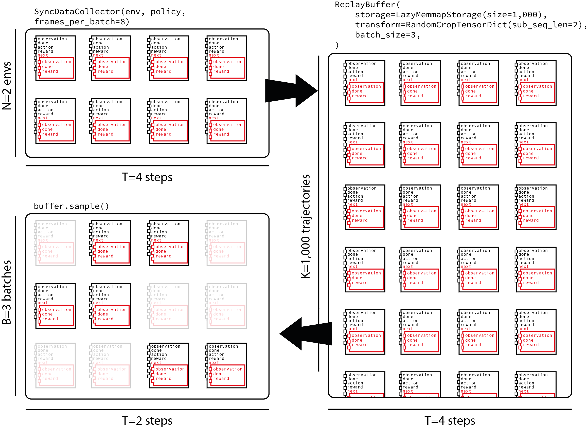

Note

Go to the end
to download the full example code.

# TorchRL objectives: Coding a DDPG loss

**Author**: [Vincent Moens](https://github.com/vmoens)

## Overview

TorchRL separates the training of RL algorithms in various pieces that will be
assembled in your training script: the environment, the data collection and
storage, the model and finally the loss function.

TorchRL losses (or "objectives") are stateful objects that contain the
trainable parameters (policy and value models).
This tutorial will guide you through the steps to code a loss from the ground up
using TorchRL.

To this aim, we will be focusing on DDPG, which is a relatively straightforward
algorithm to code.
[Deep Deterministic Policy Gradient](https://arxiv.org/abs/1509.02971) (DDPG)
is a simple continuous control algorithm. It consists in learning a
parametric value function for an action-observation pair, and
then learning a policy that outputs actions that maximize this value
function given a certain observation.

What you will learn:

- how to write a loss module and customize its value estimator;
- how to build an environment in TorchRL, including transforms
(for example, data normalization) and parallel execution;
- how to design a policy and value network;
- how to collect data from your environment efficiently and store them
in a replay buffer;
- how to store trajectories (and not transitions) in your replay buffer);
- how to evaluate your model.

### Prerequisites

This tutorial assumes that you have completed the
[PPO tutorial](reinforcement_ppo.html) which gives
an overview of the TorchRL components and dependencies, such as
[`tensordict.TensorDict`](https://docs.pytorch.org/tensordict/stable/reference/generated/tensordict.TensorDict.html#tensordict.TensorDict) and `tensordict.nn.TensorDictModules`,
although it should be
sufficiently transparent to be understood without a deep understanding of
these classes.

Note

We do not aim at giving a SOTA implementation of the algorithm, but rather
to provide a high-level illustration of TorchRL's loss implementations
and the library features that are to be used in the context of
this algorithm.

## Imports and setup

> ```
> %%bash
> pip3 install torchrl mujoco glfw
> ```

```

```

We will execute the policy on CUDA if available

## TorchRL [`LossModule`](https://docs.pytorch.org/rl/stable/reference/generated/torchrl.objectives.LossModule.html#torchrl.objectives.LossModule)

TorchRL provides a series of losses to use in your training scripts.
The aim is to have losses that are easily reusable/swappable and that have
a simple signature.

The main characteristics of TorchRL losses are:

- They are stateful objects: they contain a copy of the trainable parameters
such that `loss_module.parameters()` gives whatever is needed to train the
algorithm.
- They follow the `TensorDict` convention: the [`torch.nn.Module.forward()`](https://docs.pytorch.org/docs/stable/generated/torch.nn.Module.html#torch.nn.Module.forward)
method will receive a TensorDict as input that contains all the necessary
information to return a loss value.

```
>>> data = replay_buffer.sample()
>>> loss_dict = loss_module(data)
```
- They output a [`tensordict.TensorDict`](https://docs.pytorch.org/tensordict/stable/reference/generated/tensordict.TensorDict.html#tensordict.TensorDict) instance with the loss values
written under a `"loss_<smth>"` where `smth` is a string describing the
loss. Additional keys in the `TensorDict` may be useful metrics to log during
training time.

Note

The reason we return independent losses is to let the user use a different
optimizer for different sets of parameters for instance. Summing the losses
can be simply done via

```
>>> loss_val = sum(loss for key, loss in loss_dict.items() if key.startswith("loss_"))
```

### The `__init__` method

The parent class of all losses is [`LossModule`](https://docs.pytorch.org/rl/stable/reference/generated/torchrl.objectives.LossModule.html#torchrl.objectives.LossModule).
As many other components of the library, its [`forward()`](https://docs.pytorch.org/rl/stable/reference/generated/torchrl.objectives.LossModule.html#torchrl.objectives.LossModule.forward) method expects
as input a [`tensordict.TensorDict`](https://docs.pytorch.org/tensordict/stable/reference/generated/tensordict.TensorDict.html#tensordict.TensorDict) instance sampled from an experience
replay buffer, or any similar data structure. Using this format makes it
possible to re-use the module across
modalities, or in complex settings where the model needs to read multiple
entries for instance. In other words, it allows us to code a loss module that
is oblivious to the data type that is being given to is and that focuses on
running the elementary steps of the loss function and only those.

To keep the tutorial as didactic as we can, we'll be displaying each method
of the class independently and we'll be populating the class at a later
stage.

Let us start with the `__init__()`
method. DDPG aims at solving a control task with a simple strategy:
training a policy to output actions that maximize the value predicted by
a value network. Hence, our loss module needs to receive two networks in its
constructor: an actor and a value networks. We expect both of these to be
TensorDict-compatible objects, such as
[`tensordict.nn.TensorDictModule`](https://docs.pytorch.org/tensordict/stable/reference/generated/tensordict.nn.TensorDictModule.html#tensordict.nn.TensorDictModule).
Our loss function will need to compute a target value and fit the value
network to this, and generate an action and fit the policy such that its
value estimate is maximized.

The crucial step of the `LossModule.__init__()` method is the call to
`convert_to_functional()`. This method will extract
the parameters from the module and convert it to a functional module.
Strictly speaking, this is not necessary and one may perfectly code all
the losses without it. However, we encourage its usage for the following
reason.

The reason TorchRL does this is that RL algorithms often execute the same
model with different sets of parameters, called "trainable" and "target"
parameters.
The "trainable" parameters are those that the optimizer needs to fit. The
"target" parameters are usually a copy of the former's with some time lag
(absolute or diluted through a moving average).
These target parameters are used to compute the value associated with the
next observation. One the advantages of using a set of target parameters
for the value model that do not match exactly the current configuration is
that they provide a pessimistic bound on the value function being computed.
Pay attention to the `create_target_params` keyword argument below: this
argument tells the [`convert_to_functional()`](https://docs.pytorch.org/rl/stable/reference/generated/torchrl.objectives.LossModule.html#torchrl.objectives.LossModule.convert_to_functional)
method to create a set of target parameters in the loss module to be used
for target value computation. If this is set to `False` (see the actor network
for instance) the `target_actor_network_params` attribute will still be
accessible but this will just return a **detached** version of the
actor parameters.

Later, we will see how the target parameters should be updated in TorchRL.

### The value estimator loss method

In many RL algorithm, the value network (or Q-value network) is trained based
on an empirical value estimate. This can be bootstrapped (TD(0), low
variance, high bias), meaning
that the target value is obtained using the next reward and nothing else, or
a Monte-Carlo estimate can be obtained (TD(1)) in which case the whole
sequence of upcoming rewards will be used (high variance, low bias). An
intermediate estimator (TD(\(\lambda\))) can also be used to compromise
bias and variance.
TorchRL makes it easy to use one or the other estimator via the
[`ValueEstimators`](https://docs.pytorch.org/rl/stable/reference/generated/torchrl.objectives.ValueEstimators.html#torchrl.objectives.ValueEstimators) Enum class, which contains
pointers to all the value estimators implemented. Let us define the default
value function here. We will take the simplest version (TD(0)), and show later
on how this can be changed.

We also need to give some instructions to DDPG on how to build the value
estimator, depending on the user query. Depending on the estimator provided,
we will build the corresponding module to be used at train time:

The `make_value_estimator` method can but does not need to be called: if
not, the [`LossModule`](https://docs.pytorch.org/rl/stable/reference/generated/torchrl.objectives.LossModule.html#torchrl.objectives.LossModule) will query this method with
its default estimator.

### The actor loss method

The central piece of an RL algorithm is the training loss for the actor.
In the case of DDPG, this function is quite simple: we just need to compute
the value associated with an action computed using the policy and optimize
the actor weights to maximize this value.

When computing this value, we must make sure to take the value parameters out
of the graph, otherwise the actor and value loss will be mixed up.
For this, the `hold_out_params()` function
can be used.

### The value loss method

We now need to optimize our value network parameters.
To do this, we will rely on the value estimator of our class:

### Putting things together in a forward call

The only missing piece is the forward method, which will glue together the
value and actor loss, collect the cost values and write them in a `TensorDict`
delivered to the user.

Now that we have our loss, we can use it to train a policy to solve a
control task.

## Environment

In most algorithms, the first thing that needs to be taken care of is the
construction of the environment as it conditions the remainder of the
training script.

For this example, we will be using the `"cheetah"` task. The goal is to make
a half-cheetah run as fast as possible.

In TorchRL, one can create such a task by relying on `dm_control` or `gym`:

```
env = GymEnv("HalfCheetah-v4")
```

or

```
env = DMControlEnv("cheetah", "run")
```

By default, these environment disable rendering. Training from states is
usually easier than training from images. To keep things simple, we focus
on learning from states only. To pass the pixels to the `tensordicts` that
are collected by `env.step()`, simply pass the `from_pixels=True`
argument to the constructor:

```
env = GymEnv("HalfCheetah-v4", from_pixels=True, pixels_only=True)
```

We write a `make_env()` helper function that will create an environment
with either one of the two backends considered above (`dm-control` or `gym`).

### Transforms

Now that we have a base environment, we may want to modify its representation
to make it more policy-friendly. In TorchRL, transforms are appended to the
base environment in a specialized `torchr.envs.TransformedEnv` class.

- It is common in DDPG to rescale the reward using some heuristic value. We
will multiply the reward by 5 in this example.
- If we are using `dm_control`, it is also important to build an interface
between the simulator which works with double precision numbers, and our
script which presumably uses single precision ones. This transformation goes
both ways: when calling `env.step()`, our actions will need to be
represented in double precision, and the output will need to be transformed
to single precision.
The `DoubleToFloat` transform does exactly this: the
`in_keys` list refers to the keys that will need to be transformed from
double to float, while the `in_keys_inv` refers to those that need to
be transformed to double before being passed to the environment.
- We concatenate the state keys together using the `CatTensors`
transform.
- Finally, we also leave the possibility of normalizing the states: we will
take care of computing the normalizing constants later on.

### Parallel execution

The following helper function allows us to run environments in parallel.
Running environments in parallel can significantly speed up the collection
throughput. When using transformed environment, we need to choose whether we
want to execute the transform individually for each environment, or
centralize the data and transform it in batch. Both approaches are easy to
code:

```
env = ParallelEnv(
 lambda: TransformedEnv(GymEnv("HalfCheetah-v4"), transforms),
 num_workers=4
)
env = TransformedEnv(
 ParallelEnv(lambda: GymEnv("HalfCheetah-v4"), num_workers=4),
 transforms
)
```

To leverage the vectorization capabilities of PyTorch, we adopt
the first method:

```
# The backend can be ``gym`` or ``dm_control``
```

Note

`frame_skip` batches multiple step together with a single action
If > 1, the other frame counts (for example, frames_per_batch, total_frames)
need to be adjusted to have a consistent total number of frames collected
across experiments. This is important as raising the frame-skip but keeping the
total number of frames unchanged may seem like cheating: all things compared,
a dataset of 10M elements collected with a frame-skip of 2 and another with
a frame-skip of 1 actually have a ratio of interactions with the environment
of 2:1! In a nutshell, one should be cautious about the frame-count of a
training script when dealing with frame skipping as this may lead to
biased comparisons between training strategies.

Scaling the reward helps us control the signal magnitude for a more
efficient learning.

We also define when a trajectory will be truncated. A thousand steps (500 if
frame-skip = 2) is a good number to use for the cheetah task:

### Normalization of the observations

To compute the normalizing statistics, we run an arbitrary number of random
steps in the environment and compute the mean and standard deviation of the
collected observations. The `ObservationNorm.init_stats()` method can
be used for this purpose. To get the summary statistics, we create a dummy
environment and run it for a given number of steps, collect data over a given
number of steps and compute its summary statistics.

### Normalization stats

Number of random steps used as for stats computation using `ObservationNorm`

Number of environments in each data collector

We pass the stats computed earlier to normalize the output of our
environment:

## Building the model

We now turn to the setup of the model. As we have seen, DDPG requires a
value network, trained to estimate the value of a state-action pair, and a
parametric actor that learns how to select actions that maximize this value.

Recall that building a TorchRL module requires two steps:

- writing the [`torch.nn.Module`](https://docs.pytorch.org/docs/stable/generated/torch.nn.Module.html#torch.nn.Module) that will be used as network,
- wrapping the network in a [`tensordict.nn.TensorDictModule`](https://docs.pytorch.org/tensordict/stable/reference/generated/tensordict.nn.TensorDictModule.html#tensordict.nn.TensorDictModule) where the
data flow is handled by specifying the input and output keys.

In more complex scenarios, [`tensordict.nn.TensorDictSequential`](https://docs.pytorch.org/tensordict/stable/reference/generated/tensordict.nn.TensorDictSequential.html#tensordict.nn.TensorDictSequential) can
also be used.

The Q-Value network is wrapped in a [`ValueOperator`](https://docs.pytorch.org/rl/stable/reference/generated/torchrl.modules.ValueOperator.html#torchrl.modules.ValueOperator)
that automatically sets the `out_keys` to `"state_action_value` for q-value
networks and `state_value` for other value networks.

TorchRL provides a built-in version of the DDPG networks as presented in the
original paper. These can be found under [`DdpgMlpActor`](https://docs.pytorch.org/rl/stable/reference/generated/torchrl.modules.DdpgMlpActor.html#torchrl.modules.DdpgMlpActor)
and [`DdpgMlpQNet`](https://docs.pytorch.org/rl/stable/reference/generated/torchrl.modules.DdpgMlpQNet.html#torchrl.modules.DdpgMlpQNet).

Since we use lazy modules, it is necessary to materialize the lazy modules
before being able to move the policy from device to device and achieve other
operations. Hence, it is good practice to run the modules with a small
sample of data. For this purpose, we generate fake data from the
environment specs.

### Exploration

The policy is passed into a [`OrnsteinUhlenbeckProcessModule`](https://docs.pytorch.org/rl/stable/reference/generated/torchrl.modules.OrnsteinUhlenbeckProcessModule.html#torchrl.modules.OrnsteinUhlenbeckProcessModule)
exploration module, as suggested in the original paper.
Let's define the number of frames before OU noise reaches its minimum value

## Data collector

TorchRL provides specialized classes to help you collect data by executing
the policy in the environment. These "data collectors" iteratively compute
the action to be executed at a given time, then execute a step in the
environment and reset it when required.
Data collectors are designed to help developers have a tight control
on the number of frames per batch of data, on the (a)sync nature of this
collection and on the resources allocated to the data collection (for example
GPU, number of workers, and so on).

Here we will use
`SyncDataCollector`, a simple, single-process
data collector. TorchRL offers other collectors, such as
`MultiaSyncDataCollector`, which executed the
rollouts in an asynchronous manner (for example, data will be collected while
the policy is being optimized, thereby decoupling the training and
data collection).

The parameters to specify are:

- an environment factory or an environment,
- the policy,
- the total number of frames before the collector is considered empty,
- the maximum number of frames per trajectory (useful for non-terminating
environments, like `dm_control` ones).

Note

The `max_frames_per_traj` passed to the collector will have the effect
of registering a new `StepCounter` transform
with the environment used for inference. We can achieve the same result
manually, as we do in this script.

One should also pass:

- the number of frames in each batch collected,
- the number of random steps executed independently from the policy,
- the devices used for policy execution
- the devices used to store data before the data is passed to the main
process.

The total frames we will use during training should be around 1M.

The number of frames returned by the collector at each iteration of the outer
loop is equal to the length of each sub-trajectories times the number of
environments run in parallel in each collector.

In other words, we expect batches from the collector to have a shape
`[env_per_collector, traj_len]` where
`traj_len=frames_per_batch/env_per_collector`:

## Evaluator: building your recorder object

As the training data is obtained using some exploration strategy, the true
performance of our algorithm needs to be assessed in deterministic mode. We
do this using a dedicated class, `Recorder`, which executes the policy in
the environment at a given frequency and returns some statistics obtained
from these simulations.

The following helper function builds this object:

We will be recording the performance every 10 batch collected

## Replay buffer

Replay buffers come in two flavors: prioritized (where some error signal
is used to give a higher likelihood of sampling to some items than others)
and regular, circular experience replay.

TorchRL replay buffers are composable: one can pick up the storage, sampling
and writing strategies. It is also possible to
store tensors on physical memory using a memory-mapped array. The following
function takes care of creating the replay buffer with the desired
hyperparameters:

We'll store the replay buffer in a temporary directory on disk

### Replay buffer storage and batch size

TorchRL replay buffer counts the number of elements along the first dimension.
Since we'll be feeding trajectories to our buffer, we need to adapt the buffer
size by dividing it by the length of the sub-trajectories yielded by our
data collector.
Regarding the batch-size, our sampling strategy will consist in sampling
trajectories of length `traj_len=200` before selecting sub-trajectories
or length `random_crop_len=25` on which the loss will be computed.
This strategy balances the choice of storing whole trajectories of a certain
length with the need for providing samples with a sufficient heterogeneity
to our loss. The following figure shows the dataflow from a collector
that gets 8 frames in each batch with 2 environments run in parallel,
feeds them to a replay buffer that contains 1000 trajectories and
samples sub-trajectories of 2 time steps each.



Let's start with the number of frames stored in the buffer

Prioritized replay buffer is disabled by default

We also need to define how many updates we'll be doing per batch of data
collected. This is known as the update-to-data or `UTD` ratio:

We'll be feeding the loss with trajectories of length 25:

In the original paper, the authors perform one update with a batch of 64
elements for each frame collected. Here, we reproduce the same ratio
but while realizing several updates at each batch collection. We
adapt our batch-size to achieve the same number of update-per-frame ratio:

## Loss module construction

We build our loss module with the actor and `qnet` we've just created.
Because we have target parameters to update, we _must_ create a target network
updater.

let's use the TD(lambda) estimator!

Note

Off-policy usually dictates a TD(0) estimator. Here, we use a TD(\(\lambda\))
estimator, which will introduce some bias as the trajectory that follows
a certain state has been collected with an outdated policy.
This trick, as the multi-step trick that can be used during data collection,
are alternative versions of "hacks" that we usually find to work well in
practice despite the fact that they introduce some bias in the return
estimates.

### Target network updater

Target networks are a crucial part of off-policy RL algorithms.
Updating the target network parameters is made easy thanks to the
`HardUpdate` and `SoftUpdate`
classes. They're built with the loss module as argument, and the update is
achieved via a call to updater.step() at the appropriate location in the
training loop.

### Optimizer

Finally, we will use the Adam optimizer for the policy and value network:

## Time to train the policy

The training loop is pretty straightforward now that we have built all the
modules we need.

```
# Main loop
```

## Experiment results

We make a simple plot of the average rewards during training. We can observe
that our policy learned quite well to solve the task.

Note

As already mentioned above, to get a more reasonable performance,
use a greater value for `total_frames` for example, 1M.

## Conclusion

In this tutorial, we have learned how to code a loss module in TorchRL given
the concrete example of DDPG.

The key takeaways are:

- How to use the [`LossModule`](https://docs.pytorch.org/rl/stable/reference/generated/torchrl.objectives.LossModule.html#torchrl.objectives.LossModule) class to code up a new
loss component;
- How to use (or not) a target network, and how to update its parameters;
- How to create an optimizer associated with a loss module.

## Next Steps

To iterate further on this loss module we might consider:

- Using @dispatch (see [[Feature] Distpatch IQL loss module](https://github.com/pytorch/rl/pull/1230).)
- Allowing flexible TensorDict keys.

```
# %%%%%%RUNNABLE_CODE_REMOVED%%%%%%
```

**Total running time of the script:** (0 minutes 0.003 seconds)

[`Download Jupyter notebook: coding_ddpg.ipynb`](../_downloads/e9ea08c1c8bbc809d69c69a6043d56ee/coding_ddpg.ipynb)

[`Download Python source code: coding_ddpg.py`](../_downloads/592c87306513ba042d759e142b59fea4/coding_ddpg.py)

[`Download zipped: coding_ddpg.zip`](../_downloads/dbe1db98190d1d3b0637ef26f84d5040/coding_ddpg.zip)