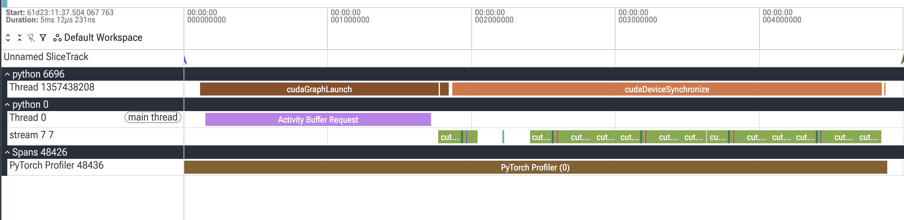
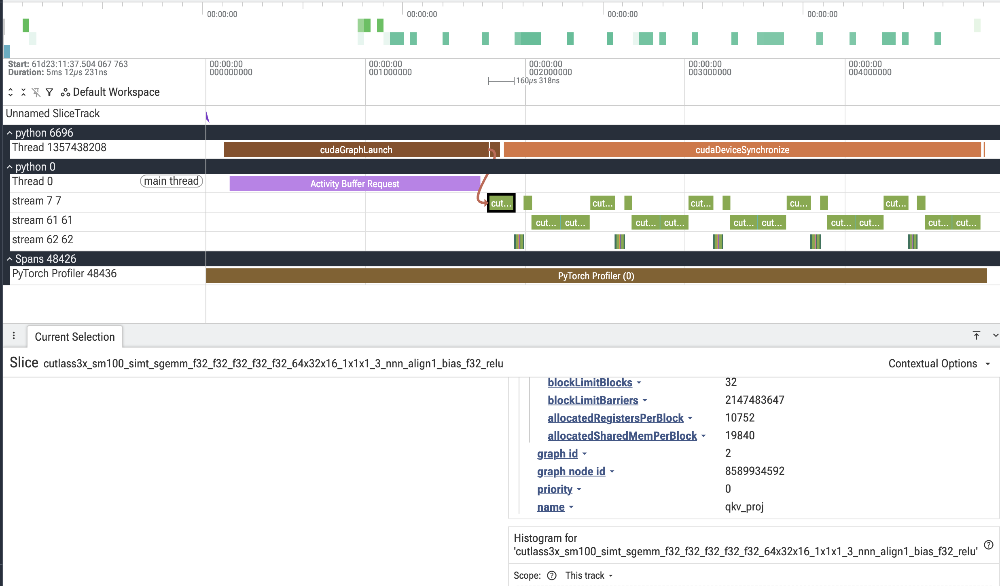
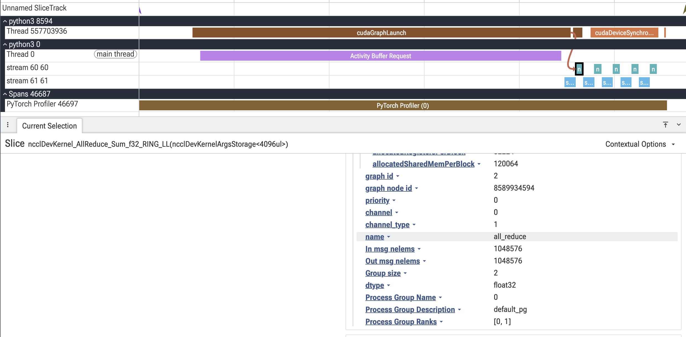

Note

Go to the end
to download the full example code.

# CUDA Graph Kernel Annotations and Profiling

**Author**: [Shangdi Yu](https://github.com/yushangdi)

 What you will learn

- How to capture CUDA graphs with kernel annotations
- How to profile annotated graphs
- How to post-process traces with semantic kernel lanes
- How to visualize graph execution with custom stream assignments
- How to annotate communication collectives with the metadata
(collective type, message size, group, rank) that eager NCCL
traces expose but CUDA graphs drop

 Prerequisites

- PyTorch 2.12+
- CUDA-capable GPU
- Driver/CUDA-compat >= 13.1 for annotation support
- cuda-bindings >= 13.1.0
- perfetto (`pip install perfetto`)

CUDA graphs are a powerful optimization technique that can significantly reduce
kernel launch overhead by capturing and replaying sequences of CUDA operations.
However, when profiling CUDA graphs, all kernels appear on the same stream,
making it difficult to understand the logical structure of your computation.

This tutorial demonstrates how to use **kernel annotations** to add semantic
labels to kernels within CUDA graphs. These annotations can be merged back into
profiler traces to create custom visualization lanes, making it easier to
understand and debug complex graph executions.

Annotations are not limited to compute kernels. One of the most valuable uses
is annotating **communication collectives**. In eager mode, the profiler
attaches rich metadata to every NCCL kernel - the collective type, message
size, process group, and ranks - so you can see exactly what each comm is
doing. Under CUDA graphs that metadata is lost: the collective replays as an
opaque kernel. This tutorial shows how to re-attach that metadata with
annotations so graphed comms read just like eager ones.

## Overview

CUDA graph kernel annotations allow you to add semantic labels to kernels
during graph capture. These labels help you understand what each kernel does
when profiling, making it easy to identify which parts of your model (e.g.,
attention, MLP, normalization) are executing at any given time.

Without annotations, profiler traces show all kernels on a single stream with
auto-generated names, making it difficult to understand the logical structure
of your computation. With annotations, you can:

1. **Label kernel groups** with meaningful names during capture
2. **Assign custom stream IDs** for visual organization
3. **Merge labels into profiler traces** for semantic visualization

The result is a profiler trace where kernels are labeled and organized by
their function, making it much easier to identify performance bottlenecks
and understand execution flow.

**Before annotations:** All kernels appear on a single stream with
auto-generated names, making it difficult to understand which operations
belong to which logical component of your model.

[](../_images/cuda_graph_trace_before.png)

**After annotations:** Kernels are organized into semantic lanes (streams 61
and 62) with meaningful labels like "attention" and "mlp", making it easy to
identify different components and understand the execution structure.

[](../_images/cuda_graph_trace_after.png)

As another example, here is an AllReduce kernel with annotated metadata:

[](../_images/annotated_cudagraph.png)

## Requirements

For this tutorial, you'll need:

- PyTorch 2.12+
- A CUDA GPU
- Driver/CUDA-compat >= 13.1 for annotation support
- The `cuda-bindings` package >= 13.1.0 (`pip install cuda-python`)
- The `perfetto` package for writing the trace (`pip install perfetto`)

The cuda-bindings package provides the Python bindings for CUDA runtime APIs.
Version 13.1.0+ is required for the `cudaGraphNodeGetToolsId` API that
enables kernel annotations. If you have an older version, the tutorial will
run but annotations will be disabled with a warning message explaining how
to upgrade.

On older drivers or cuda-bindings versions, the capture and profiling will
still work, but `mark_kernels` will be a no-op and no semantic lanes will
appear in the final trace.

## Building a Model

Let's create a simple transformer block as our example model. We'll annotate
different parts of the computation (QKV projection, attention, output
projection, MLP) to see them as separate lanes in the profiler.

## The `mark_kernels` Context Manager

The key API is `mark_kernels()`, which takes a dictionary with:

- `name`: A string label for this kernel group (becomes the lane name)
- `stream` (optional): A virtual stream ID for visualization

Any CUDA kernels launched within the context will be tagged with these
annotations. Later, when we post-process the profiler trace, these tags
will be used to organize kernels into custom lanes.

## Capturing a CUDA Graph with Annotations

To capture a graph with annotations enabled, we pass
`enable_annotations=True` to `torch.cuda.graph()`. This automatically
handles the annotation lifecycle: enabling, resolving, and remapping.

## Profiling the Graph

After capturing the graph, we replay it a few times to warm up, then profile
subsequent replays. The profiler will record kernel execution times, which
we'll later merge with our annotations.

## Saving Annotation Metadata

We need to save the annotation metadata in a pickle file that the
post-processing tool can discover. The file should be named
`kernel_annotations_rank0_fwd_bwd.pkl` and placed where the trace tool
can find it.

## Post-Processing: Merging Annotations into Traces

The final step is to merge the annotations back into the trace. This involves:

1. Loading the raw trace and annotations
2. Calling `annotate_trace()` to apply the annotations
3. Emitting a native Perfetto `.pftrace` that preserves overlapping kernels
on their real stream

The result is a trace where kernels are organized by your semantic labels.

**Why a Perfetto protobuf trace (not Chrome JSON)?** A Chrome JSON trace -
the format `torch.profiler.export_chrome_trace` produces - has a
fundamental limitation: a single track (a `(pid, tid)` row) can only show
**properly nested** slices, never crossing/overlapping ones.

Perfetto's native **protobuf** trace (`.pftrace`) solves this
via the `TrackDescriptor` field `sibling_merge_key`. We split
overlapping slices across hidden *backing* tracks (so each protobuf
begin/end stack stays validly nested), then give those backing tracks the
**same** `sibling_merge_key` so the Perfetto UI merges them back into a
single logical row. Nothing is relocated to a fake stream and no timestamp is
clamped - the overlap is shown faithfully on the kernel's real stream.

This converter is adapted from Driss Guessous's [transformer_nuggets](https://github.com/drisspg/transformer_nuggets)
(`transformer_nuggets/utils/track_event.py`); we inline a compact,
self-contained version here. It needs the `perfetto` package
(`pip install perfetto`).

## Comparing Before and After

To see the impact of annotations, let's count how kernels are distributed
across thread IDs (which represent visualization lanes in the trace).

## Putting It All Together

Now let's run the complete workflow: build a model, capture it with
annotations, profile it, and post-process the trace.

```
# Example output:
# if __name__ == "__main__":
# main()
#
# Annotation support available: True
#
# 1. Building transformer block model...
#
# 2. Capturing CUDA graph with annotations...
# Captured graph with 13 annotated nodes
#
# 3. Saving annotation metadata...
# Saved 13 annotations to traces/kernel_annotations_rank0_fwd_bwd.pkl
#
# 4. Profiling graph replays...
# Saved raw trace to traces/trace_raw.json.gz
#
# 5. Post-processing: merging annotations into trace...
# Annotated 65 kernels in the trace
# Saved annotated trace to traces/trace_annotated.pftrace
#
# 6. Comparing traces...
#
# ============================================================
# BEFORE annotation - kernels per lane (tid -> count):
# Stream 7: 65 kernels
#
# AFTER annotation - kernels per lane (tid -> count):
# Stream 7: 10 kernels
# Stream 61: 15 kernels
# Stream 62: 40 kernels
# ============================================================
#
# ============================================================
# SUMMARY
# ============================================================
# Raw trace: traces/trace_raw.json.gz
# Annotated trace: traces/trace_annotated.pftrace
# Annotations: traces/kernel_annotations_rank0_fwd_bwd.pkl
#
# Open the annotated trace in https://ui.perfetto.dev/ to visualize
# the semantic kernel lanes.
# ============================================================
```

## Annotating Communication Collectives

In eager mode the profiler **automatically intercepts** NCCL collectives and
records rich metadata: collective type, input/output message sizes, the process
group, its size, and the participating ranks.

Under CUDA graphs that automatic interception stops working. The collective is
captured once and then replayed as an opaque kernel node. The profiler cannot
intercept graph replay, so it has nothing to attach the NCCL metadata to. The
kernels still show up in the trace (e.g., `ncclDevKernel_AllReduce_Sum_f32_RING_LL`),
but they are opaque: you cannot tell what collective type it is, how many bytes
moved, or which process group it belongs to.

Annotations close this gap. By wrapping the collective in `mark_kernels`
with the same fields the profiler auto-attaches in eager mode, we manually
re-attach that metadata to the graphed kernel. After post-processing, a
graphed collective reads just like an eager one. The helper below builds the
metadata dict; using the field names the profiler uses in eager
(`In msg nelems`, `Group size`, `Process Group Name`, ...) keeps the
annotated trace consistent with non-graphed traces.

## A Block That Mixes Compute and Communication

A tensor- or data-parallel layer interleaves matmuls with collectives. Here
the projection output is all-reduced across the group, mirroring the comm in
a tensor-parallel linear. The collective is annotated with
`annotate_collective` and lands on its own lane.

## Running the Communication Demo

```
# Example output (2 GPUs):
# if __name__ == "__main__":
# comm_annotation_demo()
#
# Building compute + collective block...
# Capturing CUDA graph with annotations...
# Captured graph with 2 annotated nodes
# Saved 2 annotations to traces_comm/kernel_annotations_rank0_fwd_bwd.pkl
# Saved raw trace to traces_comm/trace_raw.json.gz
# Annotated 5 kernels in the trace
# Saved annotated trace to traces_comm/trace_annotated.pftrace
#
# The all_reduce runs a real NCCL kernel
# (``ncclDevKernel_AllReduce_Sum_f32_RING_LL``) across the two ranks:
#
# Annotated collective kernels (metadata restored):
# ncclDevKernel_AllReduce_Sum_f32_RING_LL
# In msg nelems: 1048576
# Out msg nelems: 1048576
# Group size: 2
# dtype: float32
# Process Group Name: default
# Process Group Description: default
# Process Group Ranks: [0, 1]
# stream: 60
#
# In the trace viewer, the all-reduce sits on its own dedicated comm lane
# (stream 60), and selecting it shows the collective type, message sizes, group,
# and ranks -- the same fields you would see in an eager trace, now recovered
# for a CUDA-graphed collective. This metadata is LOST without annotations.
```

## How Overlapping Kernels Are Handled

Graphed CUDA kernels often overlap slightly, and a single trace track can
only render properly nested slices. The Perfetto converter handles this
faithfully:

1. `_assign_nesting_lanes()`: For each stream, overlapping slices are split
across hidden *backing* lanes so that each lane's begin/end stack is validly
nested. A lane is a backing track index, **not** a user-visible stream.
2. `sibling_merge_key`: All backing lanes for one stream are given the same
merge key, so the Perfetto UI merges them back into a single logical row.

The result: overlaps render correctly on the kernel's **real** stream. No
kernel is relocated to a fabricated stream, and no timestamp is mutated -
unlike the legacy Chrome-JSON workaround, which had to do both.

## Performance Considerations

Kernel annotations add minimal overhead:

- Annotation marking happens during graph capture (one-time cost)
- Graph replay performance is identical to unannotated graphs
- Post-processing is offline and doesn't affect runtime

The main cost is the profiling itself, which you would do anyway when
optimizing performance. Annotations simply make the profiler output more
useful by adding semantic structure.

## Troubleshooting

**No annotations in the trace?**

- Check that your driver/CUDA-compat >= 13.1
- Verify that `enable_annotations=True` was passed to `torch.cuda.graph()`
- Ensure `cuda-python` is installed

**Annotations not showing up in specific kernels?**

- Some operations may not launch kernels (e.g., tensor views)
- Only kernels launched within the `mark_kernels` context are annotated
- Verify the operation actually produces CUDA kernels using `torch.profiler`

## Conclusion

CUDA graph kernel annotations provide a powerful way to add semantic
structure to your profiling traces. By marking logical components of your
model during graph capture and merging these annotations in post-processing,
you can create visualizations that make it much easier to understand and
optimize complex CUDA graph executions.

Key takeaways:

- Use `mark_kernels()` to label regions during graph capture
- Enable annotations with `enable_annotations=True`
- Annotate communication collectives to recover the NCCL metadata
(collective type, message size, group, rank) that CUDA graphs drop but
eager traces expose
- Post-process traces with `annotate_trace()`
- View results in [https://ui.perfetto.dev/](https://ui.perfetto.dev/) for intuitive visualization

This technique is especially valuable for large models with many components,
distributed training setups, or any scenario where understanding the
execution structure is critical for performance optimization.

```
# %%%%%%RUNNABLE_CODE_REMOVED%%%%%%
```

**Total running time of the script:** (0 minutes 0.002 seconds)

[`Download Jupyter notebook: cuda_graph_annotations_tutorial.ipynb`](../_downloads/93c170f8ef9d2c0e3ebe2db9ba616e9f/cuda_graph_annotations_tutorial.ipynb)

[`Download Python source code: cuda_graph_annotations_tutorial.py`](../_downloads/8891ea63335e99147b5909553baa119b/cuda_graph_annotations_tutorial.py)

[`Download zipped: cuda_graph_annotations_tutorial.zip`](../_downloads/f5e06826050964a8e3c15c270666f021/cuda_graph_annotations_tutorial.zip)