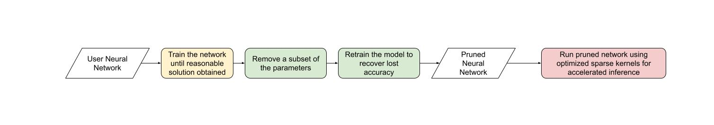

Note

Go to the end
to download the full example code.

# (beta) Accelerating BERT with semi-structured (2:4) sparsity

**Author**: [Jesse Cai](https://github.com/jcaip)

## Overview

Like other forms of sparsity, **semi-structured sparsity** is a model
optimization technique that seeks to reduce the memory overhead and
latency of a neural network at the expense of some model accuracy. It is
also known as **fine-grained structured sparsity** or **2:4 structured
sparsity**.

Semi-structured sparsity derives its name from its unique sparsity
pattern, where n out of every 2n elements are pruned. We most often see
n=2, hence 2:4 sparsity Semi-structured sparsity is particularly
interesting because it can be efficiently accelerated on GPUs and
doesn't degrade model accuracy as much as other sparsity patterns.

With the introduction of
[semi-structured sparsity support](https://pytorch.org/docs/2.1/sparse.html#sparse-semi-structured-tensors),
it is possible to prune and accelerate a semi-structured sparse model
without leaving PyTorch. We will explain this process in this tutorial.



By the end of this tutorial, we will have sparsified a BERT
question-answering model to be 2:4 sparse, fine-tuning it to recover
nearly all F1 loss (86.92 dense vs 86.48 sparse). Finally, we will
accelerate this 2:4 sparse model for inference, yielding a 1.3x speedup.

## Requirements

- PyTorch >= 2.1.
- A NVIDIA GPU with semi-structured sparsity support (Compute
Capability 8.0+).

> Note
> 
> 
> 
> 
> This tutorial is tested on an NVIDIA A100 80GB GPU. You may not see similar speedups on newer GPU architectures, For the latest information on semi-structured sparsity support, please refer to the README `here <[pytorch/ao](https://github.com/pytorch/ao/tree/main/torchao/sparsity#torchao-sparsity)>

This tutorial is designed for beginners to semi-structured sparsity and
sparsity in general. For users with existing 2:4 sparse models,
accelerating `nn.Linear` layers for inference with
`to_sparse_semi_structured` is quite straightforward. Here is an example:

```
# mask Linear weight to be 2:4 sparse
```

## What problem does semi-structured sparsity solve?

The general motivation behind sparsity is simple: if there are zeros in
your network, you can optimize efficiency by not storing or computing those
parameters. However, the specifics of sparsity are tricky. Zeroing out
parameters doesn't affect the latency / memory overhead of our model out
of the box.

This is because the dense tensor still contains the pruned (zero)
elements, which the dense matrix multiplication kernel will still
operate on this elements. In order to realize performance gains, we need
to swap out dense kernels for sparse kernels, which skip calculation
involving pruned elements.

To do this, these kernels work on sparse matrices, which do not store
the pruned elements and store the specified elements in a compressed
format.

For semi-structured sparsity, we store exactly half of the original
parameters along with some compressed metadata about how the elements
were arranged.

There are many different sparse layouts, each with their own benefits
and drawbacks. The 2:4 semi-structured sparse layout is particularly
interesting for two reasons:

- Unlike previous sparse formats,
semi-structured sparsity was designed to be efficiently accelerated on
GPUs. In 2020, NVIDIA introduced hardware support for semi-structured
sparsity with their Ampere architecture, and have also released fast
sparse kernels via
CUTLASS [cuSPARSELt](https://docs.nvidia.com/cuda/cusparselt/index.html).
- At the same time, semi-structured sparsity tends to have a milder
impact on model accuracy compared to other sparse formats, especially
when accounting for more advanced pruning / fine-tuning methods. NVIDIA
has shown in their [white paper](https://arxiv.org/abs/2104.08378)
that a simple paradigm of magnitude pruning once to be 2:4 sparse and
then retraining the model yields nearly identical model accuracies.

Semi-structured exists in a sweet spot, providing a 2x (theoretical)
speedup at a much lower sparsity level (50%), while still being granular
enough to preserve model accuracy.

| Network | Data Set | Metric | Dense FP16 | Sparse FP16 |
| --- | --- | --- | --- | --- |
| ResNet-50 | ImageNet | Top-1 | 76.1 | 76.2 |
| ResNeXt-101_32x8d | ImageNet | Top-1 | 79.3 | 79.3 |
| Xception | ImageNet | Top-1 | 79.2 | 79.2 |
| SSD-RN50 | COCO2017 | bbAP | 24.8 | 24.8 |
| MaskRCNN-RN50 | COCO2017 | bbAP | 37.9 | 37.9 |
| FairSeq Transformer | EN-DE WMT14 | BLEU | 28.2 | 28.5 |
| BERT-Large | SQuAD v1.1 | F1 | 91.9 | 91.9 |

Semi-structured sparsity has an additional advantage from a workflow
perspective. Because the sparsity level is fixed at 50%, it is easier to
decompose the problem of sparsifying a model into two distinct
subproblems:

- Accuracy - How can we find a set of 2:4 sparse weights that minimize
the accuracy degradation of our model?
- Performance - How can we accelerate our 2:4 sparse weights for
inference and reduced memory overhead?

\[\begin{bmatrix}
 1 & 1 & 0 & 0 \\
 0 & 0 & 1 & 1 \\
 1 & 0 & 0 & 0 \\
 0 & 0 & 1 & 1 \\
 \end{bmatrix}\]

The natural handoff point between these two problems are zeroed-out
dense tensors. Our inference solution is designed to compress and
accelerate tensors in this format. We anticipate many users coming up
with custom masking solution, as this is an active area of research.

Now that we've learned a little more about semi-structured sparsity,
let's apply it to a BERT model trained on a question answering task,
SQuAD.

## Intro & Setup

Let's start by importing all the packages we need.

```
# If you are running this in Google Colab, run:
# .. code-block: python
#
# !pip install datasets transformers evaluate accelerate pandas
#

# force CUTLASS use if ``cuSPARSELt`` is not available

# Set default device to "cuda:0"
```

We'll also need to define some helper functions that are specific to the
dataset / task at hand. These were adapted from
[this](https://huggingface.co/learn/nlp-course/chapter7/7?fw=pt)
Hugging Face course as a reference.

Now that those are defined, we just need one additional helper function,
which will help us benchmark our model.

We will get started by loading our model and tokenizer, and then setting
up our dataset.

```
# load model

# set up train and val dataset
```

# Establishing a baseline

Next, we'll train a quick baseline of our model on SQuAD. This task asks
our model to identify spans, or segments of text, in a given context
(Wikipedia articles) that answer a given question. Running the following
code gives me an F1 score of 86.9. This is quite close to the reported
NVIDIA score and the difference is likely due to BERT-base
vs. BERT-large or fine-tuning hyperparameters.

```
# batch sizes to compare for eval

# 2:4 sparsity require fp16, so we cast here for a fair comparison
```

## Pruning BERT to be 2:4 sparse

Now that we have our baseline, it's time we prune BERT. There are many
different pruning strategies, but one of the most common is **magnitude
pruning**, which seeks to remove the weights with the lowest L1 norm.
Magnitude pruning was used by NVIDIA in all their results and is a
common baseline.

To do this, we will use the `torch.ao.pruning` package, which contains
a weight-norm (magnitude) sparsifier. These sparsifiers work by applying
mask parametrizations to the weight tensors in a model. This lets them
simulate sparsity by masking out the pruned weights.

We'll also have to decide what layers of the model to apply sparsity to,
which in this case is all of the `nn.Linear` layers, except for the
task-specific head outputs. That's because semi-structured sparsity has
[shape constraints](https://pytorch.org/docs/2.1/sparse.html#constructing-sparse-semi-structured-tensors),
and the task-specific `nn.Linear` layers do not satisfy them.

```
# add to config if ``nn.Linear`` and in the BERT model.
```

The first step for pruning the model is to insert parametrizations for
masking the weights of the model. This is done by the prepare step.
Anytime we try to access the `.weight` we will get `mask * weight`
instead.

```
# Prepare the model, insert fake-sparsity parametrizations for training
```

Then, we'll take a single pruning step. All pruners implement a
`update_mask()` method that updates the mask with the logic being
determined by the pruner implementation. The step method calls this
`update_mask` functions for the weights specified in the sparse
config.

We will also evaluate the model to show the accuracy degradation of
zero-shot pruning, or pruning without fine-tuning / retraining.

In this state, we can start fine-tuning the model, updating the elements
that wouldn't be pruned to better account for the accuracy loss. Once
we've reached a satisfied state, we can call `squash_mask` to fuse the
mask and the weight together. This will remove the parametrizations and
we are left with a zeroed-out 2:4 dense model.

## Accelerating 2:4 sparse models for inference

Now that we have a model in this format, we can accelerate it for
inference just like in the QuickStart Guide.

```
# accelerate for sparsity
```

Retraining our model after magnitude pruning has recovered nearly all of
the F1 that has been lost when the model was pruned. At the same time we
have achieved a 1.28x speedup for `bs=16`. Note that not all shapes are
amenable to performance improvements. When batch sizes are small and
limited time is spent in compute sparse kernels may be slower than their
dense counterparts.

Because semi-structured sparsity is implemented as a tensor subclass, it
is compatible with `torch.compile`. When composed with
`to_sparse_semi_structured`, we are able to achieve a total 2x speedup
on BERT.

| Metrics | fp16 | 2:4 sparse | delta / speedup | compiled |
| --- | --- | --- | --- | --- |
| Exact Match (%) | 78.53 | 78.44 | -0.09 | |
| F1 (%) | 86.93 | 86.49 | -0.44 | |
| Time (bs=4) | 11.10 | 15.54 | 0.71x | no |
| Time (bs=16) | 19.35 | 15.74 | 1.23x | no |
| Time (bs=64) | 72.71 | 59.41 | 1.22x | no |
| Time (bs=256) | 286.65 | 247.63 | 1.14x | no |
| Time (bs=4) | 7.59 | 7.46 | 1.02x | yes |
| Time (bs=16) | 11.47 | 9.68 | 1.18x | yes |
| Time (bs=64) | 41.57 | 36.92 | 1.13x | yes |
| Time (bs=256) | 159.22 | 142.23 | 1.12x | yes |

# Conclusion

In this tutorial, we have shown how to prune BERT to be 2:4 sparse and
how to accelerate a 2:4 sparse model for inference. By taking advantage
of our `SparseSemiStructuredTensor` subclass, we were able to achieve a
1.3x speedup over the fp16 baseline, and up to 2x with
`torch.compile`. We also demonstrated the benefits of 2:4 sparsity by
fine-tuning BERT to recover any lost F1 (86.92 dense vs 86.48 sparse).

```
# %%%%%%RUNNABLE_CODE_REMOVED%%%%%%
```

[`Download Jupyter notebook: semi_structured_sparse.ipynb`](../_downloads/e6af5f45662e344f06f9caca32c8752f/semi_structured_sparse.ipynb)

[`Download Python source code: semi_structured_sparse.py`](../_downloads/5508d56677e1ebd9b3560596e7e41f57/semi_structured_sparse.py)

[`Download zipped: semi_structured_sparse.zip`](../_downloads/32e07f26956ebdc4b487876bba9af291/semi_structured_sparse.zip)