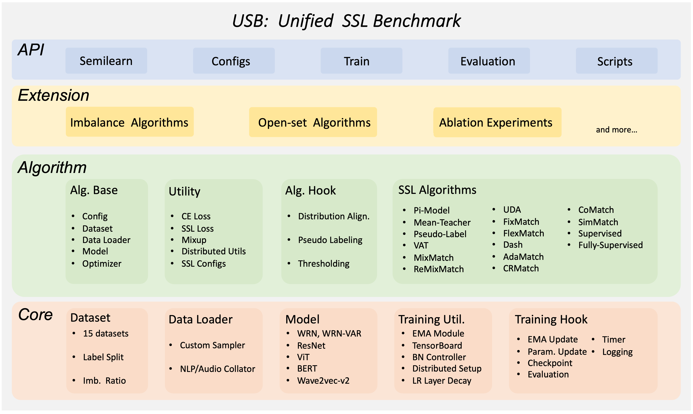

Note

Go to the end
to download the full example code.

# Semi-Supervised Learning using USB built upon PyTorch

**Author**: [Hao Chen](https://github.com/Hhhhhhao)

Unified Semi-supervised learning Benchmark (USB) is a semi-supervised
learning (SSL) framework built upon PyTorch.
Based on Datasets and Modules provided by PyTorch, USB becomes a flexible,
modular, and easy-to-use framework for semi-supervised learning.
It supports a variety of semi-supervised learning algorithms, including
`FixMatch`, `FreeMatch`, `DeFixMatch`, `SoftMatch`, and so on.
It also supports a variety of imbalanced semi-supervised learning algorithms.
The benchmark results across different datasets of computer vision, natural
language processing, and speech processing are included in USB.

This tutorial will walk you through the basics of using the USB lighting
package.
Let's get started by training a `FreeMatch`/`SoftMatch` model on
CIFAR-10 using pretrained Vision Transformers (ViT)!
And we will show it is easy to change the semi-supervised algorithm and train
on imbalanced datasets.



## Introduction to `FreeMatch` and `SoftMatch` in Semi-Supervised Learning

Here we provide a brief introduction to `FreeMatch` and `SoftMatch`.
First, we introduce a famous baseline for semi-supervised learning called `FixMatch`.
`FixMatch` is a very simple framework for semi-supervised learning, where it
utilizes a strong augmentation to generate pseudo labels for unlabeled data.
It adopts a confidence thresholding strategy to filter out the low-confidence
pseudo labels with a fixed threshold set.
`FreeMatch` and `SoftMatch` are two algorithms that improve upon `FixMatch`.
`FreeMatch` proposes adaptive thresholding strategy to replace the fixed
thresholding strategy in `FixMatch`. The adaptive thresholding progressively
increases the threshold according to the learning status of the model on each
class. `SoftMatch` absorbs the idea of confidence thresholding as an
weighting mechanism. It proposes a Gaussian weighting mechanism to overcome
the quantity-quality trade-off in pseudo-labels. In this tutorial, we will
use USB to train `FreeMatch` and `SoftMatch`.

## Use USB to Train `FreeMatch`/`SoftMatch` on CIFAR-10 with only 40 labels

USB is easy to use and extend, affordable to small groups, and comprehensive
for developing and evaluating SSL algorithms.
USB provides the implementation of 14 SSL algorithms based on Consistency
Regularization, and 15 tasks for evaluation from CV, NLP, and Audio domain.
It has a modular design that allows users to easily extend the package by
adding new algorithms and tasks.
It also supports a Python API for easier adaptation to different SSL
algorithms on new data.

Now, let's use USB to train `FreeMatch` and `SoftMatch` on CIFAR-10.
First, we need to install USB package `semilearn` and import necessary API
functions from USB.
If you are running this in Google Colab, install `semilearn` by running:
`!pip install semilearn`.

Below is a list of functions we will use from `semilearn`:

- `get_dataset` to load dataset, here we use CIFAR-10
- `get_data_loader` to create train (labeled and unlabeled) and test data

loaders, the train unlabeled loaders will provide both strong and weak
augmentation of unlabeled data
- `get_net_builder` to create a model, here we use pretrained ViT
- `get_algorithm` to create the semi-supervised learning algorithm,
here we use `FreeMatch` and `SoftMatch`
- `get_config`: to get default configuration of the algorithm
- `Trainer`: a Trainer class for training and evaluating the
algorithm on dataset

Note that a CUDA-enabled backend is required for training with the `semilearn` package.
See [Enabling CUDA in Google Colab](https://pytorch.org/tutorials/beginner/colab#enabling-cuda) for instructions
on enabling CUDA in Google Colab.

After importing necessary functions, we first set the hyper-parameters of the
algorithm.

Then, we load the dataset and create data loaders for training and testing.
And we specify the model and algorithm to use.

We can start training the algorithms on CIFAR-10 with 40 labels now.
We train for 500 iterations and evaluate every 500 iterations.

Finally, let's evaluate the trained model on the validation set.
After training 500 iterations with `FreeMatch` on only 40 labels of
CIFAR-10, we obtain a classifier that achieves around 87% accuracy on the validation set.

## Use USB to Train `SoftMatch` with specific imbalanced algorithm on imbalanced CIFAR-10

Now let's say we have imbalanced labeled set and unlabeled set of CIFAR-10,
and we want to train a `SoftMatch` model on it.
We create an imbalanced labeled set and imbalanced unlabeled set of CIFAR-10,
by setting the `lb_imb_ratio` and `ulb_imb_ratio` to 10.
Also, we replace the `algorithm` with `softmatch` and set the `imbalanced`
to `True`.

Then, we re-load the dataset and create data loaders for training and testing.
And we specify the model and algorithm to use.

We can start Train the algorithms on CIFAR-10 with 40 labels now.
We train for 500 iterations and evaluate every 500 iterations.

Finally, let's evaluate the trained model on the validation set.

References:
- [1] USB: [microsoft/Semi-supervised-learning](https://github.com/microsoft/Semi-supervised-learning)
- [2] Kihyuk Sohn et al. FixMatch: Simplifying Semi-Supervised Learning with Consistency and Confidence
- [3] Yidong Wang et al. FreeMatch: Self-adaptive Thresholding for Semi-supervised Learning
- [4] Hao Chen et al. SoftMatch: Addressing the Quantity-Quality Trade-off in Semi-supervised Learning

```
# %%%%%%RUNNABLE_CODE_REMOVED%%%%%%
```

[`Download Jupyter notebook: usb_semisup_learn.ipynb`](../_downloads/1fe2913c46f55656d34ab03760cafcdc/usb_semisup_learn.ipynb)

[`Download Python source code: usb_semisup_learn.py`](../_downloads/f9131668f10ce00fb20564fb14f4b2fc/usb_semisup_learn.py)

[`Download zipped: usb_semisup_learn.zip`](../_downloads/95daea500c35cc7f98d7d462f31ea4ef/usb_semisup_learn.zip)