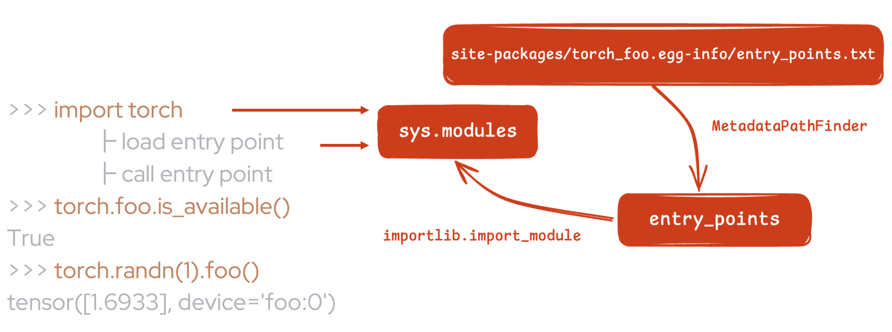

Autoloading Out-of-Tree Extension
===========================================

**Author:** `Yuanhao Ji <www.github.com/shink>`__  

The extension autoloading mechanism enables PyTorch to automatically
load out-of-tree backend extensions without explicit import statements. This
feature is beneficial for users as it enhances their 
experience and enables them to follow the familiar PyTorch device
programming model without having to explicitly load or import device-specific
extensions. Additionally, it facilitates effortless
adoption of existing PyTorch applications with zero-code changes on
out-of-tree devices. For further details, refer to the
`[RFC] Autoload Device Extension <https://github.com/pytorch/pytorch/issues/122468>`_.

.. grid:: 2

    .. grid-item-card:: :octicon:`mortar-board;1em;` What you will learn
       :class-card: card-prerequisites

       * How to use out-of-tree extension autoloading in PyTorch
       * Review examples with Intel Gaudi HPU, Huawei Ascend NPU

    .. grid-item-card:: :octicon:`list-unordered;1em;` Prerequisites
       :class-card: card-prerequisites

       * PyTorch v2.5 or later
.. note::

    This feature is enabled by default and can be disabled by using
    ``export TORCH_DEVICE_BACKEND_AUTOLOAD=0``.
    If you get an error like this: "Failed to load the backend extension",
    this error is independent with PyTorch, you should disable this feature
    and ask the out-of-tree extension maintainer for help.

How to apply this mechanism to out-of-tree extensions?
------------------------------------------------------

For instance, suppose you have a backend named ``foo`` and a corresponding package named ``torch_foo``. Ensure that
your package is compatible with PyTorch 2.5 or later and includes the following snippet in its ``__init__.py`` file:

.. code-block:: python

    def _autoload():
        print("No need to import torch_foo anymore! Check things are working with `torch.foo.is_available()`.")

Then, the only thing you need to do is define an entry point within your Python package:

.. code-block:: python

    setup(
        name="torch_foo",
        version="1.0",
        entry_points={
            "torch.backends": [
                "torch_foo = torch_foo:_autoload",
            ],
        }
    )

Now you can import the ``torch_foo`` module by simply adding the ``import torch`` statement without the need to add ``import torch_foo``:

.. code-block:: python

    >>> import torch
    Check things are working with `torch.foo.is_available()`.
    >>> torch.foo.is_available()
    True

In some cases, you might encounter issues with circular imports. The examples below demonstrate how you can address them.

Examples
^^^^^^^^

In this example, we will be using Intel Gaudi HPU and Huawei Ascend NPU to determine how to
integrate your out-of-tree extension with PyTorch using the autoloading feature.

`habana_frameworks.torch`_ is a Python package that enables users to run
PyTorch programs on Intel Gaudi by using the PyTorch ``HPU`` device key.

.. _habana_frameworks.torch: https://docs.habana.ai/en/latest/PyTorch/Getting_Started_with_PyTorch_and_Gaudi/Getting_Started_with_PyTorch.html

``habana_frameworks.torch`` is a submodule of ``habana_frameworks``, we add an entry point to
``__autoload()`` in ``habana_frameworks/setup.py``:

.. code-block:: diff

    setup(
        name="habana_frameworks",
        version="2.5",
    +   entry_points={
    +       'torch.backends': [
    +           "device_backend = habana_frameworks:__autoload",
    +       ],
    +   }
    )

In ``habana_frameworks/init.py``, we use a global variable to track if our module has been loaded:

.. code-block:: python

    import os

    is_loaded = False  # A member variable of habana_frameworks module to track if our module has been imported

    def __autoload():
        # This is an entrypoint for pytorch autoload mechanism
        # If the following condition is true, that means our backend has already been loaded, either explicitly
        # or by the autoload mechanism and importing it again should be skipped to avoid circular imports
        global is_loaded
        if is_loaded:
            return
        import habana_frameworks.torch

In ``habana_frameworks/torch/init.py``, we prevent circular imports by updating the state of the global variable:

.. code-block:: python

    import os

    # This is to prevent torch autoload mechanism from causing circular imports
    import habana_frameworks

    habana_frameworks.is_loaded = True

`torch_npu`_ enables users to run PyTorch programs on Huawei Ascend NPU, it
leverages the ``PrivateUse1`` device key and exposes the device name
as ``npu`` to the end users.

.. _torch_npu: https://github.com/Ascend/pytorch

We define an entry point in `torch_npu/setup.py`_:

.. _torch_npu/setup.py: https://github.com/Ascend/pytorch/blob/master/setup.py#L618

.. code-block:: diff

    setup(
        name="torch_npu",
        version="2.5",
    +   entry_points={
    +       'torch.backends': [
    +           'torch_npu = torch_npu:_autoload',
    +       ],
    +   }
    )

Unlike ``habana_frameworks``, ``torch_npu`` uses the environment variable ``TORCH_DEVICE_BACKEND_AUTOLOAD``
to control the autoloading process. For example, we set it to ``0`` to disable autoloading to prevent circular imports:

.. code-block:: python

    # Disable autoloading before running 'import torch'
    os.environ['TORCH_DEVICE_BACKEND_AUTOLOAD'] = '0'

    import torch

How it works
------------

Autoloading is implemented based on Python's `Entrypoints
<https://packaging.python.org/en/latest/specifications/entry-points/>`_
mechanism. We discover and load all of the specific entry points
in ``torch/__init__.py`` that are defined by out-of-tree extensions.

As shown above, after installing ``torch_foo``, your Python module can be imported
when loading the entrypoint that you have defined, and then you can do some necessary work when
calling it.

See the implementation in this pull request: `[RFC] Add support for device extension autoloading
<https://github.com/pytorch/pytorch/pull/127074>`_.

Conclusion
----------

This tutorial has guided you through the out-of-tree extension autoloading
mechanism, including its usage and implementation.
