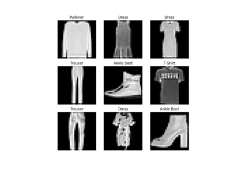

# Learn the Basics

1. intro.py

Learn the Basics
[https://pytorch.org/tutorials/beginner/basics/intro.html](https://pytorch.org/tutorials/beginner/basics/intro.html)
2. quickstart_tutorial.py

Quickstart
[https://pytorch.org/tutorials/beginner/basics/quickstart_tutorial.html](https://pytorch.org/tutorials/beginner/basics/quickstart_tutorial.html)
3. tensorqs_tutorial.py

Tensors
[https://pytorch.org/tutorials/beginner/basics/tensor_tutorial.html](https://pytorch.org/tutorials/beginner/basics/tensor_tutorial.html)
4. data_tutorial.py

Datasets & DataLoaders
[https://pytorch.org/tutorials/beginner/basics/data_tutorial.html](https://pytorch.org/tutorials/beginner/basics/data_tutorial.html)
5. transforms_tutorial.py

Transforms
[https://pytorch.org/tutorials/beginner/basics/transforms_tutorial.html](https://pytorch.org/tutorials/beginner/basics/transforms_tutorial.html)
6. buildmodel_tutorial.py

Building the Neural Network
[https://pytorch.org/tutorials/beginner/basics/buildmodel_tutorial.html](https://pytorch.org/tutorials/beginner/basics/buildmodel_tutorial.html)
7. autogradqs_tutorial.py

Automatic Differentiation with torch.autograd_tutorial
[https://pytorch.org/tutorials/beginner/basics/autograd_tutorial.html](https://pytorch.org/tutorials/beginner/basics/autograd_tutorial.html)
8. optimization_tutorial.py

Optimizing Model Parameters
[https://pytorch.org/tutorials/beginner/basics/optimization_tutorial.html](https://pytorch.org/tutorials/beginner/basics/optimization_tutorial.html)
9. saveloadrun_tutorial.py

Save and Load the Model
[https://pytorch.org/tutorials/beginner/basics/saveloadrun_tutorial.html](https://pytorch.org/tutorials/beginner/basics/saveloadrun_tutorial.html)

sphx_glr_beginner_basics_autogradqs_tutorial.py

Learn the Basics ||

sphx_glr_beginner_basics_buildmodel_tutorial.py

Learn the Basics ||

sphx_glr_beginner_basics_intro.py

Learn the Basics ||

sphx_glr_beginner_basics_saveloadrun_tutorial.py

Learn the Basics ||

sphx_glr_beginner_basics_optimization_tutorial.py

Learn the Basics ||

sphx_glr_beginner_basics_data_tutorial.py

Learn the Basics ||

sphx_glr_beginner_basics_quickstart_tutorial.py

Learn the Basics ||

sphx_glr_beginner_basics_tensorqs_tutorial.py

Learn the Basics ||

sphx_glr_beginner_basics_transforms_tutorial.py

Learn the Basics ||