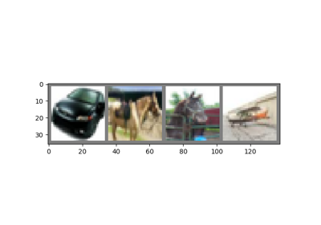

# Deep Learning with PyTorch: A 60 Minute Blitz

1. tensor_tutorial.py

What is PyTorch?
[https://pytorch.org/tutorials/beginner/blitz/tensor_tutorial.html](https://pytorch.org/tutorials/beginner/blitz/tensor_tutorial.html)
2. autograd_tutorial.py

Autograd: Automatic Differentiation
[https://pytorch.org/tutorials/beginner/blitz/autograd_tutorial.html](https://pytorch.org/tutorials/beginner/blitz/autograd_tutorial.html)
3. neural_networks_tutorial.py

Neural Networks
[https://pytorch.org/tutorials/beginner/blitz/neural_networks_tutorial](https://pytorch.org/tutorials/beginner/blitz/neural_networks_tutorial).html#
4. cifar10_tutorial.py

Training a Classifier
[https://pytorch.org/tutorials/beginner/blitz/cifar10_tutorial.html](https://pytorch.org/tutorials/beginner/blitz/cifar10_tutorial.html)
5. data_parallel_tutorial.py

Optional: Data Parallelism
[https://pytorch.org/tutorials/beginner/blitz/data_parallel_tutorial.html](https://pytorch.org/tutorials/beginner/blitz/data_parallel_tutorial.html)

[Neural Networks](neural_networks_tutorial.html#sphx-glr-beginner-blitz-neural-networks-tutorial-py)

Neural Networks

[Optional: Data Parallelism](data_parallel_tutorial.html#sphx-glr-beginner-blitz-data-parallel-tutorial-py)

Optional: Data Parallelism

[A Gentle Introduction to torch.autograd](autograd_tutorial.html#sphx-glr-beginner-blitz-autograd-tutorial-py)

A Gentle Introduction to torch.autograd

[Tensors](tensor_tutorial.html#sphx-glr-beginner-blitz-tensor-tutorial-py)

Tensors

[Training a Classifier](cifar10_tutorial.html#sphx-glr-beginner-blitz-cifar10-tutorial-py)

Training a Classifier