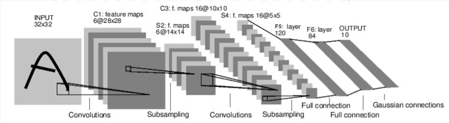

Note

Go to the end
to download the full example code.

# Neural Networks

Neural networks can be constructed using the `torch.nn` package.

Now that you had a glimpse of `autograd`, `nn` depends on
`autograd` to define models and differentiate them.
An `nn.Module` contains layers, and a method `forward(input)` that
returns the `output`.

For example, look at this network that classifies digit images:



convnet

It is a simple feed-forward network. It takes the input, feeds it
through several layers one after the other, and then finally gives the
output.

A typical training procedure for a neural network is as follows:

- Define the neural network that has some learnable parameters (or
weights)
- Iterate over a dataset of inputs
- Process input through the network
- Compute the loss (how far is the output from being correct)
- Propagate gradients back into the network's parameters
- Update the weights of the network, typically using a simple update rule:
`weight = weight - learning_rate * gradient`

## Define the network

Let's define this network:

You just have to define the `forward` function, and the `backward`
function (where gradients are computed) is automatically defined for you
using `autograd`.
You can use any of the Tensor operations in the `forward` function.

The learnable parameters of a model are returned by `net.parameters()`

Let's try a random 32x32 input.
Note: expected input size of this net (LeNet) is 32x32. To use this net on
the MNIST dataset, please resize the images from the dataset to 32x32.

Zero the gradient buffers of all parameters and backprops with random
gradients:

Note

`torch.nn` only supports mini-batches. The entire `torch.nn`
package only supports inputs that are a mini-batch of samples, and not
a single sample.

For example, `nn.Conv2d` will take in a 4D Tensor of
`nSamples x nChannels x Height x Width`.

If you have a single sample, just use `input.unsqueeze(0)` to add
a fake batch dimension.

Before proceeding further, let's recap all the classes you've seen so far.

**Recap:**

- `torch.Tensor` - A *multi-dimensional array* with support for autograd
operations like `backward()`. Also *holds the gradient* w.r.t. the
tensor.
- `nn.Module` - Neural network module. *Convenient way of
encapsulating parameters*, with helpers for moving them to GPU,
exporting, loading, etc.
- `nn.Parameter` - A kind of Tensor, that is *automatically
registered as a parameter when assigned as an attribute to a*
`Module`.
- `autograd.Function` - Implements *forward and backward definitions
of an autograd operation*. Every `Tensor` operation creates at
least a single `Function` node that connects to functions that
created a `Tensor` and *encodes its history*.

**At this point, we covered:**

- Defining a neural network
- Processing inputs and calling backward

**Still Left:**

- Computing the loss
- Updating the weights of the network

## Loss Function

A loss function takes the (output, target) pair of inputs, and computes a
value that estimates how far away the output is from the target.

There are several different
[loss functions](https://pytorch.org/docs/nn.html#loss-functions) under the
nn package .
A simple loss is: `nn.MSELoss` which computes the mean-squared error
between the output and the target.

For example:

Now, if you follow `loss` in the backward direction, using its
`.grad_fn` attribute, you will see a graph of computations that looks
like this:

```
input -> conv2d -> relu -> maxpool2d -> conv2d -> relu -> maxpool2d
 -> flatten -> linear -> relu -> linear -> relu -> linear
 -> MSELoss
 -> loss
```

So, when we call `loss.backward()`, the whole graph is differentiated
w.r.t. the neural net parameters, and all Tensors in the graph that have
`requires_grad=True` will have their `.grad` Tensor accumulated with the
gradient.

For illustration, let us follow a few steps backward:

## Backprop

To backpropagate the error all we have to do is to `loss.backward()`.
You need to clear the existing gradients though, else gradients will be
accumulated to existing gradients.

Now we shall call `loss.backward()`, and have a look at conv1's bias
gradients before and after the backward. Since we have not introduced an
optimizer yet, we clear the gradients directly on the model. Once using an
optimizer, prefer `optimizer.zero_grad()` as shown below.

Now, we have seen how to use loss functions.

**Read Later:**

> The neural network package contains various modules and loss functions
> that form the building blocks of deep neural networks. A full list with
> documentation is [here](https://pytorch.org/docs/nn).

**The only thing left to learn is:**

> - Updating the weights of the network

## Update the weights

The simplest update rule used in practice is the Stochastic Gradient
Descent (SGD):

```
weight = weight - learning_rate * gradient
```

We can implement this using simple Python code:

```
learning_rate = 0.01
for f in net.parameters():
 with torch.no_grad():
 f -= f.grad * learning_rate
```

However, as you use neural networks, you want to use various different
update rules such as SGD, Nesterov-SGD, Adam, RMSProp, etc.
To enable this, we built a small package: `torch.optim` that
implements all these methods. Using it is very simple:

```
import torch.optim as optim

# create your optimizer
optimizer = optim.SGD(net.parameters(), lr=0.01)

# in your training loop:
optimizer.zero_grad() # zero the gradient buffers
output = net(input)
loss = criterion(output, target)
loss.backward()
optimizer.step() # Does the update
```

Note

Observe how gradient buffers had to be manually set to zero using
`optimizer.zero_grad()`. This is because gradients are accumulated
as explained in the Backprop section.

```
# %%%%%%RUNNABLE_CODE_REMOVED%%%%%%
```

**Total running time of the script:** (0 minutes 0.002 seconds)

[`Download Jupyter notebook: neural_networks_tutorial.ipynb`](../../_downloads/c029676472d90691aa145c6fb97a61c3/neural_networks_tutorial.ipynb)

[`Download Python source code: neural_networks_tutorial.py`](../../_downloads/fb69edad8880ff72cdc3687bb1dad1e6/neural_networks_tutorial.py)

[`Download zipped: neural_networks_tutorial.zip`](../../_downloads/11e2004e14318fb5a142762c58588ffd/neural_networks_tutorial.zip)