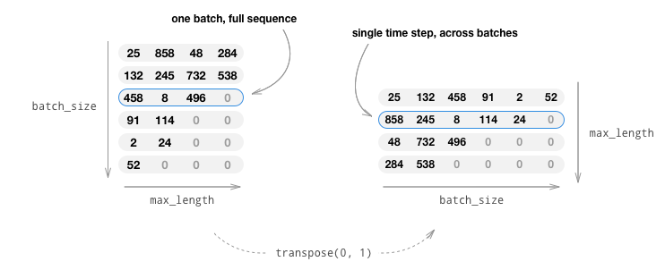
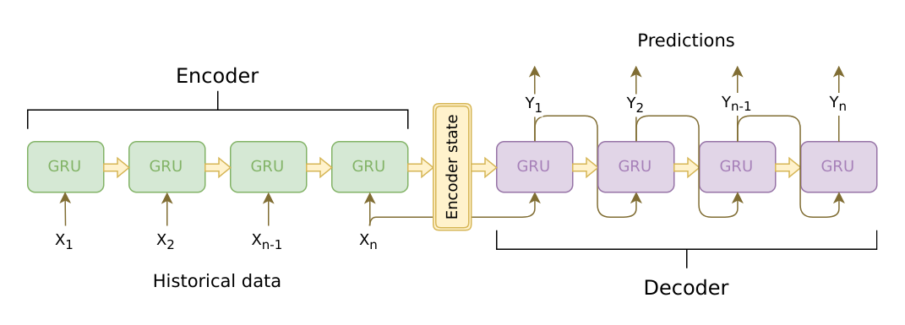
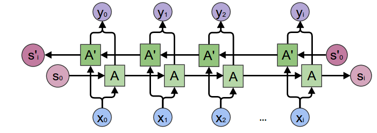
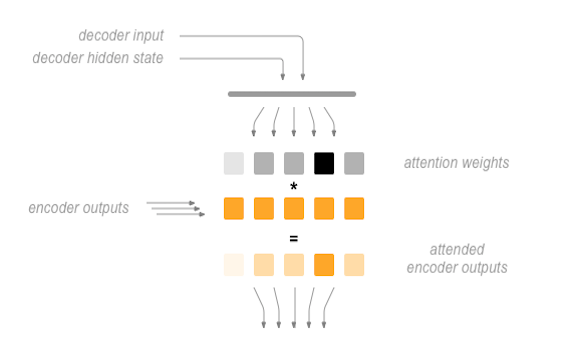
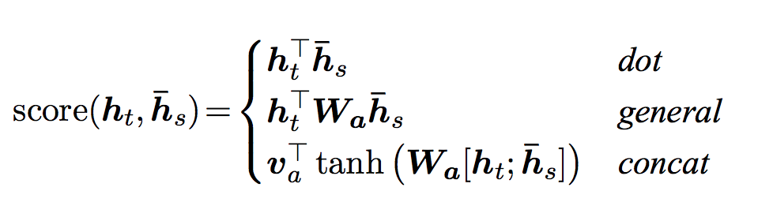
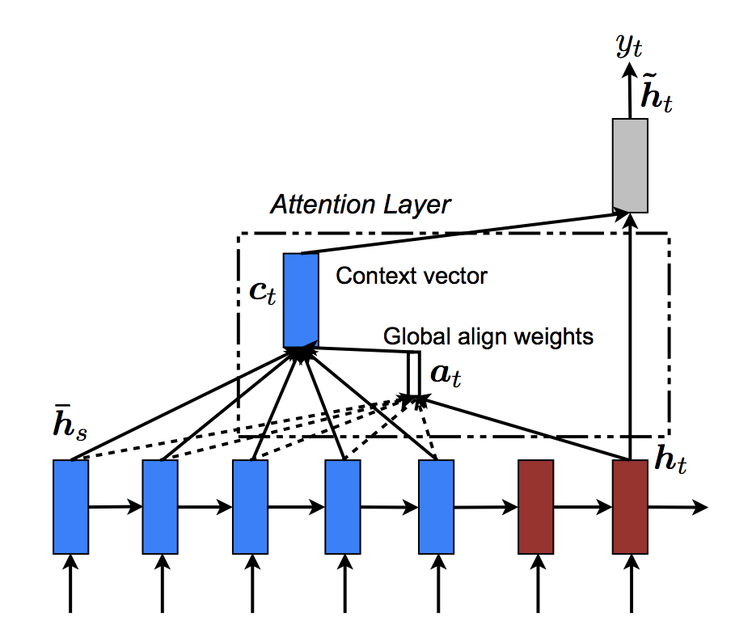
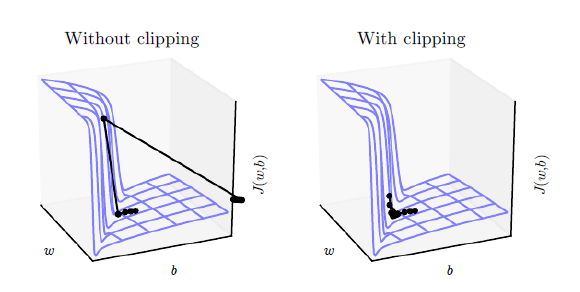

Note

Go to the end
to download the full example code.

# Chatbot Tutorial

**Author:** [Matthew Inkawhich](https://github.com/MatthewInkawhich)

In this tutorial, we explore a fun and interesting use-case of recurrent
sequence-to-sequence models. We will train a simple chatbot using movie
scripts from the [Cornell Movie-Dialogs
Corpus](https://www.cs.cornell.edu/~cristian/Cornell_Movie-Dialogs_Corpus.html).

Conversational models are a hot topic in artificial intelligence
research. Chatbots can be found in a variety of settings, including
customer service applications and online helpdesks. These bots are often
powered by retrieval-based models, which output predefined responses to
questions of certain forms. In a highly restricted domain like a
company's IT helpdesk, these models may be sufficient, however, they are
not robust enough for more general use-cases. Teaching a machine to
carry out a meaningful conversation with a human in multiple domains is
a research question that is far from solved. Recently, the deep learning
boom has allowed for powerful generative models like Google's [Neural
Conversational Model](https://arxiv.org/abs/1506.05869), which marks
a large step towards multi-domain generative conversational models. In
this tutorial, we will implement this kind of model in PyTorch.


```
> hello?
Bot: hello .
> where am I?
Bot: you re in a hospital .
> who are you?
Bot: i m a lawyer .
> how are you doing?
Bot: i m fine .
> are you my friend?
Bot: no .
> you're under arrest
Bot: i m trying to help you !
> i'm just kidding
Bot: i m sorry .
> where are you from?
Bot: san francisco .
> it's time for me to leave
Bot: i know .
> goodbye
Bot: goodbye .
```

**Tutorial Highlights**

- Handle loading and preprocessing of [Cornell Movie-Dialogs
Corpus](https://www.cs.cornell.edu/~cristian/Cornell_Movie-Dialogs_Corpus.html)
dataset
- Implement a sequence-to-sequence model with [Luong attention
mechanism(s)](https://arxiv.org/abs/1508.04025)
- Jointly train encoder and decoder models using mini-batches
- Implement greedy-search decoding module
- Interact with trained chatbot

**Acknowledgments**

This tutorial borrows code from the following sources:

1. Yuan-Kuei Wu's pytorch-chatbot implementation:
[ywk991112/pytorch-chatbot](https://github.com/ywk991112/pytorch-chatbot)
2. Sean Robertson's practical-pytorch seq2seq-translation example:
[spro/practical-pytorch](https://github.com/spro/practical-pytorch/tree/master/seq2seq-translation)
3. FloydHub Cornell Movie Corpus preprocessing code:
[floydhub/textutil-preprocess-cornell-movie-corpus](https://github.com/floydhub/textutil-preprocess-cornell-movie-corpus)

## Preparations

To get started, [download](https://zissou.infosci.cornell.edu/convokit/datasets/movie-corpus/movie-corpus.zip) the Movie-Dialogs Corpus zip file.

```
# and put in a ``data/`` directory under the current directory.
#
# After that, let's import some necessities.
#

# If the current `accelerator <https://pytorch.org/docs/stable/torch.html#accelerators>`__ is available,
# we will use it. Otherwise, we use the CPU.
```

## Load & Preprocess Data

The next step is to reformat our data file and load the data into
structures that we can work with.

The [Cornell Movie-Dialogs
Corpus](https://www.cs.cornell.edu/~cristian/Cornell_Movie-Dialogs_Corpus.html)
is a rich dataset of movie character dialog:

- 220,579 conversational exchanges between 10,292 pairs of movie
characters
- 9,035 characters from 617 movies
- 304,713 total utterances

This dataset is large and diverse, and there is a great variation of
language formality, time periods, sentiment, etc. Our hope is that this
diversity makes our model robust to many forms of inputs and queries.

First, we'll take a look at some lines of our datafile to see the
original format.

### Create formatted data file

For convenience, we'll create a nicely formatted data file in which each line
contains a tab-separated *query sentence* and a *response sentence* pair.

The following functions facilitate the parsing of the raw
`utterances.jsonl` data file.

- `loadLinesAndConversations` splits each line of the file into a dictionary of
lines with fields: `lineID`, `characterID`, and text and then groups them
into conversations with fields: `conversationID`, `movieID`, and lines.
- `extractSentencePairs` extracts pairs of sentences from
conversations

```
# Splits each line of the file to create lines and conversations

# Extracts pairs of sentences from conversations
```

Now we'll call these functions and create the file. We'll call it
`formatted_movie_lines.txt`.

```
# Define path to new file

# Unescape the delimiter

# Initialize lines dict and conversations dict

# Load lines and conversations

# Write new csv file

# Print a sample of lines
```

### Load and trim data

Our next order of business is to create a vocabulary and load
query/response sentence pairs into memory.

Note that we are dealing with sequences of **words**, which do not have
an implicit mapping to a discrete numerical space. Thus, we must create
one by mapping each unique word that we encounter in our dataset to an
index value.

For this we define a `Voc` class, which keeps a mapping from words to
indexes, a reverse mapping of indexes to words, a count of each word and
a total word count. The class provides methods for adding a word to the
vocabulary (`addWord`), adding all words in a sentence
(`addSentence`) and trimming infrequently seen words (`trim`). More
on trimming later.

```
# Default word tokens
```

Now we can assemble our vocabulary and query/response sentence pairs.
Before we are ready to use this data, we must perform some
preprocessing.

First, we must convert the Unicode strings to ASCII using
`unicodeToAscii`. Next, we should convert all letters to lowercase and
trim all non-letter characters except for basic punctuation
(`normalizeString`). Finally, to aid in training convergence, we will
filter out sentences with length greater than the `MAX_LENGTH`
threshold (`filterPairs`).

```
# Turn a Unicode string to plain ASCII, thanks to
# https://stackoverflow.com/a/518232/2809427

# Lowercase, trim, and remove non-letter characters

# Read query/response pairs and return a voc object

# Returns True if both sentences in a pair 'p' are under the MAX_LENGTH threshold

# Filter pairs using the ``filterPair`` condition

# Using the functions defined above, return a populated voc object and pairs list

# Load/Assemble voc and pairs

# Print some pairs to validate
```

Another tactic that is beneficial to achieving faster convergence during
training is trimming rarely used words out of our vocabulary. Decreasing
the feature space will also soften the difficulty of the function that
the model must learn to approximate. We will do this as a two-step
process:

1. Trim words used under `MIN_COUNT` threshold using the `voc.trim`
function.
2. Filter out pairs with trimmed words.

```
# Trim voc and pairs
```

## Prepare Data for Models

Although we have put a great deal of effort into preparing and massaging our
data into a nice vocabulary object and list of sentence pairs, our models
will ultimately expect numerical torch tensors as inputs. One way to
prepare the processed data for the models can be found in the [seq2seq
translation
tutorial](https://pytorch.org/tutorials/intermediate/seq2seq_translation_tutorial.html).
In that tutorial, we use a batch size of 1, meaning that all we have to
do is convert the words in our sentence pairs to their corresponding
indexes from the vocabulary and feed this to the models.

However, if you're interested in speeding up training and/or would like
to leverage GPU parallelization capabilities, you will need to train
with mini-batches.

Using mini-batches also means that we must be mindful of the variation
of sentence length in our batches. To accommodate sentences of different
sizes in the same batch, we will make our batched input tensor of shape
*(max_length, batch_size)*, where sentences shorter than the
*max_length* are zero padded after an *EOS_token*.

If we simply convert our English sentences to tensors by converting
words to their indexes(`indexesFromSentence`) and zero-pad, our
tensor would have shape *(batch_size, max_length)* and indexing the
first dimension would return a full sequence across all time-steps.
However, we need to be able to index our batch along time, and across
all sequences in the batch. Therefore, we transpose our input batch
shape to *(max_length, batch_size)*, so that indexing across the first
dimension returns a time step across all sentences in the batch. We
handle this transpose implicitly in the `zeroPadding` function.



The `inputVar` function handles the process of converting sentences to
tensor, ultimately creating a correctly shaped zero-padded tensor. It
also returns a tensor of `lengths` for each of the sequences in the
batch which will be passed to our decoder later.

The `outputVar` function performs a similar function to `inputVar`,
but instead of returning a `lengths` tensor, it returns a binary mask
tensor and a maximum target sentence length. The binary mask tensor has
the same shape as the output target tensor, but every element that is a
*PAD_token* is 0 and all others are 1.

`batch2TrainData` simply takes a bunch of pairs and returns the input
and target tensors using the aforementioned functions.

```
# Returns padded input sequence tensor and lengths

# Returns padded target sequence tensor, padding mask, and max target length

# Returns all items for a given batch of pairs

# Example for validation
```

## Define Models

### Seq2Seq Model

The brains of our chatbot is a sequence-to-sequence (seq2seq) model. The
goal of a seq2seq model is to take a variable-length sequence as an
input, and return a variable-length sequence as an output using a
fixed-sized model.

[Sutskever et al.](https://arxiv.org/abs/1409.3215) discovered that
by using two separate recurrent neural nets together, we can accomplish
this task. One RNN acts as an **encoder**, which encodes a variable
length input sequence to a fixed-length context vector. In theory, this
context vector (the final hidden layer of the RNN) will contain semantic
information about the query sentence that is input to the bot. The
second RNN is a **decoder**, which takes an input word and the context
vector, and returns a guess for the next word in the sequence and a
hidden state to use in the next iteration.



Image source:
[https://jeddy92.github.io/JEddy92.github.io/ts_seq2seq_intro/](https://jeddy92.github.io/JEddy92.github.io/ts_seq2seq_intro/)

### Encoder

The encoder RNN iterates through the input sentence one token
(e.g. word) at a time, at each time step outputting an "output" vector
and a "hidden state" vector. The hidden state vector is then passed to
the next time step, while the output vector is recorded. The encoder
transforms the context it saw at each point in the sequence into a set
of points in a high-dimensional space, which the decoder will use to
generate a meaningful output for the given task.

At the heart of our encoder is a multi-layered Gated Recurrent Unit,
invented by [Cho et al.](https://arxiv.org/pdf/1406.1078v3.pdf) in
2014. We will use a bidirectional variant of the GRU, meaning that there
are essentially two independent RNNs: one that is fed the input sequence
in normal sequential order, and one that is fed the input sequence in
reverse order. The outputs of each network are summed at each time step.
Using a bidirectional GRU will give us the advantage of encoding both
past and future contexts.

Bidirectional RNN:

[](../_images/RNN-bidirectional.png)

Image source: [https://colah.github.io/posts/2015-09-NN-Types-FP/](https://colah.github.io/posts/2015-09-NN-Types-FP/)

Note that an `embedding` layer is used to encode our word indices in
an arbitrarily sized feature space. For our models, this layer will map
each word to a feature space of size *hidden_size*. When trained, these
values should encode semantic similarity between similar meaning words.

Finally, if passing a padded batch of sequences to an RNN module, we
must pack and unpack padding around the RNN pass using
`nn.utils.rnn.pack_padded_sequence` and
`nn.utils.rnn.pad_packed_sequence` respectively.

**Computation Graph:**

> 1. Convert word indexes to embeddings.
> 2. Pack padded batch of sequences for RNN module.
> 3. Forward pass through GRU.
> 4. Unpack padding.
> 5. Sum bidirectional GRU outputs.
> 6. Return output and final hidden state.

**Inputs:**

- `input_seq`: batch of input sentences; shape=*(max_length,
batch_size)*
- `input_lengths`: list of sentence lengths corresponding to each
sentence in the batch; shape=*(batch_size)*
- `hidden`: hidden state; shape=*(n_layers x num_directions,
batch_size, hidden_size)*

**Outputs:**

- `outputs`: output features from the last hidden layer of the GRU
(sum of bidirectional outputs); shape=*(max_length, batch_size,
hidden_size)*
- `hidden`: updated hidden state from GRU; shape=*(n_layers x
num_directions, batch_size, hidden_size)*

### Decoder

The decoder RNN generates the response sentence in a token-by-token
fashion. It uses the encoder's context vectors, and internal hidden
states to generate the next word in the sequence. It continues
generating words until it outputs an *EOS_token*, representing the end
of the sentence. A common problem with a vanilla seq2seq decoder is that
if we rely solely on the context vector to encode the entire input
sequence's meaning, it is likely that we will have information loss.
This is especially the case when dealing with long input sequences,
greatly limiting the capability of our decoder.

To combat this, [Bahdanau et al.](https://arxiv.org/abs/1409.0473)
created an "attention mechanism" that allows the decoder to pay
attention to certain parts of the input sequence, rather than using the
entire fixed context at every step.

At a high level, attention is calculated using the decoder's current
hidden state and the encoder's outputs. The output attention weights
have the same shape as the input sequence, allowing us to multiply them
by the encoder outputs, giving us a weighted sum which indicates the
parts of encoder output to pay attention to. [Sean
Robertson's](https://github.com/spro) figure describes this very
well:



[Luong et al.](https://arxiv.org/abs/1508.04025) improved upon
Bahdanau et al.'s groundwork by creating "Global attention". The key
difference is that with "Global attention", we consider all of the
encoder's hidden states, as opposed to Bahdanau et al.'s "Local
attention", which only considers the encoder's hidden state from the
current time step. Another difference is that with "Global attention",
we calculate attention weights, or energies, using the hidden state of
the decoder from the current time step only. Bahdanau et al.'s attention
calculation requires knowledge of the decoder's state from the previous
time step. Also, Luong et al. provides various methods to calculate the
attention energies between the encoder output and decoder output which
are called "score functions":

[](../_images/scores.png)

where \(h_t\) = current target decoder state and \(\bar{h}_s\) =
all encoder states.

Overall, the Global attention mechanism can be summarized by the
following figure. Note that we will implement the "Attention Layer" as a
separate `nn.Module` called `Attn`. The output of this module is a
softmax normalized weights tensor of shape *(batch_size, 1,
max_length)*.

[](../_images/global_attn.png)

```
# Luong attention layer
```

Now that we have defined our attention submodule, we can implement the
actual decoder model. For the decoder, we will manually feed our batch
one time step at a time. This means that our embedded word tensor and
GRU output will both have shape *(1, batch_size, hidden_size)*.

**Computation Graph:**

> 1. Get embedding of current input word.
> 2. Forward through unidirectional GRU.
> 3. Calculate attention weights from the current GRU output from (2).
> 4. Multiply attention weights to encoder outputs to get new "weighted sum" context vector.
> 5. Concatenate weighted context vector and GRU output using Luong eq. 5.
> 6. Predict next word using Luong eq. 6 (without softmax).
> 7. Return output and final hidden state.

**Inputs:**

- `input_step`: one time step (one word) of input sequence batch;
shape=*(1, batch_size)*
- `last_hidden`: final hidden layer of GRU; shape=*(n_layers x
num_directions, batch_size, hidden_size)*
- `encoder_outputs`: encoder model's output; shape=*(max_length,
batch_size, hidden_size)*

**Outputs:**

- `output`: softmax normalized tensor giving probabilities of each
word being the correct next word in the decoded sequence;
shape=*(batch_size, voc.num_words)*
- `hidden`: final hidden state of GRU; shape=*(n_layers x
num_directions, batch_size, hidden_size)*

## Define Training Procedure

### Masked loss

Since we are dealing with batches of padded sequences, we cannot simply
consider all elements of the tensor when calculating loss. We define
`maskNLLLoss` to calculate our loss based on our decoder's output
tensor, the target tensor, and a binary mask tensor describing the
padding of the target tensor. This loss function calculates the average
negative log likelihood of the elements that correspond to a *1* in the
mask tensor.

### Single training iteration

The `train` function contains the algorithm for a single training
iteration (a single batch of inputs).

We will use a couple of clever tricks to aid in convergence:

- The first trick is using **teacher forcing**. This means that at some
probability, set by `teacher_forcing_ratio`, we use the current
target word as the decoder's next input rather than using the
decoder's current guess. This technique acts as training wheels for
the decoder, aiding in more efficient training. However, teacher
forcing can lead to model instability during inference, as the
decoder may not have a sufficient chance to truly craft its own
output sequences during training. Thus, we must be mindful of how we
are setting the `teacher_forcing_ratio`, and not be fooled by fast
convergence.
- The second trick that we implement is **gradient clipping**. This is
a commonly used technique for countering the "exploding gradient"
problem. In essence, by clipping or thresholding gradients to a
maximum value, we prevent the gradients from growing exponentially
and either overflow (NaN), or overshoot steep cliffs in the cost
function.

[](../_images/grad_clip.png)

Image source: Goodfellow et al. *Deep Learning*. 2016. [https://www.deeplearningbook.org/](https://www.deeplearningbook.org/)

**Sequence of Operations:**

> 1. Forward pass entire input batch through encoder.
> 2. Initialize decoder inputs as SOS_token, and hidden state as the encoder's final hidden state.
> 3. Forward input batch sequence through decoder one time step at a time.
> 4. If teacher forcing: set next decoder input as the current target; else: set next decoder input as current decoder output.
> 5. Calculate and accumulate loss.
> 6. Perform backpropagation.
> 7. Clip gradients.
> 8. Update encoder and decoder model parameters.

Note

PyTorch's RNN modules (`RNN`, `LSTM`, `GRU`) can be used like any
other non-recurrent layers by simply passing them the entire input
sequence (or batch of sequences). We use the `GRU` layer like this in
the `encoder`. The reality is that under the hood, there is an
iterative process looping over each time step calculating hidden states.
Alternatively, you can run these modules one time-step at a time. In
this case, we manually loop over the sequences during the training
process like we must do for the `decoder` model. As long as you
maintain the correct conceptual model of these modules, implementing
sequential models can be very straightforward.

### Training iterations

It is finally time to tie the full training procedure together with the
data. The `trainIters` function is responsible for running
`n_iterations` of training given the passed models, optimizers, data,
etc. This function is quite self explanatory, as we have done the heavy
lifting with the `train` function.

One thing to note is that when we save our model, we save a tarball
containing the encoder and decoder `state_dicts` (parameters), the
optimizers' `state_dicts`, the loss, the iteration, etc. Saving the model
in this way will give us the ultimate flexibility with the checkpoint.
After loading a checkpoint, we will be able to use the model parameters
to run inference, or we can continue training right where we left off.

## Define Evaluation

After training a model, we want to be able to talk to the bot ourselves.
First, we must define how we want the model to decode the encoded input.

### Greedy decoding

Greedy decoding is the decoding method that we use during training when
we are **NOT** using teacher forcing. In other words, for each time
step, we simply choose the word from `decoder_output` with the highest
softmax value. This decoding method is optimal on a single time-step
level.

To facilitate the greedy decoding operation, we define a
`GreedySearchDecoder` class. When run, an object of this class takes
an input sequence (`input_seq`) of shape *(input_seq length, 1)*, a
scalar input length (`input_length`) tensor, and a `max_length` to
bound the response sentence length. The input sentence is evaluated
using the following computational graph:

**Computation Graph:**

> 1. Forward input through encoder model.
> 2. Prepare encoder's final hidden layer to be first hidden input to the decoder.
> 3. Initialize decoder's first input as SOS_token.
> 4. Initialize tensors to append decoded words to.
> 5. Iteratively decode one word token at a time:
> 
> 1. Forward pass through decoder.
> 2. Obtain most likely word token and its softmax score.
> 3. Record token and score.
> 4. Prepare current token to be next decoder input.
> 6. Return collections of word tokens and scores.

### Evaluate my text

Now that we have our decoding method defined, we can write functions for
evaluating a string input sentence. The `evaluate` function manages
the low-level process of handling the input sentence. We first format
the sentence as an input batch of word indexes with *batch_size==1*. We
do this by converting the words of the sentence to their corresponding
indexes, and transposing the dimensions to prepare the tensor for our
models. We also create a `lengths` tensor which contains the length of
our input sentence. In this case, `lengths` is scalar because we are
only evaluating one sentence at a time (batch_size==1). Next, we obtain
the decoded response sentence tensor using our `GreedySearchDecoder`
object (`searcher`). Finally, we convert the response's indexes to
words and return the list of decoded words.

`evaluateInput` acts as the user interface for our chatbot. When
called, an input text field will spawn in which we can enter our query
sentence. After typing our input sentence and pressing *Enter*, our text
is normalized in the same way as our training data, and is ultimately
fed to the `evaluate` function to obtain a decoded output sentence. We
loop this process, so we can keep chatting with our bot until we enter
either "q" or "quit".

Finally, if a sentence is entered that contains a word that is not in
the vocabulary, we handle this gracefully by printing an error message
and prompting the user to enter another sentence.

## Run Model

Finally, it is time to run our model!

Regardless of whether we want to train or test the chatbot model, we
must initialize the individual encoder and decoder models. In the
following block, we set our desired configurations, choose to start from
scratch or set a checkpoint to load from, and build and initialize the
models. Feel free to play with different model configurations to
optimize performance.

```
# Configure models

#``attn_model = 'general'``
#``attn_model = 'concat'``

# Set checkpoint to load from; set to None if starting from scratch
```

Sample code to load from a checkpoint:

```
loadFilename = os.path.join(save_dir, model_name, corpus_name,
 '{}-{}_{}'.format(encoder_n_layers, decoder_n_layers, hidden_size),
 '{}_checkpoint.tar'.format(checkpoint_iter))
```

```
# Load model if a ``loadFilename`` is provided

# Initialize word embeddings

# Initialize encoder & decoder models

# Use appropriate device
```

### Run Training

Run the following block if you want to train the model.

First we set training parameters, then we initialize our optimizers, and
finally we call the `trainIters` function to run our training
iterations.

```
# Configure training/optimization

# Ensure dropout layers are in train mode

# Initialize optimizers

# If you have an accelerator, configure it to call

# Run training iterations
```

### Run Evaluation

To chat with your model, run the following block.

```
# Set dropout layers to ``eval`` mode

# Initialize search module

# Begin chatting (uncomment and run the following line to begin)
# evaluateInput(encoder, decoder, searcher, voc)
```

## Conclusion

That's all for this one, folks. Congratulations, you now know the
fundamentals to building a generative chatbot model! If you're
interested, you can try tailoring the chatbot's behavior by tweaking the
model and training parameters and customizing the data that you train
the model on.

Check out the other tutorials for more cool deep learning applications
in PyTorch!

```
# %%%%%%RUNNABLE_CODE_REMOVED%%%%%%
```

**Total running time of the script:** (0 minutes 0.004 seconds)

[`Download Jupyter notebook: chatbot_tutorial.ipynb`](../_downloads/44a84f8c1764dbf61662d306ff9ed43a/chatbot_tutorial.ipynb)

[`Download Python source code: chatbot_tutorial.py`](../_downloads/d90127b0deeb355be3a350521d770206/chatbot_tutorial.py)

[`Download zipped: chatbot_tutorial.zip`](../_downloads/38f7ebe164dfda80cf255d96796423f1/chatbot_tutorial.zip)