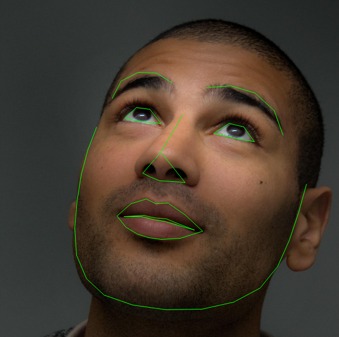

Note

Go to the end
to download the full example code.

# Writing Custom Datasets, DataLoaders and Transforms

**Author**: [Sasank Chilamkurthy](https://chsasank.github.io)

A lot of effort in solving any machine learning problem goes into
preparing the data. PyTorch provides many tools to make data loading
easy and hopefully, to make your code more readable. In this tutorial,
we will see how to load and preprocess/augment data from a non trivial
dataset.

To run this tutorial, please make sure the following packages are
installed:

- `scikit-image`: For image io and transforms
- `pandas`: For easier csv parsing

```
# Ignore warnings
```

The dataset we are going to deal with is that of facial pose.
This means that a face is annotated like this:

[](../_images/landmarked_face2.png)

Over all, 68 different landmark points are annotated for each face.

Note

Download the dataset from [here](https://download.pytorch.org/tutorial/faces.zip)
so that the images are in a directory named 'data/faces/'.
This dataset was actually
generated by applying excellent [dlib's pose
estimation](https://blog.dlib.net/2014/08/real-time-face-pose-estimation.html)
on a few images from imagenet tagged as 'face'.

Dataset comes with a `.csv` file with annotations which looks like this:

```
image_name,part_0_x,part_0_y,part_1_x,part_1_y,part_2_x, ... ,part_67_x,part_67_y
0805personali01.jpg,27,83,27,98, ... 84,134
1084239450_e76e00b7e7.jpg,70,236,71,257, ... ,128,312
```

Let's take a single image name and its annotations from the CSV, in this case row index number 65
for person-7.jpg just as an example. Read it, store the image name in `img_name` and store its
annotations in an (L, 2) array `landmarks` where L is the number of landmarks in that row.

Let's write a simple helper function to show an image and its landmarks
and use it to show a sample.

## Dataset class

`torch.utils.data.Dataset` is an abstract class representing a
dataset.
Your custom dataset should inherit `Dataset` and override the following
methods:

- `__len__` so that `len(dataset)` returns the size of the dataset.
- `__getitem__` to support the indexing such that `dataset[i]` can
be used to get \(i\)th sample.

Let's create a dataset class for our face landmarks dataset. We will
read the csv in `__init__` but leave the reading of images to
`__getitem__`. This is memory efficient because all the images are not
stored in the memory at once but read as required.

Sample of our dataset will be a dict
`{'image': image, 'landmarks': landmarks}`. Our dataset will take an
optional argument `transform` so that any required processing can be
applied on the sample. We will see the usefulness of `transform` in the
next section.

Let's instantiate this class and iterate through the data samples. We
will print the sizes of first 4 samples and show their landmarks.

## Transforms

One issue we can see from the above is that the samples are not of the
same size. Most neural networks expect the images of a fixed size.
Therefore, we will need to write some preprocessing code.
Let's create three transforms:

- `Rescale`: to scale the image
- `RandomCrop`: to crop from image randomly. This is data
augmentation.
- `ToTensor`: to convert the numpy images to torch images (we need to
swap axes).

We will write them as callable classes instead of simple functions so
that parameters of the transform need not be passed every time it's
called. For this, we just need to implement `__call__` method and
if required, `__init__` method. We can then use a transform like this:

```
tsfm = Transform(params)
transformed_sample = tsfm(sample)
```

Observe below how these transforms had to be applied both on the image and
landmarks.

Note

In the example above, RandomCrop uses an external library's random number generator
(in this case, Numpy's np.random.int). This can result in unexpected behavior with DataLoader
(see [here](https://pytorch.org/docs/stable/notes/faq.html#my-data-loader-workers-return-identical-random-numbers)).
In practice, it is safer to stick to PyTorch's random number generator, e.g. by using torch.randint instead.

### Compose transforms

Now, we apply the transforms on a sample.

Let's say we want to rescale the shorter side of the image to 256 and
then randomly crop a square of size 224 from it. i.e, we want to compose
`Rescale` and `RandomCrop` transforms.
`torchvision.transforms.Compose` is a simple callable class which allows us
to do this.

```
# Apply each of the above transforms on sample.
```

## Iterating through the dataset

Let's put this all together to create a dataset with composed
transforms.
To summarize, every time this dataset is sampled:

- An image is read from the file on the fly
- Transforms are applied on the read image
- Since one of the transforms is random, data is augmented on
sampling

We can iterate over the created dataset with a `for i in range`
loop as before.

However, we are losing a lot of features by using a simple `for` loop to
iterate over the data. In particular, we are missing out on:

- Batching the data
- Shuffling the data
- Load the data in parallel using `multiprocessing` workers.

`torch.utils.data.DataLoader` is an iterator which provides all these
features. Parameters used below should be clear. One parameter of
interest is `collate_fn`. You can specify how exactly the samples need
to be batched using `collate_fn`. However, default collate should work
fine for most use cases.

```
# Helper function to show a batch

# if you are using Windows, uncomment the next line and indent the for loop.
# you might need to go back and change ``num_workers`` to 0.

# if __name__ == '__main__':
```

## Afterword: torchvision

In this tutorial, we have seen how to write and use datasets, transforms
and dataloader. `torchvision` package provides some common datasets and
transforms. You might not even have to write custom classes. One of the
more generic datasets available in torchvision is `ImageFolder`.
It assumes that images are organized in the following way:

```
root/ants/xxx.png
root/ants/xxy.jpeg
root/ants/xxz.png
.
.
.
root/bees/123.jpg
root/bees/nsdf3.png
root/bees/asd932_.png
```

where 'ants', 'bees' etc. are class labels. Similarly generic transforms
which operate on `PIL.Image` like `RandomHorizontalFlip`, `Scale`,
are also available. You can use these to write a dataloader like this:

```
import torch
from torchvision import transforms, datasets

data_transform = transforms.Compose([
 transforms.RandomResizedCrop(224),
 transforms.RandomHorizontalFlip(),
 transforms.ToTensor(),
 transforms.Normalize(mean=[0.485, 0.456, 0.406],
 std=[0.229, 0.224, 0.225])
 ])
hymenoptera_dataset = datasets.ImageFolder(root='hymenoptera_data/train',
 transform=data_transform)
dataset_loader = torch.utils.data.DataLoader(hymenoptera_dataset,
 batch_size=4, shuffle=True,
 num_workers=4)
```

For an example with training code, please see
[Transfer Learning for Computer Vision Tutorial](transfer_learning_tutorial.html).

```
# %%%%%%RUNNABLE_CODE_REMOVED%%%%%%
```

**Total running time of the script:** (0 minutes 0.003 seconds)

[`Download Jupyter notebook: data_loading_tutorial.ipynb`](../_downloads/f498e3bcd9b6159ecfb1a07d6551287d/data_loading_tutorial.ipynb)

[`Download Python source code: data_loading_tutorial.py`](../_downloads/6042bacf7948939030769777afe22e55/data_loading_tutorial.py)

[`Download zipped: data_loading_tutorial.zip`](../_downloads/87fbf07e3a7a367017f554174f91759e/data_loading_tutorial.zip)