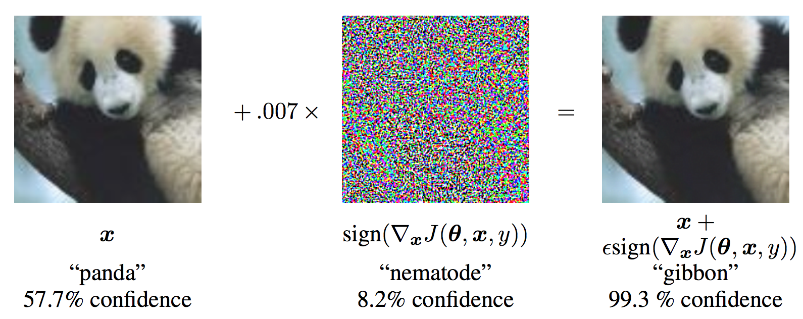

Note

Go to the end
to download the full example code.

# Adversarial Example Generation

**Author:** [Nathan Inkawhich](https://github.com/inkawhich)

If you are reading this, hopefully you can appreciate how effective some
machine learning models are. Research is constantly pushing ML models to
be faster, more accurate, and more efficient. However, an often
overlooked aspect of designing and training models is security and
robustness, especially in the face of an adversary who wishes to fool
the model.

This tutorial will raise your awareness to the security vulnerabilities
of ML models, and will give insight into the hot topic of adversarial
machine learning. You may be surprised to find that adding imperceptible
perturbations to an image *can* cause drastically different model
performance. Given that this is a tutorial, we will explore the topic
via example on an image classifier. Specifically, we will use one of the
first and most popular attack methods, the Fast Gradient Sign Attack
(FGSM), to fool an MNIST classifier.

## Threat Model

For context, there are many categories of adversarial attacks, each with
a different goal and assumption of the attacker's knowledge. However, in
general the overarching goal is to add the least amount of perturbation
to the input data to cause the desired misclassification. There are
several kinds of assumptions of the attacker's knowledge, two of which
are: **white-box** and **black-box**. A *white-box* attack assumes the
attacker has full knowledge and access to the model, including
architecture, inputs, outputs, and weights. A *black-box* attack assumes
the attacker only has access to the inputs and outputs of the model, and
knows nothing about the underlying architecture or weights. There are
also several types of goals, including **misclassification** and
**source/target misclassification**. A goal of *misclassification* means
the adversary only wants the output classification to be wrong but does
not care what the new classification is. A *source/target
misclassification* means the adversary wants to alter an image that is
originally of a specific source class so that it is classified as a
specific target class.

In this case, the FGSM attack is a *white-box* attack with the goal of
*misclassification*. With this background information, we can now
discuss the attack in detail.

## Fast Gradient Sign Attack

One of the first and most popular adversarial attacks to date is
referred to as the *Fast Gradient Sign Attack (FGSM)* and is described
by Goodfellow et. al. in [Explaining and Harnessing Adversarial
Examples](https://arxiv.org/abs/1412.6572). The attack is remarkably
powerful, and yet intuitive. It is designed to attack neural networks by
leveraging the way they learn, *gradients*. The idea is simple, rather
than working to minimize the loss by adjusting the weights based on the
backpropagated gradients, the attack *adjusts the input data to maximize
the loss* based on the same backpropagated gradients. In other words,
the attack uses the gradient of the loss w.r.t the input data, then
adjusts the input data to maximize the loss.

Before we jump into the code, let's look at the famous
[FGSM](https://arxiv.org/abs/1412.6572) panda example and extract
some notation.



From the figure, \(\mathbf{x}\) is the original input image
correctly classified as a "panda", \(y\) is the ground truth label
for \(\mathbf{x}\), \(\mathbf{\theta}\) represents the model
parameters, and \(J(\mathbf{\theta}, \mathbf{x}, y)\) is the loss
that is used to train the network. The attack backpropagates the
gradient back to the input data to calculate
\(\nabla_{x} J(\mathbf{\theta}, \mathbf{x}, y)\). Then, it adjusts
the input data by a small step (\(\epsilon\) or \(0.007\) in the
picture) in the direction (i.e.
\(sign(\nabla_{x} J(\mathbf{\theta}, \mathbf{x}, y))\)) that will
maximize the loss. The resulting perturbed image, \(x'\), is then
*misclassified* by the target network as a "gibbon" when it is still
clearly a "panda".

Hopefully now the motivation for this tutorial is clear, so lets jump
into the implementation.

## Implementation

In this section, we will discuss the input parameters for the tutorial,
define the model under attack, then code the attack and run some tests.

### Inputs

There are only three inputs for this tutorial, and are defined as
follows:

- `epsilons` - List of epsilon values to use for the run. It is
important to keep 0 in the list because it represents the model
performance on the original test set. Also, intuitively we would
expect the larger the epsilon, the more noticeable the perturbations
but the more effective the attack in terms of degrading model
accuracy. Since the data range here is \([0,1]\), no epsilon
value should exceed 1.
- `pretrained_model` - path to the pretrained MNIST model which was
trained with
[pytorch/examples/mnist](https://github.com/pytorch/examples/tree/master/mnist).
For simplicity, download the pretrained model [here](https://drive.google.com/file/d/1HJV2nUHJqclXQ8flKvcWmjZ-OU5DGatl/view?usp=drive_link).

```
# Set random seed for reproducibility
```

### Model Under Attack

As mentioned, the model under attack is the same MNIST model from
[pytorch/examples/mnist](https://github.com/pytorch/examples/tree/master/mnist).
You may train and save your own MNIST model or you can download and use
the provided model. The *Net* definition and test dataloader here have
been copied from the MNIST example. The purpose of this section is to
define the model and dataloader, then initialize the model and load the
pretrained weights.

```
# LeNet Model definition

# MNIST Test dataset and dataloader declaration

# We want to be able to train our model on an `accelerator <https://pytorch.org/docs/stable/torch.html#accelerators>`__
# such as CUDA, MPS, MTIA, or XPU. If the current accelerator is available, we will use it. Otherwise, we use the CPU.

# Initialize the network

# Load the pretrained model

# Set the model in evaluation mode. In this case this is for the Dropout layers
```

### FGSM Attack

Now, we can define the function that creates the adversarial examples by
perturbing the original inputs. The `fgsm_attack` function takes three
inputs, *image* is the original clean image (\(x\)), *epsilon* is
the pixel-wise perturbation amount (\(\epsilon\)), and *data_grad*
is gradient of the loss w.r.t the input image
(\(\nabla_{x} J(\mathbf{\theta}, \mathbf{x}, y)\)). The function
then creates perturbed image as

\[perturbed\_image = image + epsilon*sign(data\_grad) = x + \epsilon * sign(\nabla_{x} J(\mathbf{\theta}, \mathbf{x}, y))

\]

Finally, in order to maintain the original range of the data, the
perturbed image is clipped to range \([0,1]\).

```
# FGSM attack code

# restores the tensors to their original scale
```

### Testing Function

Finally, the central result of this tutorial comes from the `test`
function. Each call to this test function performs a full test step on
the MNIST test set and reports a final accuracy. However, notice that
this function also takes an *epsilon* input. This is because the
`test` function reports the accuracy of a model that is under attack
from an adversary with strength \(\epsilon\). More specifically, for
each sample in the test set, the function computes the gradient of the
loss w.r.t the input data (\(data\_grad\)), creates a perturbed
image with `fgsm_attack` (\(perturbed\_data\)), then checks to see
if the perturbed example is adversarial. In addition to testing the
accuracy of the model, the function also saves and returns some
successful adversarial examples to be visualized later.

### Run Attack

The last part of the implementation is to actually run the attack. Here,
we run a full test step for each epsilon value in the *epsilons* input.
For each epsilon we also save the final accuracy and some successful
adversarial examples to be plotted in the coming sections. Notice how
the printed accuracies decrease as the epsilon value increases. Also,
note the \(\epsilon=0\) case represents the original test accuracy,
with no attack.

```
# Run test for each epsilon
```

## Results

### Accuracy vs Epsilon

The first result is the accuracy versus epsilon plot. As alluded to
earlier, as epsilon increases we expect the test accuracy to decrease.
This is because larger epsilons mean we take a larger step in the
direction that will maximize the loss. Notice the trend in the curve is
not linear even though the epsilon values are linearly spaced. For
example, the accuracy at \(\epsilon=0.05\) is only about 4% lower
than \(\epsilon=0\), but the accuracy at \(\epsilon=0.2\) is 25%
lower than \(\epsilon=0.15\). Also, notice the accuracy of the model
hits random accuracy for a 10-class classifier between
\(\epsilon=0.25\) and \(\epsilon=0.3\).

### Sample Adversarial Examples

Remember the idea of no free lunch? In this case, as epsilon increases
the test accuracy decreases **BUT** the perturbations become more easily
perceptible. In reality, there is a tradeoff between accuracy
degradation and perceptibility that an attacker must consider. Here, we
show some examples of successful adversarial examples at each epsilon
value. Each row of the plot shows a different epsilon value. The first
row is the \(\epsilon=0\) examples which represent the original
"clean" images with no perturbation. The title of each image shows the
"original classification -> adversarial classification." Notice, the
perturbations start to become evident at \(\epsilon=0.15\) and are
quite evident at \(\epsilon=0.3\). However, in all cases humans are
still capable of identifying the correct class despite the added noise.

```
# Plot several examples of adversarial samples at each epsilon
```

## Where to go next?

Hopefully this tutorial gives some insight into the topic of adversarial
machine learning. There are many potential directions to go from here.
This attack represents the very beginning of adversarial attack research
and since there have been many subsequent ideas for how to attack and
defend ML models from an adversary. In fact, at NIPS 2017 there was an
adversarial attack and defense competition and many of the methods used
in the competition are described in this paper: [Adversarial Attacks and
Defences Competition](https://arxiv.org/pdf/1804.00097.pdf). The work
on defense also leads into the idea of making machine learning models
more *robust* in general, to both naturally perturbed and adversarially
crafted inputs.

Another direction to go is adversarial attacks and defense in different
domains. Adversarial research is not limited to the image domain, check
out [this](https://arxiv.org/pdf/1801.01944.pdf) attack on
speech-to-text models. But perhaps the best way to learn more about
adversarial machine learning is to get your hands dirty. Try to
implement a different attack from the NIPS 2017 competition, and see how
it differs from FGSM. Then, try to defend the model from your own
attacks.

A further direction to go, depending on available resources, is to modify
the code to support processing work in batch, in parallel, and or distributed
vs working on one attack at a time in the above for each `epsilon test()` loop.

```
# %%%%%%RUNNABLE_CODE_REMOVED%%%%%%
```

**Total running time of the script:** (0 minutes 0.003 seconds)

[`Download Jupyter notebook: fgsm_tutorial.ipynb`](../_downloads/56c122e1c18e5e07666673e900acaed5/fgsm_tutorial.ipynb)

[`Download Python source code: fgsm_tutorial.py`](../_downloads/377bf4a7b1761e5f081e057385870d8e/fgsm_tutorial.py)

[`Download zipped: fgsm_tutorial.zip`](../_downloads/20e0cd443ee8621ecc24d0dfdeb6a3d0/fgsm_tutorial.zip)