# Introduction to Holistic Trace Analysis

**Author:** [Anupam Bhatnagar](https://github.com/anupambhatnagar)

In this tutorial, we demonstrate how to use Holistic Trace Analysis (HTA) to
analyze traces from a distributed training job. To get started follow the steps
below.

## Installing HTA

We recommend using a Conda environment to install HTA. To install Anaconda, see
[the official Anaconda documentation](https://docs.anaconda.com/anaconda/install/index.html).

1. Install HTA using pip:

```
pip install HolisticTraceAnalysis
```
2. (Optional and recommended) Set up a Conda environment:

```
# create the environment env_name
conda create -n env_name

# activate the environment
conda activate env_name

# When you are done, deactivate the environment by running ``conda deactivate``
```

## Getting Started

Launch a Jupyter notebook and set the `trace_dir` variable to the location of the traces.

```
from hta.trace_analysis import TraceAnalysis
trace_dir = "/path/to/folder/with/traces"
analyzer = TraceAnalysis(trace_dir=trace_dir)
```

### Temporal Breakdown

To effectively utilize the GPUs, it is crucial to understand how they are spending
time for a specific job. Are they primarily engaged in computation, communication,
memory events, or are they idle? The temporal breakdown feature provides a detailed
analysis of the time spent in these three categories.

- Idle time - GPU is idle.
- Compute time - GPU is being used for matrix multiplications or vector operations.
- Non-compute time - GPU is being used for communication or memory events.

To achieve high training efficiency, the code should maximize compute time and
minimize idle time and non-compute time. The following function generates a
dataframe that provides a detailed breakdown of the temporal usage for each rank.

```
analyzer = TraceAnalysis(trace_dir = "/path/to/trace/folder")
time_spent_df = analyzer.get_temporal_breakdown()
```

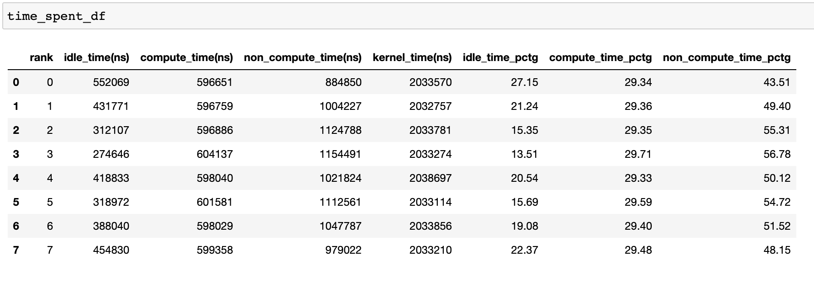

When the `visualize` argument is set to `True` in the [get_temporal_breakdown](https://hta.readthedocs.io/en/latest/source/api/trace_analysis_api.html#hta.trace_analysis.TraceAnalysis.get_temporal_breakdown)
function it also generates a bar graph representing the breakdown by rank.

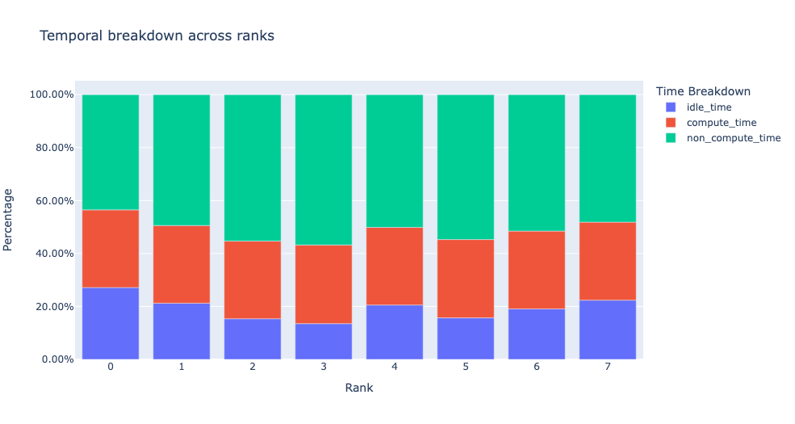

### Idle Time Breakdown

Gaining insight into the amount of time the GPU spends idle and the
reasons behind it can help guide optimization strategies. A GPU is
considered idle when no kernel is running on it. We have developed an
algorithm to categorize the Idle time into three distinct categories:

- **Host wait:** refers to the idle time on the GPU that is caused by
the CPU not enqueuing kernels quickly enough to keep the GPU fully utilized.
These types of inefficiencies can be addressed by examining the CPU
operators that are contributing to the slowdown, increasing the batch
size and applying operator fusion.
- **Kernel wait:** This refers to brief overhead associated with launching
consecutive kernels on the GPU. The idle time attributed to this category
can be minimized by using CUDA Graph optimizations.
- **Other wait:** This category includes idle time that cannot currently
be attributed due to insufficient information. The likely causes include
synchronization among CUDA streams using CUDA events and delays in launching
kernels.

The host wait time can be interpreted as the time when the GPU is stalling due
to the CPU. To attribute the idle time as kernel wait we use the following
heuristic:

> **gap between consecutive kernels < threshold**

The default threshold value is 30 nanoseconds and can be configured using the
`consecutive_kernel_delay` argument. By default, the idle time breakdown is
computed for rank 0 only. In order to calculate the breakdown for other ranks,
use the `ranks` argument in the [get_idle_time_breakdown](https://hta.readthedocs.io/en/latest/source/api/trace_analysis_api.html#hta.trace_analysis.TraceAnalysis.get_idle_time_breakdown)
function. The idle time breakdown can be generated as follows:

```
analyzer = TraceAnalysis(trace_dir = "/path/to/trace/folder")
idle_time_df = analyzer.get_idle_time_breakdown()
```

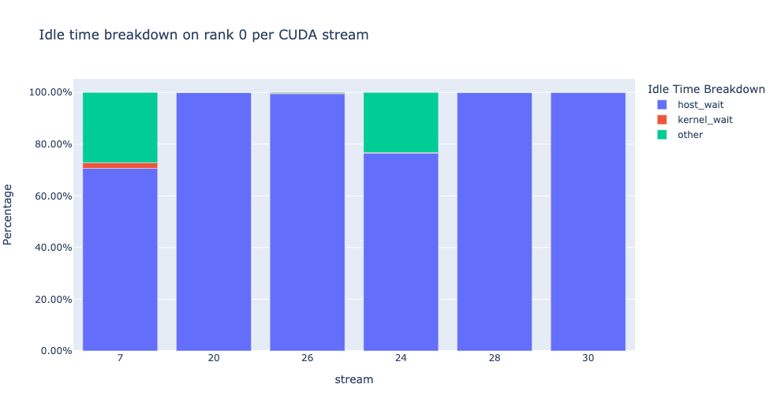

The function returns a tuple of dataframes. The first dataframe contains the
idle time by category on each stream for each rank.

[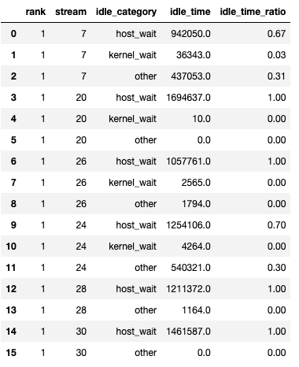](../_images/idle_time.png)

The second dataframe is generated when `show_idle_interval_stats` is set to
`True`. It contains the summary statistics of the idle time for each stream
on each rank.

[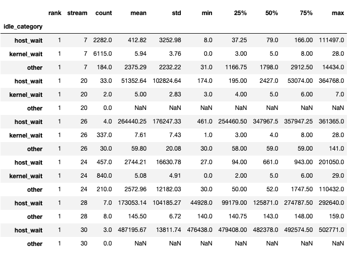](../_images/idle_time_summary.png)

Tip

By default, the idle time breakdown presents the percentage of each of the
idle time categories. Setting the `visualize_pctg` argument to `False`,
the function renders with absolute time on the y-axis.

### Kernel Breakdown

The kernel breakdown feature breaks down the time spent for each kernel type,
such as communication (COMM), computation (COMP), and memory (MEM), across all
ranks and presents the proportion of time spent in each category. Here is the
percentage of time spent in each category as a pie chart:

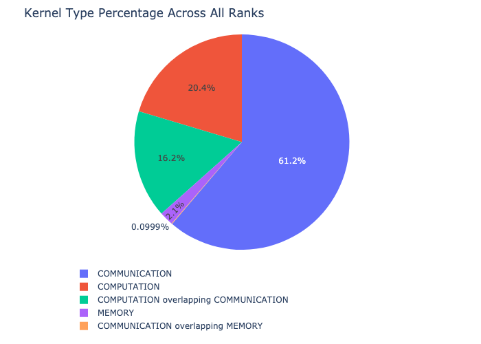

The kernel breakdown can be calculated as follows:

```
analyzer = TraceAnalysis(trace_dir = "/path/to/trace/folder")
kernel_type_metrics_df, kernel_metrics_df = analyzer.get_gpu_kernel_breakdown()
```

The first dataframe returned by the function contains the raw values used to
generate the pie chart.

#### Kernel Duration Distribution

The second dataframe returned by [get_gpu_kernel_breakdown](https://hta.readthedocs.io/en/latest/source/api/trace_analysis_api.html#hta.trace_analysis.TraceAnalysis.get_gpu_kernel_breakdown)
contains duration summary statistics for each kernel. In particular, this
includes the count, min, max, average, standard deviation, sum, and kernel type
for each kernel on each rank.

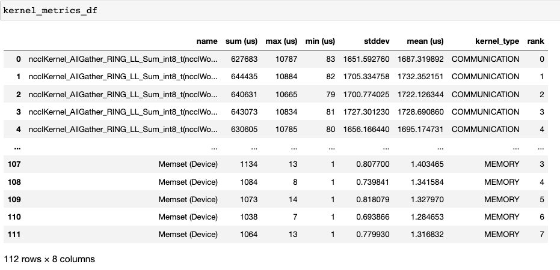

Using this data HTA creates many visualizations to identify performance
bottlenecks.

1. Pie charts of the top kernels for each kernel type for each rank.
2. Bar graphs of the average duration across all ranks for each of the top
kernels and for each kernel type.

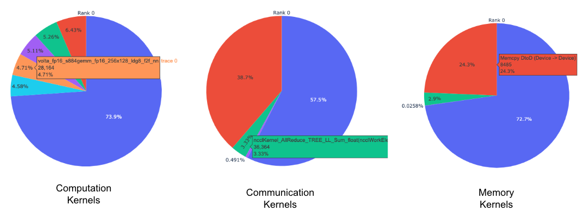

Tip

All images are generated using plotly. Hovering on the graph shows the
mode bar on the top right which allows the user to zoom, pan, select, and
download the graph.

The pie charts above show the top 5 computation, communication, and memory
kernels. Similar pie charts are generated for each rank. The pie charts can be
configured to show the top k kernels using the `num_kernels` argument passed
to the get_gpu_kernel_breakdown function. Additionally, the
`duration_ratio` argument can be used to tune the percentage of time that
needs to be analyzed. If both `num_kernels` and `duration_ratio` are
specified, then `num_kernels` takes precedence.

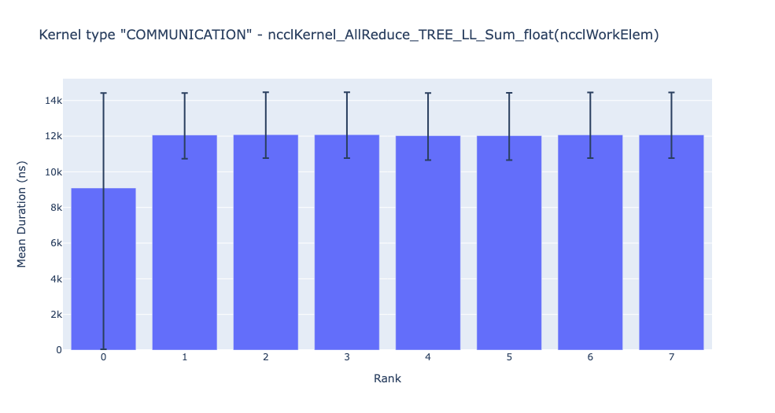

The bar graph above shows the average duration of the NCCL AllReduce kernel
across all the ranks. The black lines indicate the minimum and maximum time
taken on each rank.

Warning

When using jupyter-lab set the "image_renderer" argument value to
"jupyterlab" otherwise the graphs will not render in the notebook.

For a detailed walkthrough of this feature see the [gpu_kernel_breakdown
notebook](https://github.com/facebookresearch/HolisticTraceAnalysis/blob/main/examples/kernel_breakdown_demo.ipynb)
in the examples folder of the repo.

### Communication Computation Overlap

In distributed training, a significant amount of time is spent in communication
and synchronization events between GPUs. To achieve high GPU efficiency (such as
TFLOPS/GPU), it is crucial to keep the GPU oversubscribed with computation
kernels. In other words, the GPU should not be blocked due to unresolved data
dependencies. One way to measure the extent to which computation is blocked by
data dependencies is to calculate the communication computation overlap. Higher
GPU efficiency is observed if communication events overlap computation events.
Lack of communication and computation overlap will lead to the GPU being idle,
resulting in low efficiency.
To sum up, a higher communication computation overlap is desirable. To calculate
the overlap percentage for each rank, we measure the following ratio:

> **(time spent in computation while communicating) / (time spent in communication)**

The communication computation overlap can be calculated as follows:

```
analyzer = TraceAnalysis(trace_dir = "/path/to/trace/folder")
overlap_df = analyzer.get_comm_comp_overlap()
```

The function returns a dataframe containing the overlap percentage
for each rank.

[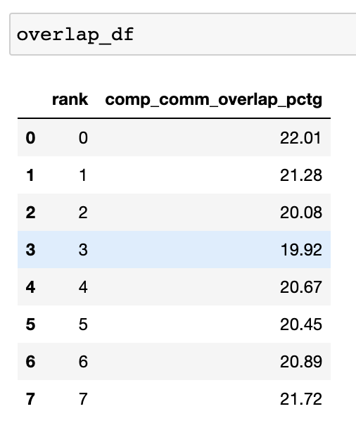](../_images/overlap_df.png)

When the `visualize` argument is set to True, the [get_comm_comp_overlap](https://hta.readthedocs.io/en/latest/source/api/trace_analysis_api.html#hta.trace_analysis.TraceAnalysis.get_comm_comp_overlap)
function also generates a bar graph representing the overlap by rank.

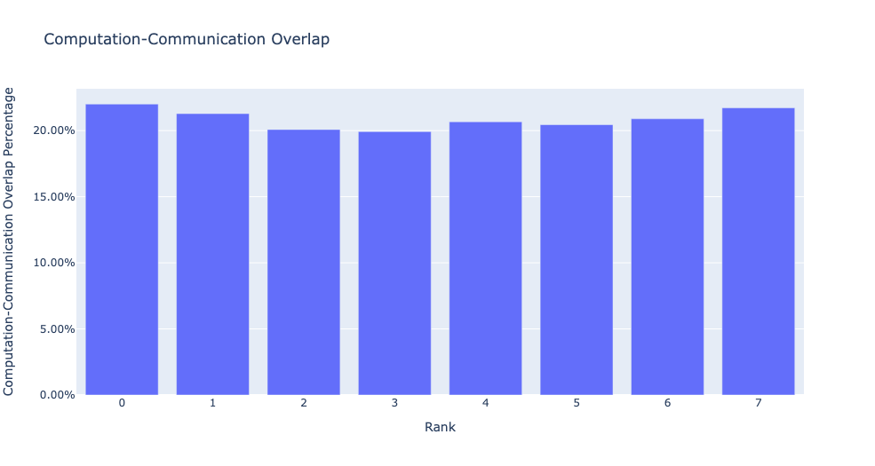

### Augmented Counters

#### Memory Bandwidth & Queue Length Counters

Memory bandwidth counters measure the memory copy bandwidth used while copying
the data from H2D, D2H and D2D by memory copy (memcpy) and memory set (memset)
events. HTA also computes the number of outstanding operations on each CUDA
stream. We refer to this as **queue length**. When the queue length on a stream
is 1024 or larger new events cannot be scheduled on that stream and the CPU
will stall until the events on the GPU stream have processed.

The [generate_trace_with_counters](https://hta.readthedocs.io/en/latest/source/api/trace_analysis_api.html#hta.trace_analysis.TraceAnalysis.generate_trace_with_counters)
API outputs a new trace file with the memory bandwidth and queue length
counters. The new trace file contains tracks which indicate the memory
bandwidth used by memcpy/memset operations and tracks for the queue length on
each stream. By default, these counters are generated using the rank 0
trace file, and the new file contains the suffix `_with_counters` in its name.
Users have the option to generate the counters for multiple ranks by using the
`ranks` argument in the `generate_trace_with_counters` API.

```
analyzer = TraceAnalysis(trace_dir = "/path/to/trace/folder")
analyzer.generate_trace_with_counters()
```

A screenshot of the generated trace file with augmented counters.

[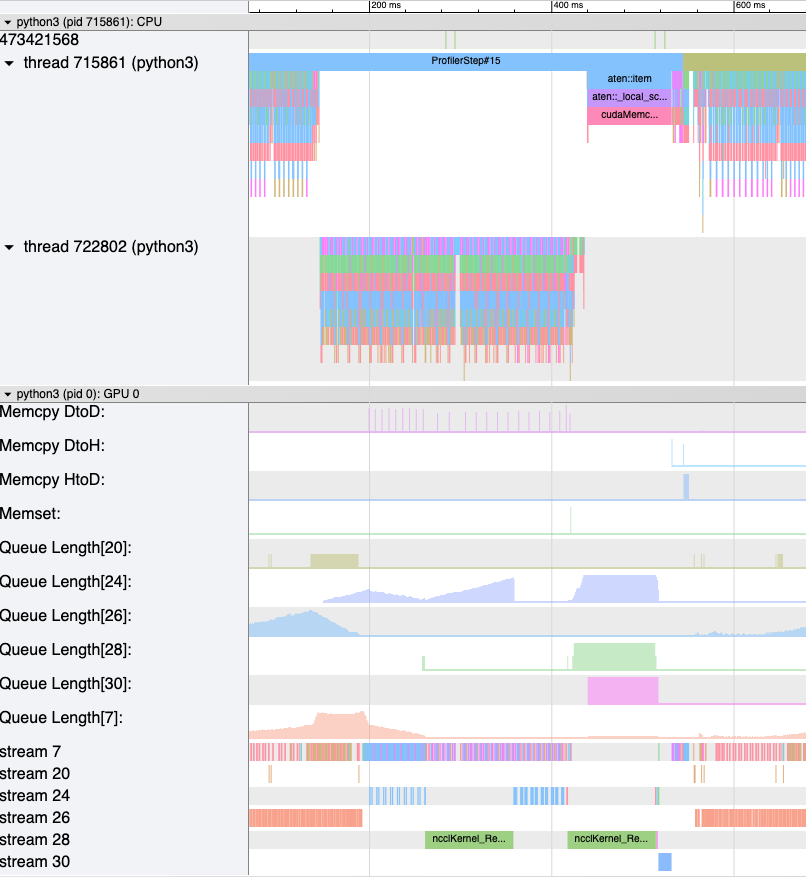](../_images/mem_bandwidth_queue_length.png)

HTA also provides a summary of the memory copy bandwidth and queue length
counters as well as the time series of the counters for the profiled portion of
the code using the following API:

- [get_memory_bw_summary](https://hta.readthedocs.io/en/latest/source/api/trace_analysis_api.html#hta.trace_analysis.TraceAnalysis.get_memory_bw_summary)
- [get_queue_length_summary](https://hta.readthedocs.io/en/latest/source/api/trace_analysis_api.html#hta.trace_analysis.TraceAnalysis.get_queue_length_summary)
- [get_memory_bw_time_series](https://hta.readthedocs.io/en/latest/source/api/trace_analysis_api.html#hta.trace_analysis.TraceAnalysis.get_memory_bw_time_series)
- [get_queue_length_time_series](https://hta.readthedocs.io/en/latest/source/api/trace_analysis_api.html#hta.trace_analysis.TraceAnalysis.get_queue_length_time_series)

To view the summary and time series, use:

```
# generate summary
mem_bw_summary = analyzer.get_memory_bw_summary()
queue_len_summary = analyzer.get_queue_length_summary()

# get time series
mem_bw_series = analyzer.get_memory_bw_time_series()
queue_len_series = analyzer.get_queue_length_series()
```

The summary contains the count, min, max, mean, standard deviation, 25th, 50th,
and 75th percentile.

[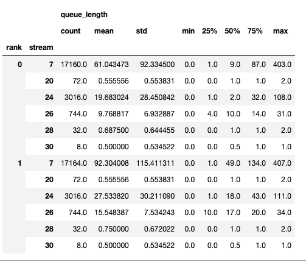](../_images/queue_length_summary.png)

The time series only contains the points when a value changes. Once a value is
observed the time series stays constant until the next update. The memory
bandwidth and queue length time series functions return a dictionary whose key
is the rank and the value is the time series for that rank. By default, the
time series is computed for rank 0 only.

### CUDA Kernel Launch Statistics

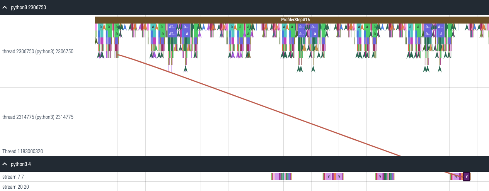

For each event launched on the GPU, there is a corresponding scheduling event on
the CPU, such as `CudaLaunchKernel`, `CudaMemcpyAsync`, `CudaMemsetAsync`.
These events are linked by a common correlation ID in the trace - see the figure
above. This feature computes the duration of the CPU runtime event, its corresponding GPU
kernel and the launch delay, for example, the difference between GPU kernel starting and
CPU operator ending. The kernel launch info can be generated as follows:

```
analyzer = TraceAnalysis(trace_dir="/path/to/trace/dir")
kernel_info_df = analyzer.get_cuda_kernel_launch_stats()
```

A screenshot of the generated dataframe is given below.

[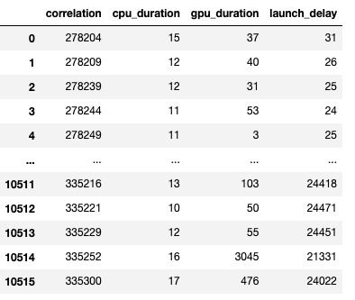](../_images/cuda_kernel_launch_stats.png)

The duration of the CPU op, GPU kernel, and the launch delay allow us to find
the following:

- **Short GPU kernels** - GPU kernels with duration less than the corresponding
CPU runtime event.
- **Runtime event outliers** - CPU runtime events with excessive duration.
- **Launch delay outliers** - GPU kernels which take too long to be scheduled.

HTA generates distribution plots for each of the aforementioned three categories.

**Short GPU kernels**

Typically, the launch time on the CPU side ranges from 5-20 microseconds. In some
cases, the GPU execution time is lower than the launch time itself. The graph
below helps us to find how frequently such instances occur in the code.

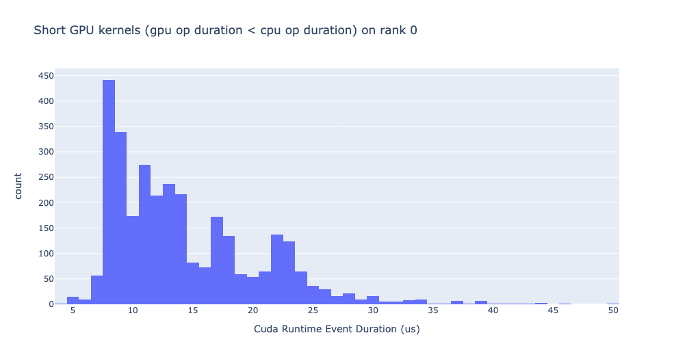

**Runtime event outliers**

The runtime outliers depend on the cutoff used to classify the outliers, hence
the [get_cuda_kernel_launch_stats](https://hta.readthedocs.io/en/latest/source/api/trace_analysis_api.html#hta.trace_analysis.TraceAnalysis.get_cuda_kernel_launch_stats)
API provides the `runtime_cutoff` argument to configure the value.

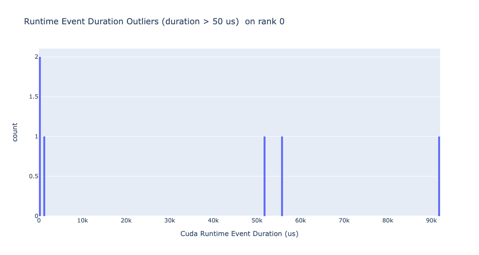

**Launch delay outliers**

The launch delay outliers depend on the cutoff used to classify the outliers,
hence the get_cuda_kernel_launch_stats API provides the
`launch_delay_cutoff` argument to configure the value.

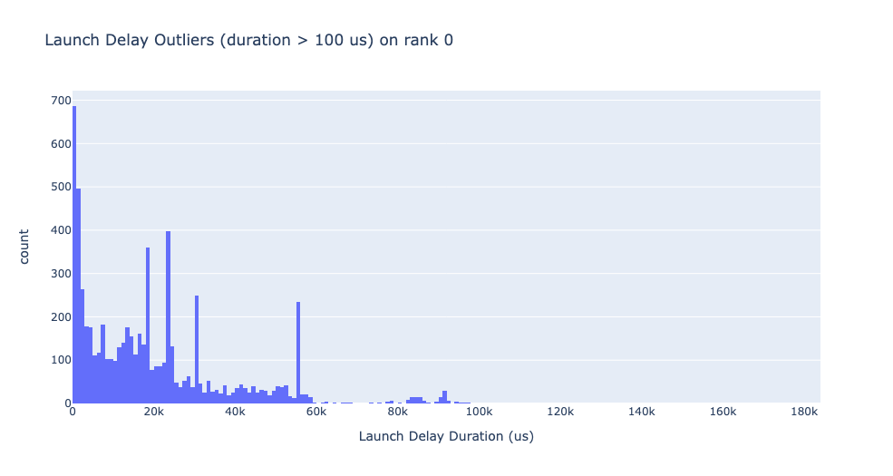

## Conclusion

In this tutorial, you have learned how to install and use HTA,
a performance tool that enables you analyze bottlenecks in your distributed
training workflows. To learn how you can use the HTA tool to perform trace
diff analysis, see [Trace Diff using Holistic Trace Analysis](https://pytorch.org/tutorials/beginner/hta_trace_diff_tutorial.html).