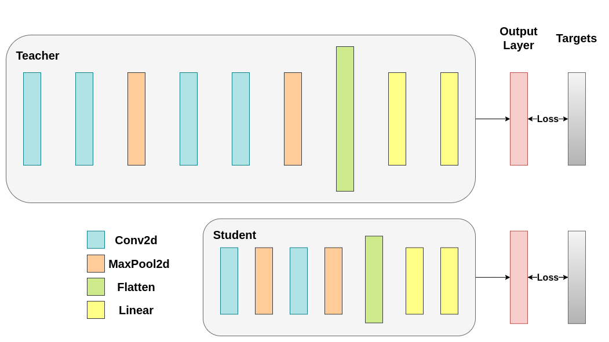
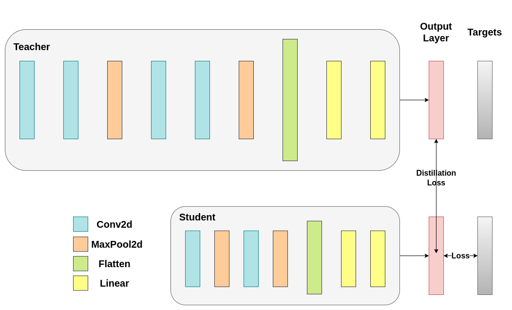
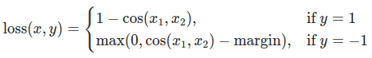
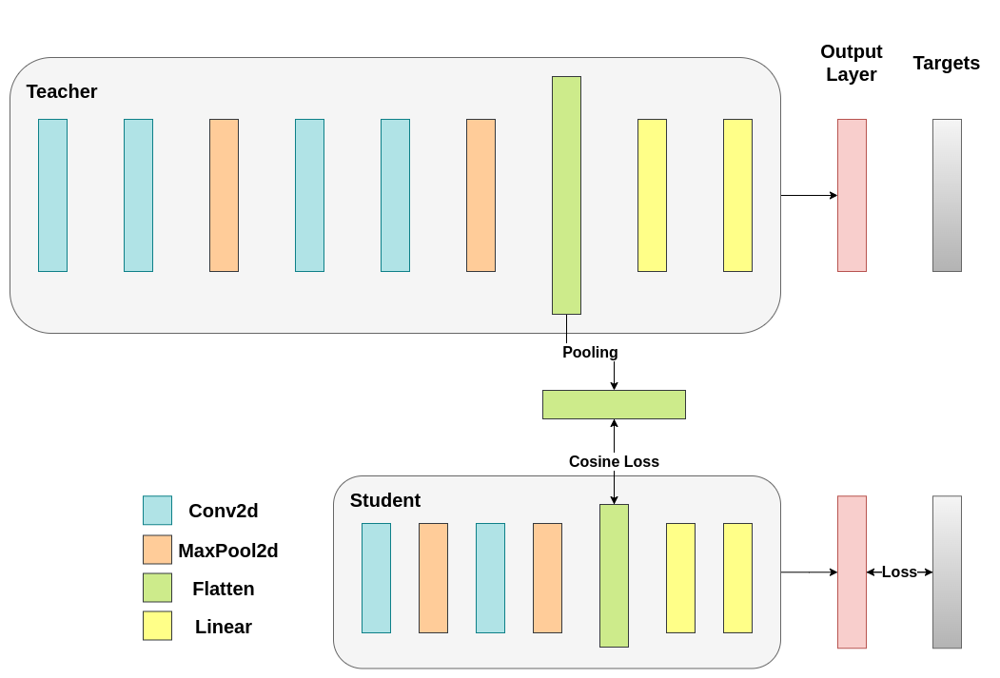
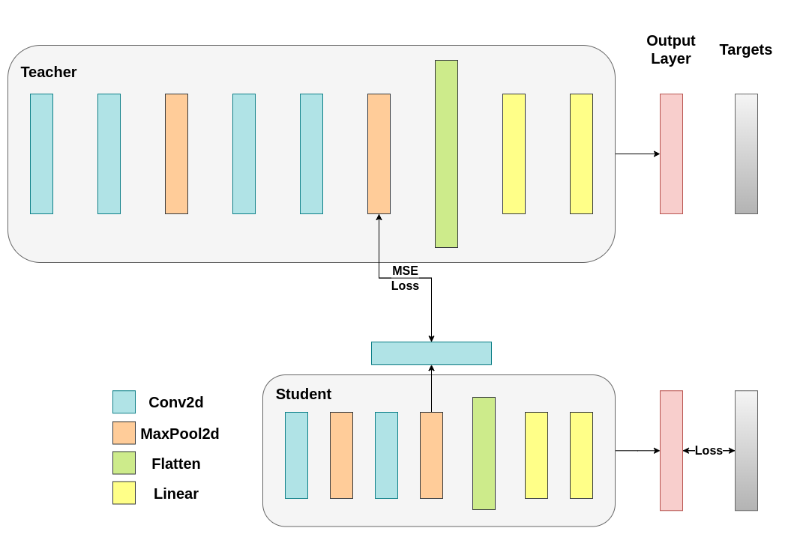

Note

Go to the end
to download the full example code.

# Knowledge Distillation Tutorial

**Author**: [Alexandros Chariton](https://github.com/AlexandrosChrtn)

Knowledge distillation is a technique that enables knowledge transfer from large, computationally expensive
models to smaller ones without losing validity. This allows for deployment on less powerful
hardware, making evaluation faster and more efficient.

In this tutorial, we will run a number of experiments focused at improving the accuracy of a
lightweight neural network, using a more powerful network as a teacher.
The computational cost and the speed of the lightweight network will remain unaffected,
our intervention only focuses on its weights, not on its forward pass.
Applications of this technology can be found in devices such as drones or mobile phones.
In this tutorial, we do not use any external packages as everything we need is available in `torch` and
`torchvision`.

In this tutorial, you will learn:

- How to modify model classes to extract hidden representations and use them for further calculations
- How to modify regular train loops in PyTorch to include additional losses on top of, for example, cross-entropy for classification
- How to improve the performance of lightweight models by using more complex models as teachers

## Prerequisites

- 1 GPU, 4GB of memory
- PyTorch v2.0 or later
- CIFAR-10 dataset (downloaded by the script and saved in a directory called `/data`)

```
# Check if the current `accelerator <https://pytorch.org/docs/stable/torch.html#accelerators>`__
# is available, and if not, use the CPU
```

### Loading CIFAR-10

CIFAR-10 is a popular image dataset with ten classes. Our objective is to predict one of the following classes for each input image.


Example of CIFAR-10 images

The input images are RGB, so they have 3 channels and are 32x32 pixels. Basically, each image is described by 3 x 32 x 32 = 3072 numbers ranging from 0 to 255.
A common practice in neural networks is to normalize the input, which is done for multiple reasons,
including avoiding saturation in commonly used activation functions and increasing numerical stability.
Our normalization process consists of subtracting the mean and dividing by the standard deviation along each channel.
The tensors "mean=[0.485, 0.456, 0.406]" and "std=[0.229, 0.224, 0.225]" were already computed,
and they represent the mean and standard deviation of each channel in the
predefined subset of CIFAR-10 intended to be the training set.
Notice how we use these values for the test set as well, without recomputing the mean and standard deviation from scratch.
This is because the network was trained on features produced by subtracting and dividing the numbers above, and we want to maintain consistency.
Furthermore, in real life, we would not be able to compute the mean and standard deviation of the test set since,
under our assumptions, this data would not be accessible at that point.

As a closing point, we often refer to this held-out set as the validation set, and we use a separate set,
called the test set, after optimizing a model's performance on the validation set.
This is done to avoid selecting a model based on the greedy and biased optimization of a single metric.

```
# Below we are preprocessing data for CIFAR-10. We use an arbitrary batch size of 128.

# Loading the CIFAR-10 dataset:
```

Note

This section is for CPU users only who are interested in quick results. Use this option only if you're interested in a small scale experiment. Keep in mind the code should run fairly quickly using any GPU. Select only the first `num_images_to_keep` images from the train/test dataset

```
#from torch.utils.data import Subset
#num_images_to_keep = 2000
#train_dataset = Subset(train_dataset, range(min(num_images_to_keep, 50_000)))
#test_dataset = Subset(test_dataset, range(min(num_images_to_keep, 10_000)))
```

```
#Dataloaders
```

### Defining model classes and utility functions

Next, we need to define our model classes. Several user-defined parameters need to be set here. We use two different architectures, keeping the number of filters fixed across our experiments to ensure fair comparisons.
Both architectures are Convolutional Neural Networks (CNNs) with a different number of convolutional layers that serve as feature extractors, followed by a classifier with 10 classes.
The number of filters and neurons is smaller for the students.

```
# Deeper neural network class to be used as teacher:

# Lightweight neural network class to be used as student:
```

We employ 2 functions to help us produce and evaluate the results on our original classification task.
One function is called `train` and takes the following arguments:

- `model`: A model instance to train (update its weights) via this function.
- `train_loader`: We defined our `train_loader` above, and its job is to feed the data into the model.
- `epochs`: How many times we loop over the dataset.
- `learning_rate`: The learning rate determines how large our steps towards convergence should be. Too large or too small steps can be detrimental.
- `device`: Determines the device to run the workload on. Can be either CPU or GPU depending on availability.

Our test function is similar, but it will be invoked with `test_loader` to load images from the test set.



Train both networks with Cross-Entropy. The student will be used as a baseline:

### Cross-entropy runs

For reproducibility, we need to set the torch manual seed. We train networks using different methods, so to compare them fairly,
it makes sense to initialize the networks with the same weights.
Start by training the teacher network using cross-entropy:

```
# Instantiate the lightweight network:
```

We instantiate one more lightweight network model to compare their performances.
Back propagation is sensitive to weight initialization,
so we need to make sure these two networks have the exact same initialization.

To ensure we have created a copy of the first network, we inspect the norm of its first layer.
If it matches, then we are safe to conclude that the networks are indeed the same.

```
# Print the norm of the first layer of the initial lightweight model

# Print the norm of the first layer of the new lightweight model
```

Print the total number of parameters in each model:

Train and test the lightweight network with cross entropy loss:

As we can see, based on test accuracy, we can now compare the deeper network that is to be used as a teacher with the lightweight network that is our supposed student. So far, our student has not intervened with the teacher, therefore this performance is achieved by the student itself.
The metrics so far can be seen with the following lines:

### Knowledge distillation run

Now let's try to improve the test accuracy of the student network by incorporating the teacher.
Knowledge distillation is a straightforward technique to achieve this,
based on the fact that both networks output a probability distribution over our classes.
Therefore, the two networks share the same number of output neurons.
The method works by incorporating an additional loss into the traditional cross entropy loss,
which is based on the softmax output of the teacher network.
The assumption is that the output activations of a properly trained teacher network carry additional information that can be leveraged by a student network during training.
The original work suggests that utilizing ratios of smaller probabilities in the soft targets can help achieve the underlying objective of deep neural networks,
which is to create a similarity structure over the data where similar objects are mapped closer together.
For example, in CIFAR-10, a truck could be mistaken for an automobile or airplane,
if its wheels are present, but it is less likely to be mistaken for a dog.
Therefore, it makes sense to assume that valuable information resides not only in the top prediction of a properly trained model but in the entire output distribution.
However, cross entropy alone does not sufficiently exploit this information as the activations for non-predicted classes
tend to be so small that propagated gradients do not meaningfully change the weights to construct this desirable vector space.

As we continue defining our first helper function that introduces a teacher-student dynamic, we need to include a few extra parameters:

- `T`: Temperature controls the smoothness of the output distributions. Larger `T` leads to smoother distributions, thus smaller probabilities get a larger boost.
- `soft_target_loss_weight`: A weight assigned to the extra objective we're about to include.
- `ce_loss_weight`: A weight assigned to cross-entropy. Tuning these weights pushes the network towards optimizing for either objective.



Distillation loss is calculated from the logits of the networks. It only returns gradients to the student:

```
# Apply ``train_knowledge_distillation`` with a temperature of 2. Arbitrarily set the weights to 0.75 for CE and 0.25 for distillation loss.

# Compare the student test accuracy with and without the teacher, after distillation
```

### Cosine loss minimization run

Feel free to play around with the temperature parameter that controls the softness of the softmax function and the loss coefficients.
In neural networks, it is easy to include additional loss functions to the main objectives to achieve goals like better generalization.
Let's try including an objective for the student, but now let's focus on their hidden states rather than their output layers.
Our goal is to convey information from the teacher's representation to the student by including a naive loss function,
whose minimization implies that the flattened vectors that are subsequently passed to the classifiers have become more *similar* as the loss decreases.
Of course, the teacher does not update its weights, so the minimization depends only on the student's weights.
The rationale behind this method is that we are operating under the assumption that the teacher model has a better internal representation that is
unlikely to be achieved by the student without external intervention, therefore we artificially push the student to mimic the internal representation of the teacher.
Whether or not this will end up helping the student is not straightforward, though, because pushing the lightweight network
to reach this point could be a good thing, assuming that we have found an internal representation that leads to better test accuracy,
but it could also be harmful because the networks have different architectures and the student does not have the same learning capacity as the teacher.
In other words, there is no reason for these two vectors, the student's and the teacher's to match per component.
The student could reach an internal representation that is a permutation of the teacher's and it would be just as efficient.
Nonetheless, we can still run a quick experiment to figure out the impact of this method.
We will be using the `CosineEmbeddingLoss` which is given by the following formula:

[](../_static/img/knowledge_distillation/cosine_embedding_loss.png)

Formula for CosineEmbeddingLoss

Obviously, there is one thing that we need to resolve first.
When we applied distillation to the output layer we mentioned that both networks have the same number of neurons, equal to the number of classes.
However, this is not the case for the layer following our convolutional layers. Here, the teacher has more neurons than the student
after the flattening of the final convolutional layer. Our loss function accepts two vectors of equal dimensionality as inputs,
therefore we need to somehow match them. We will solve this by including an average pooling layer after the teacher's convolutional layer to reduce its dimensionality to match that of the student.

To proceed, we will modify our model classes, or create new ones.
Now, the forward function returns not only the logits of the network but also the flattened hidden representation after the convolutional layer. We include the aforementioned pooling for the modified teacher.

```
# Create a similar student class where we return a tuple. We do not apply pooling after flattening.

# We do not have to train the modified deep network from scratch of course, we just load its weights from the trained instance

# Once again ensure the norm of the first layer is the same for both networks

# Initialize a modified lightweight network with the same seed as our other lightweight instances. This will be trained from scratch to examine the effectiveness of cosine loss minimization.
```

Naturally, we need to change the train loop because now the model returns a tuple `(logits, hidden_representation)`. Using a sample input tensor
we can print their shapes.

```
# Create a sample input tensor

# Pass the input through the student

# Print the shapes of the tensors

# Pass the input through the teacher

# Print the shapes of the tensors
```

In our case, `hidden_representation_size` is `1024`. This is the flattened feature map of the final convolutional layer of the student and as you can see,
it is the input for its classifier. It is `1024` for the teacher too, because we made it so with `avg_pool1d` from `2048`.
The loss applied here only affects the weights of the student prior to the loss calculation. In other words, it does not affect the classifier of the student.
The modified training loop is the following:



In Cosine Loss minimization, we want to maximize the cosine similarity of the two representations by returning gradients to the student:

We need to modify our test function for the same reason. Here we ignore the hidden representation returned by the model.

In this case, we could easily include both knowledge distillation and cosine loss minimization in the same function. It is common to combine methods to achieve better performance in teacher-student paradigms.
For now, we can run a simple train-test session.

```
# Train and test the lightweight network with cross entropy loss
```

### Intermediate regressor run

Our naive minimization does not guarantee better results for several reasons, one being the dimensionality of the vectors.
Cosine similarity generally works better than Euclidean distance for vectors of higher dimensionality,
but we were dealing with vectors with 1024 components each, so it is much harder to extract meaningful similarities.
Furthermore, as we mentioned, pushing towards a match of the hidden representation of the teacher and the student is not supported by theory.
There are no good reasons why we should be aiming for a 1:1 match of these vectors.
We will provide a final example of training intervention by including an extra network called regressor.
The objective is to first extract the feature map of the teacher after a convolutional layer,
then extract a feature map of the student after a convolutional layer, and finally try to match these maps.
However, this time, we will introduce a regressor between the networks to facilitate the matching process.
The regressor will be trainable and ideally will do a better job than our naive cosine loss minimization scheme.
Its main job is to match the dimensionality of these feature maps so that we can properly define a loss function between the teacher and the student.
Defining such a loss function provides a teaching "path," which is basically a flow to back-propagate gradients that will change the student's weights.
Focusing on the output of the convolutional layers right before each classifier for our original networks, we have the following shapes:

```
# Pass the sample input only from the convolutional feature extractor

# Print their shapes
```

We have 32 filters for the teacher and 16 filters for the student.
We will include a trainable layer that converts the feature map of the student to the shape of the feature map of the teacher.
In practice, we modify the lightweight class to return the hidden state after an intermediate regressor that matches the sizes of the convolutional
feature maps and the teacher class to return the output of the final convolutional layer without pooling or flattening.



The trainable layer matches the shapes of the intermediate tensors and Mean Squared Error (MSE) is properly defined:

After that, we have to update our train loop again. This time, we extract the regressor output of the student, the feature map of the teacher,
we calculate the `MSE` on these tensors (they have the exact same shape so it's properly defined) and we back propagate gradients based on that loss,
in addition to the regular cross entropy loss of the classification task.

```
# Notice how our test function remains the same here with the one we used in our previous case. We only care about the actual outputs because we measure accuracy.

# Initialize a ModifiedLightNNRegressor

# We do not have to train the modified deep network from scratch of course, we just load its weights from the trained instance

# Train and test once again
```

It is expected that the final method will work better than `CosineLoss` because now we have allowed a trainable layer between the teacher and the student,
which gives the student some wiggle room when it comes to learning, rather than pushing the student to copy the teacher's representation.
Including the extra network is the idea behind hint-based distillation.

### Conclusion

None of the methods above increases the number of parameters for the network or inference time,
so the performance increase comes at the little cost of calculating gradients during training.
In ML applications, we mostly care about inference time because training happens before the model deployment.
If our lightweight model is still too heavy for deployment, we can apply different ideas, such as post-training quantization.
Additional losses can be applied in many tasks, not just classification, and you can experiment with quantities like coefficients,
temperature, or number of neurons. Feel free to tune any numbers in the tutorial above,
but keep in mind, if you change the number of neurons / filters chances are a shape mismatch might occur.

For more information, see:

- [Hinton, G., Vinyals, O., Dean, J.: Distilling the knowledge in a neural network. In: Neural Information Processing System Deep Learning Workshop (2015)](https://arxiv.org/abs/1503.02531)
- [Romero, A., Ballas, N., Kahou, S.E., Chassang, A., Gatta, C., Bengio, Y.: Fitnets: Hints for thin deep nets. In: Proceedings of the International Conference on Learning Representations (2015)](https://arxiv.org/abs/1412.6550)

```
# %%%%%%RUNNABLE_CODE_REMOVED%%%%%%
```

**Total running time of the script:** (0 minutes 0.003 seconds)

[`Download Jupyter notebook: knowledge_distillation_tutorial.ipynb`](../_downloads/a19d8941b0ebb13c102e41c7e24bc5fb/knowledge_distillation_tutorial.ipynb)

[`Download Python source code: knowledge_distillation_tutorial.py`](../_downloads/19879e6777280194639314bd79851483/knowledge_distillation_tutorial.py)

[`Download zipped: knowledge_distillation_tutorial.zip`](../_downloads/f86d5d7abef2752e3e8b0f49e14af85c/knowledge_distillation_tutorial.zip)