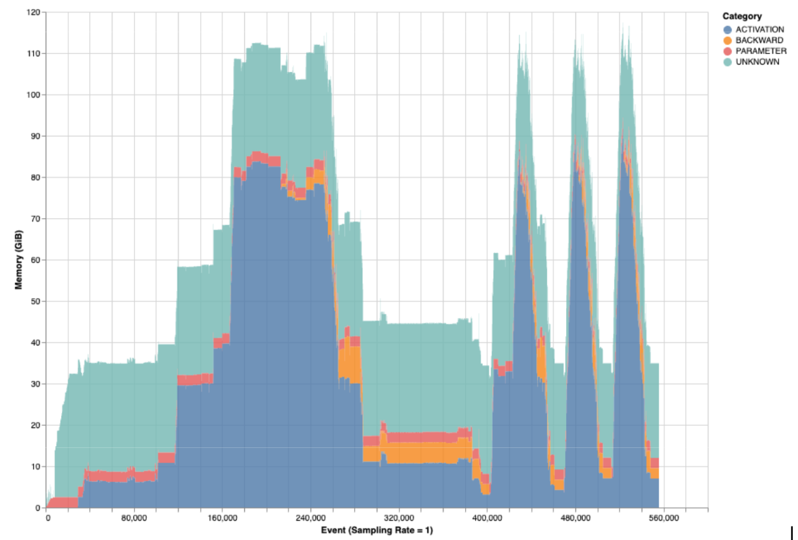
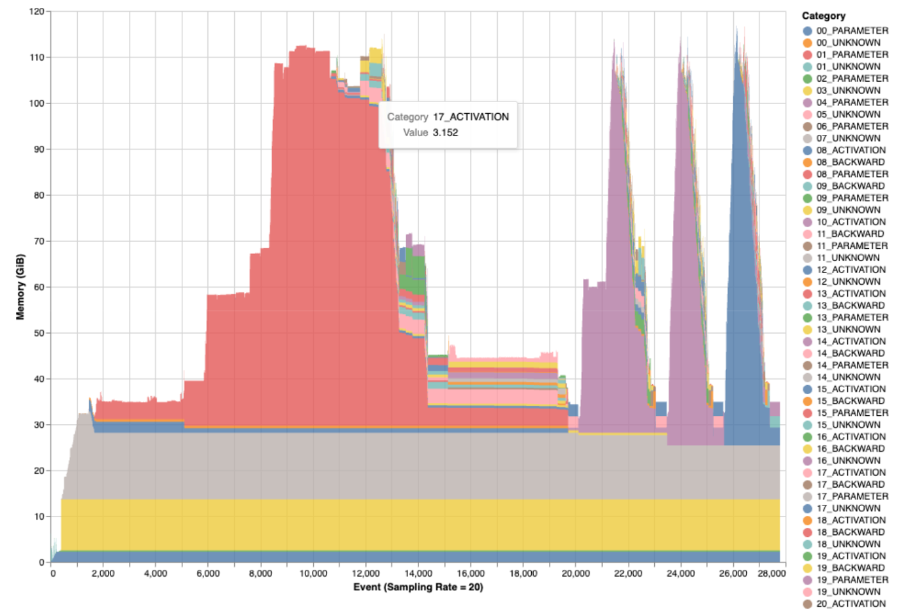
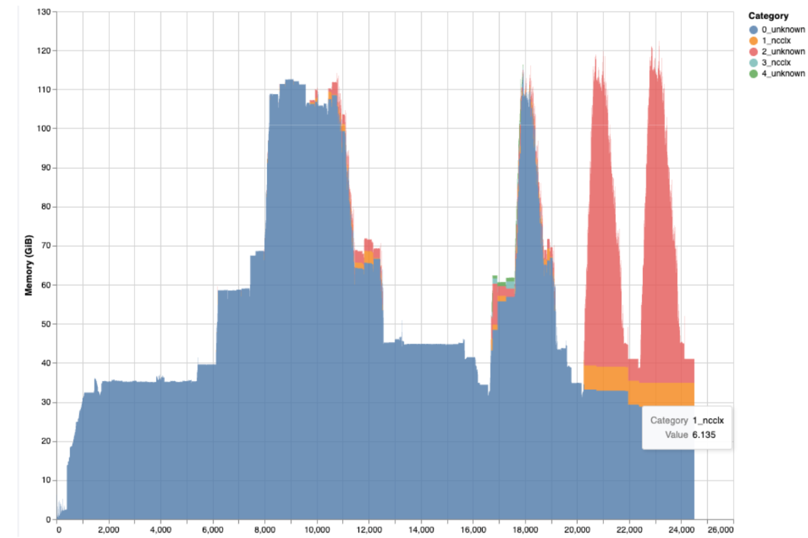
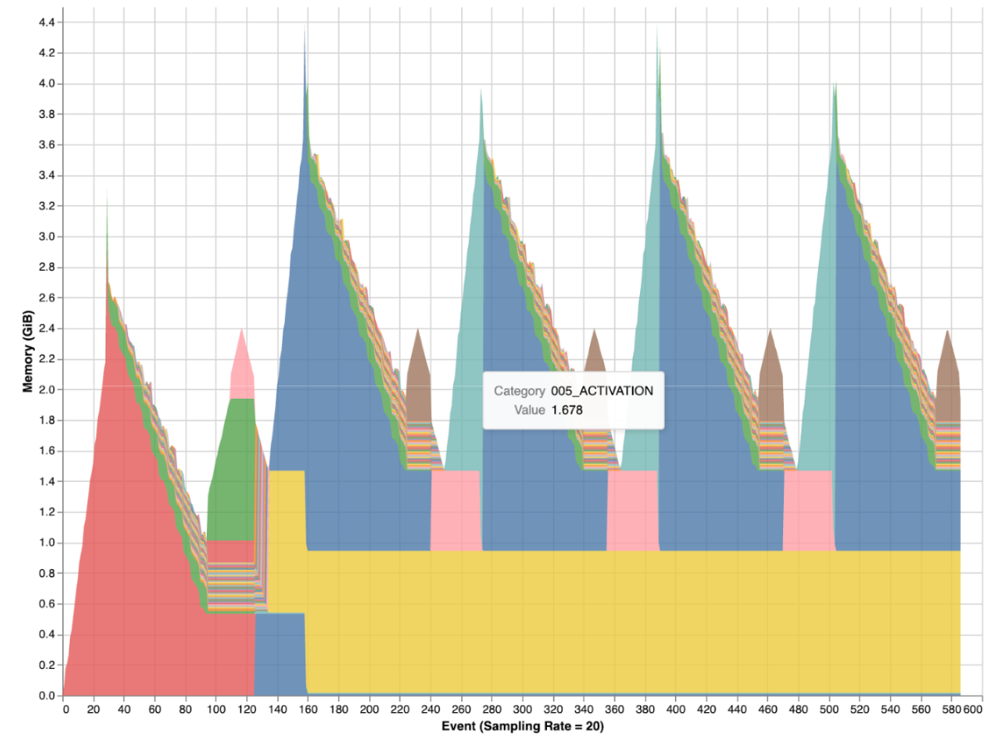
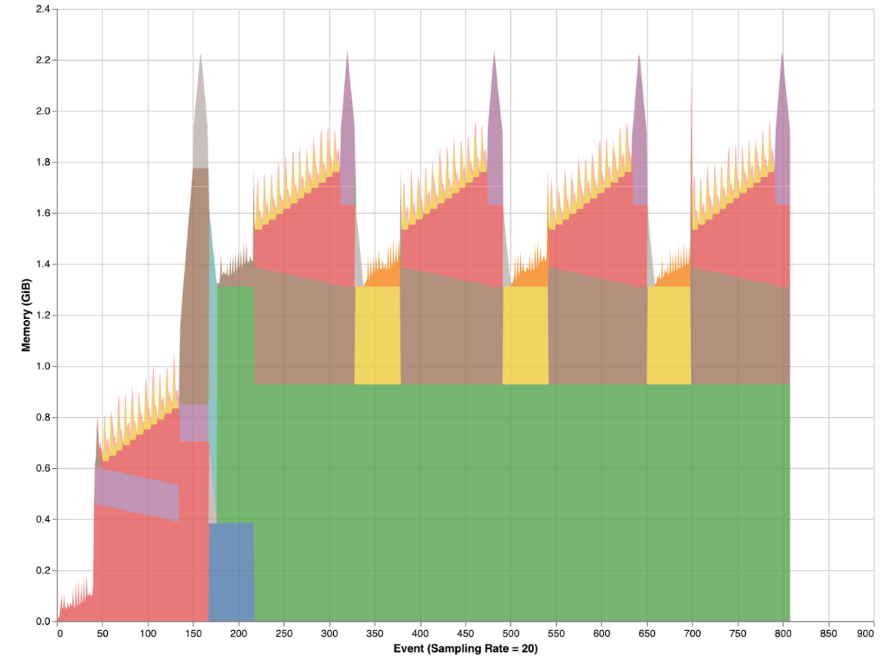

Note

Go to the end
to download the full example code.

# Mosaic: Memory Profiling for PyTorch

**Author:** [Basil Wong](https://github.com/basilwong)

 What you will learn

- How to capture and analyze PyTorch memory snapshots
- Identify memory savings from activation checkpointing
- Debug unexpected memory usage from abandoned code
- Integrate memory analysis into training pipelines

 Prerequisites

- PyTorch v2.0.0 or later
- CUDA-capable GPU
- Basic understanding of PyTorch training loops

This tutorial demonstrates how to use [Mosaic](https://github.com/facebookresearch/mosaic), a post-processing memory
snapshot analysis tool for PyTorch. Mosaic helps analyze GPU memory usage in
distributed deep learning, providing detailed insights into memory allocations,
peak usage, and memory imbalances across parallel workers.

Mosaic was instrumental in debugging OOM issues during the
[405B LLaMA training](https://ai.meta.com/blog/meta-llama-3-1/)
and is now open source.

# Introduction to Mosaic

## Overview

In distributed deep learning, understanding GPU memory usage is critical
for optimizing training efficiency and debugging Out-of-Memory (OOM) errors.
Mosaic is a post-analysis tool for memory usage designed to work with
large-scale jobs. It helps analyze PyTorch memory snapshots captured during
the execution of PyTorch training jobs, providing detailed insights into
memory allocations, peak usage, and memory imbalances across parallel workers.

## Getting Started

Clone the mosaic repository and install from the mosaic directory:

```
git clone https://github.com/facebookresearch/mosaic
cd mosaic
python3 -m venv venv
source venv/bin/activate
pip3 install -r requirements.txt
pip3 install -e .
```

Alternatively, install directly via pip:

```
pip install git+https://github.com/facebookresearch/mosaic.git
```

## Simple Usage Examples

**1. Peak Memory Usage Analysis**

When addressing memory problems like OOM errors, focusing on peak memory
usage is crucial. The `mosaic_get_memory_usage_peak` command presents a
stack trace of the memory allocations that contributed to the peak memory
usage:

```
mosaic_get_memory_usage_peak --snapshot <path to snapshot>
```

**2. Categorical Memory Profiling**

Mosaic classifies allocations into categories (activation, backward,
optimizer, etc.):

- **Activation Memory:** Tensors saved for backward pass
- **Gradient Memory:** Gradients computed during backpropagation
- **Optimizer State:** Adam/SGD momentum and variance buffers
- **Parameter Memory:** Model weights

```
mosaic_get_memory_profile --snapshot <path> --out-path <html> \
 --profile categories
```

An example HTML output looks like:

[](../_images/mosaic-categorical-memory-profiling-no-allocation-ordering.png)

Categorical memory profiling showing memory breakdown by type
(activation, gradient, optimizer, etc.)

To maintain allocation order for the categories, add `--preserve-allocation-order`:

```
mosaic_get_memory_profile --snapshot <path> --out-path <html> \
 --profile categories --preserve-allocation-order
```

[](../_images/mosaic-categorical-memory-profiling-allocation-ordering.png)

Categorical profiling with `--preserve-allocation-order` shows memory
allocations in chronological order

**3. Custom Dictionary Profiling**

For targeted analysis via regex pattern matching:

```
mosaic_get_memory_profile --snapshot <path> --profile custom \
 --custom-profile '{"ncclx": "ncclx"}'
```

This is invaluable for tracking specific kernels, optimizers, or custom code patterns:

[](../_images/mosaic-categorical-memory-profiling-ncclx.png)

Custom profiling with regex patterns to track specific operations like
NCCL communications

# Dependencies and Imports

Let's set up the required dependencies and imports for this tutorial.

```
# Fix for sphinx-gallery environment where __main__.__file__ may not exist
# This is needed for transformers library compatibility

# Install dependencies if needed
```

# Shared Utilities

These helper classes and functions are used throughout the tutorial.

# Case 1: Understanding Memory Differences with Activation Checkpointing

This section demonstrates how to use Mosaic to analyze and compare GPU
memory usage between different model configurations.

**What we'll do:**

1. Train GPT-2 and capture a memory snapshot (baseline)
2. Enable activation checkpointing and train again (modified)
3. Use Mosaic to identify exactly where memory savings occur

## Training Function for Activation Checkpointing Comparison

## Run Baseline Training (Without Activation Checkpointing)

Note

This tutorial requires a CUDA-capable GPU. If you're running in
Google Colab, make sure to select a GPU runtime:
Runtime → Change runtime type → Hardware accelerator → GPU

```
# Check if Mosaic CLI is available
```

## Run Modified Training (With Activation Checkpointing)

## Generate Categorical Memory Profiles with Mosaic

Use Mosaic to generate HTML profiles for both snapshots.

## Download Generated Files (Google Colab)

If running in Google Colab, uncomment the following lines to download
the generated snapshot and profile files:

```
# from google.colab import files
#
# print("Downloading memory snapshots and profiles...")
# files.download('snapshot_baseline.pickle')
# files.download('snapshot_with_ac.pickle')
# files.download('profile_baseline.html')
# files.download('profile_with_ac.html')
```

## Results Interpretation: Activation Checkpointing

The generated HTML profiles visualize memory usage over time, with
allocations colored by category. Here's what the profiles look like:

[](../_images/mosaic-categorical-memory-profiling-gpt2-without-ac.png)

**Baseline (without activation checkpointing):** Notice the large
activation memory (shown in one color) that persists throughout
the forward pass.

[](../_images/mosaic-categorical-memory-profiling-gpt2-with-ac.png)

**With activation checkpointing:** Activation memory is significantly
reduced as intermediate activations are discarded and recomputed
during the backward pass.

### What We Observed

Based on the Mosaic categorical profiling results:

| Metric | Baseline | With Activation Checkpointing | Difference |
| --- | --- | --- | --- |
| **Total Peak Memory** | **4.62 GB** | **2.55 GB** | **2.07 GB (45% reduction)** |
| Activation Memory | 2.93 GB | 872.79 MB | **2.08 GB saved (71% reduction)** |
| Backward/Gradient Memory | 793.39 MB | 785.27 MB | 8 MB (minimal change) |
| Optimizer State | 949.4 MB | 949.4 MB | No change |
| Unknown | 32 KB | 32 KB | No change |

### Key Insights

**Primary Finding:** Activation memory dropped from **2.93 GB → 872 MB**
(71% reduction), which accounts for nearly all the total memory savings.

### Why Does This Happen?

**Activation checkpointing** is a memory optimization technique that:

1. **Without AC (Baseline):** All intermediate activations from the forward
pass are stored in memory for use during backpropagation. GPT-2 has 12
transformer layers, each storing multiple activations (attention outputs,
MLP outputs, etc.). For batch_size=4, seq_length=512, this adds up quickly.
2. **With AC (Optimized):** Only activations at checkpoint boundaries are
stored; intermediate activations are recomputed during the backward pass.
This dramatically reduces activation memory (71% in our case) while other
memory categories remain unchanged.

### How Mosaic Helped

Mosaic's categorical profiling immediately identified:

- Activation memory is the category with the largest difference (2.08 GB saved)
- Backward/Gradient memory stayed nearly constant (793 MB → 785 MB)
- Optimizer state remained unchanged (949 MB) - expected since model
parameters don't change

**Without Mosaic:** You would need to manually instrument your code, track
allocations, and categorize them yourself.

**With Mosaic:** You get instant categorical breakdowns with exact numbers,
making it trivial to identify/quantify memory optimizations.

# Case 2: Debugging Unexpected Memory Usage

This section demonstrates how to use Mosaic to debug when your model is
using more memory than expected and you're not sure why.

**What we'll do:**

1. Train GPT-2 and capture a memory snapshot.
2. Train GPT-2 with a bug that introduces additional memory and capture
a memory snapshot.
3. Use Mosaic to identify potential culprits introducing additional memory.

## The Buggy Model

This model has **abandoned debug code** that creates unnecessary GPU memory
overhead. Someone added projection layers to "analyze hidden states" during
debugging, but forgot to remove them before training.

## Training Functions for Debug Comparison

## Run Training for Baseline (Clean Model)

## Run Training WITH the Bug

## Use Mosaic to Find the Problem

Analyze both snapshots to identify the source of extra memory usage.
We'll run Mosaic's peak memory analysis on each snapshot separately.

### Analyze the Baseline (Clean) Snapshot

### Analyze the Buggy Snapshot

## Analyzing The Mosaic Output

When you run Mosaic's peak memory analysis, it shows stack traces for each
memory allocation. Let's look at how to find abandoned or unnecessary code
that's bloating the memory.

**1. Optimizer State Allocations Delta**

In the buggy snapshot output, we can see that the first two stack traces
represent the **optimizer state allocations** (like `zeros_like` for Adam
optimizer state). See `torch/optim/adam.py` in the stack trace.

In the snapshot of the buggy model we can see around a total of 0.21 GB
more memory:

| Version | Stack Trace Position | Calls | Memory (per trace) |
| --- | --- | --- | --- |
| Buggy model | 1st and 2nd | 172 calls | 0.569 GB + 0.569 GB |
| Baseline | 2nd and 3rd | 148 calls | 0.464 GB + 0.464 GB |

What this tells us: The optimizer is tracking more tensors! This is your
first clue that there are extra parameters or tensors in the computation graph.

**2. Additional Activation Allocations**

The buggy version shows **extra allocations** that don't appear in the
baseline model. Scrolling down the Mosaic output of the buggy model we can
see additional stack traces which contain:

1. `torch::autograd::Engine::evaluate_function`: We're in the backward pass
2. `AddmmBackward0::apply`: Computing gradients for an addmm operation
3. `empty_cuda` at the bottom: Allocating a new CUDA tensor to store
the gradient

- 0.176 GB from matrix multiply gradients (`AddmmBackward0`, `mm_mat1_backward`)

### Memory Total Explanation

**Total Peak Dynamic Memory Usage:** This is the peak memory that changes
during execution, measured relative to the starting point of the snapshot.
It tracks memory allocations that occur during the traced execution timeline.

**Total Static Memory Usage:** This is the "starting memory" or baseline
memory that exists before tracing begins. It's estimated by the PyTorch
visualizer and remains constant throughout the snapshot (doesn't come with
stack traces).

Note

In the snapshots you may observe differences in total *static* memory
usage, which accounts for the remaining difference.

**Total Overall Peak Memory Usage:** Dynamic + Static

# Case 3: Integrating Memory Analysis into Your Training Pipeline

This section demonstrates how to use Mosaic to automatically capture memory
snapshots during training, get structured memory breakdown data for
monitoring/dashboards, and build automated memory monitoring for large-scale
training using Mosaic **programmatically** (as a Python dependency).

Mosaic integrates memory analysis directly into your training pipeline.

## Training with Automatic Memory Capture

## Mosaic Memory Analysis via Python API

Instead of using CLI commands, we can use Mosaic's Python API directly
for programmatic integration.

## Reusable Memory Analysis Function

Create a reusable function for analyzing training memory snapshots.

## Complete Training Pipeline with Memory Monitoring

This demonstrates a production-ready training pipeline with integrated
Mosaic memory monitoring that can be used in CI/CD, monitoring dashboards,
or capacity planning.

```
# Run the pipeline
```

## CI/CD and Dashboard Integration Patterns

These patterns show how to integrate Mosaic analysis into automated
workflows.

### Pattern 1: CI/CD Memory Regression Testing

### Pattern 2: Export to JSON for Dashboards

# Conclusion

This tutorial demonstrated three key use cases for Mosaic memory profiling:

**Case 1: Activation Checkpointing Analysis**

- Used Mosaic to compare memory usage between baseline and optimized models
- Identified that activation checkpointing reduced activation memory by 71%
- Mosaic's categorical profiling made it trivial to pinpoint memory savings

**Case 2: Debugging Unexpected Memory Usage**

- Created a "buggy" model with abandoned debug code
- Used `mosaic_get_memory_usage_peak` to identify extra allocations
- Stack traces revealed optimizer state tracking extra parameters

**Case 3: Pipeline Integration**

- Demonstrated programmatic usage via Mosaic's Python API
- Showed integration patterns for CI/CD and dashboards with structured reports

## Further Reading

- [Mosaic GitHub Repository](https://github.com/facebookresearch/mosaic)
- [PyTorch Memory Management Documentation](https://pytorch.org/docs/stable/notes/cuda.html#memory-management)
- [Understanding CUDA Memory Usage](https://pytorch.org/docs/stable/torch_cuda_memory.html)
- [Activation Checkpointing in PyTorch](https://pytorch.org/docs/stable/checkpoint.html)
- [PyTorch Memory Snapshot Visualizer](https://pytorch.org/memory_viz)

```
# %%%%%%RUNNABLE_CODE_REMOVED%%%%%%
```

[`Download Jupyter notebook: mosaic_memory_profiling_tutorial.ipynb`](../_downloads/6d7a706c6dae6d031b7942e5102d35dc/mosaic_memory_profiling_tutorial.ipynb)

[`Download Python source code: mosaic_memory_profiling_tutorial.py`](../_downloads/46e1279ff67a61c2741a365e01e6cc18/mosaic_memory_profiling_tutorial.py)

[`Download zipped: mosaic_memory_profiling_tutorial.zip`](../_downloads/6e3887911e4e0035cb8b0fe92b7fd5ff/mosaic_memory_profiling_tutorial.zip)