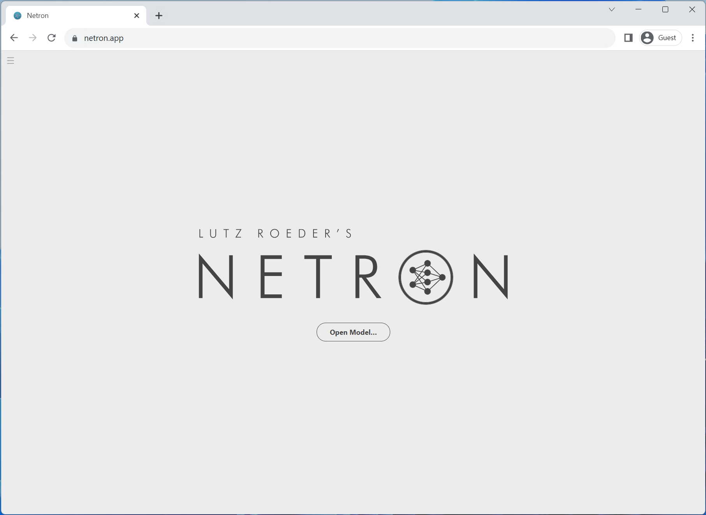
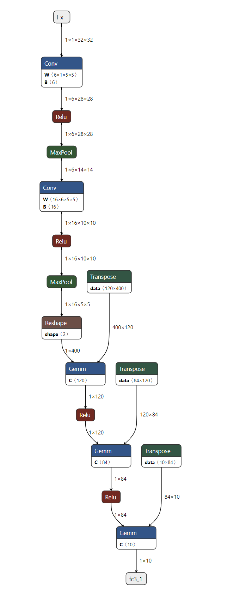

Note

Go to the end
to download the full example code.

[Introduction to ONNX](intro_onnx.html) ||
**Exporting a PyTorch model to ONNX** ||
[Extending the ONNX exporter operator support](onnx_registry_tutorial.html) ||
[Export a model with control flow to ONNX](export_control_flow_model_to_onnx_tutorial.html)

# Export a PyTorch model to ONNX

**Author**: [Ti-Tai Wang](https://github.com/titaiwangms), [Justin Chu](mailto:justinchu%40microsoft.com), [Thiago Crepaldi](https://github.com/thiagocrepaldi).

Note

Starting with PyTorch 2.5, there are two ONNX Exporter options available.
* `torch.onnx.export(..., dynamo=True)` is the recommended exporter that leverages `torch.export` and Torch FX for graph capture.
* `torch.onnx.export` is the legacy approach that relies on the deprecated TorchScript and is no longer recommended for use.

In the [60 Minute Blitz](https://pytorch.org/tutorials/beginner/deep_learning_60min_blitz.html),
we had the opportunity to learn about PyTorch at a high level and train a small neural network to classify images.
In this tutorial, we are going to expand this to describe how to convert a model defined in PyTorch into the
ONNX format using the `torch.onnx.export(..., dynamo=True)` ONNX exporter.

While PyTorch is great for iterating on the development of models, the model can be deployed to production
using different formats, including [ONNX](https://onnx.ai/) (Open Neural Network Exchange)!

ONNX is a flexible open standard format for representing machine learning models which standardized representations
of machine learning allow them to be executed across a gamut of hardware platforms and runtime environments
from large-scale cloud-based supercomputers to resource-constrained edge devices, such as your web browser and phone.

In this tutorial, we'll learn how to:

1. Install the required dependencies.
2. Author a simple image classifier model.
3. Export the model to ONNX format.
4. Save the ONNX model in a file.
5. Visualize the ONNX model graph using [Netron](https://github.com/lutzroeder/netron).
6. Execute the ONNX model with ONNX Runtime
7. Compare the PyTorch results with the ones from the ONNX Runtime.

## 1. Install the required dependencies

Because the ONNX exporter uses `onnx` and `onnxscript` to translate PyTorch operators into ONNX operators,
we will need to install them.

> ```
> pip install --upgrade onnx onnxscript
> ```

## 2. Author a simple image classifier model

Once your environment is set up, let's start modeling our image classifier with PyTorch,
exactly like we did in the [60 Minute Blitz](https://pytorch.org/tutorials/beginner/deep_learning_60min_blitz.html).

## 3. Export the model to ONNX format

Now that we have our model defined, we need to instantiate it and create a random 32x32 input.
Next, we can export the model to ONNX format.

```
# Create example inputs for exporting the model. The inputs should be a tuple of tensors.
```

As we can see, we didn't need any code change to the model.
The resulting ONNX model is stored within `torch.onnx.ONNXProgram` as a binary protobuf file.

## 4. Save the ONNX model in a file

Although having the exported model loaded in memory is useful in many applications,
we can save it to disk with the following code:

You can load the ONNX file back into memory and check if it is well formed with the following code:

## 5. Visualize the ONNX model graph using Netron

Now that we have our model saved in a file, we can visualize it with [Netron](https://github.com/lutzroeder/netron).
Netron can either be installed on macos, Linux or Windows computers, or run directly from the browser.
Let's try the web version by opening the following link: [https://netron.app/](https://netron.app/).

[](../../_images/netron_web_ui.png)

Once Netron is open, we can drag and drop our `image_classifier_model.onnx` file into the browser or select it after
clicking the **Open model** button.

[](../../_images/image_classifier_onnx_model_on_netron_web_ui.png)

And that is it! We have successfully exported our PyTorch model to ONNX format and visualized it with Netron.

## 6. Execute the ONNX model with ONNX Runtime

The last step is executing the ONNX model with ONNX Runtime, but before we do that, let's install ONNX Runtime.

> ```
> pip install onnxruntime
> ```

The ONNX standard does not support all the data structure and types that PyTorch does,
so we need to adapt PyTorch input's to ONNX format before feeding it to ONNX Runtime.
In our example, the input happens to be the same, but it might have more inputs
than the original PyTorch model in more complex models.

ONNX Runtime requires an additional step that involves converting all PyTorch tensors to Numpy (in CPU)
and wrap them on a dictionary with keys being a string with the input name as key and the numpy tensor as the value.

Now we can create an *ONNX Runtime Inference Session*, execute the ONNX model with the processed input
and get the output. In this tutorial, ONNX Runtime is executed on CPU, but it could be executed on GPU as well.

```
# ONNX Runtime returns a list of outputs
```

## 7. Compare the PyTorch results with the ones from the ONNX Runtime

The best way to determine whether the exported model is looking good is through numerical evaluation
against PyTorch, which is our source of truth.

For that, we need to execute the PyTorch model with the same input and compare the results with ONNX Runtime's.
Before comparing the results, we need to convert the PyTorch's output to match ONNX's format.

## Conclusion

That is about it! We have successfully exported our PyTorch model to ONNX format,
saved the model to disk, viewed it using Netron, executed it with ONNX Runtime
and finally compared its numerical results with PyTorch's.

## Further reading

The list below refers to tutorials that ranges from basic examples to advanced scenarios,
not necessarily in the order they are listed.
Feel free to jump directly to specific topics of your interest or
sit tight and have fun going through all of them to learn all there is about the ONNX exporter.

1. [Exporting a PyTorch model to ONNX](export_simple_model_to_onnx_tutorial.html)
2. [Extending the ONNX exporter operator support](onnx_registry_tutorial.html)
3. [Export a model with control flow to ONNX](export_control_flow_model_to_onnx_tutorial.html)

```
# %%%%%%RUNNABLE_CODE_REMOVED%%%%%%
```

**Total running time of the script:** (0 minutes 0.003 seconds)

[`Download Jupyter notebook: export_simple_model_to_onnx_tutorial.ipynb`](../../_downloads/8dd55b9d6d32d45fae2642c7ffbf454e/export_simple_model_to_onnx_tutorial.ipynb)

[`Download Python source code: export_simple_model_to_onnx_tutorial.py`](../../_downloads/1c960eb430ba8694b1655bb03904dac2/export_simple_model_to_onnx_tutorial.py)

[`Download zipped: export_simple_model_to_onnx_tutorial.zip`](../../_downloads/c385f7abbf301b718185244a648eca3e/export_simple_model_to_onnx_tutorial.zip)