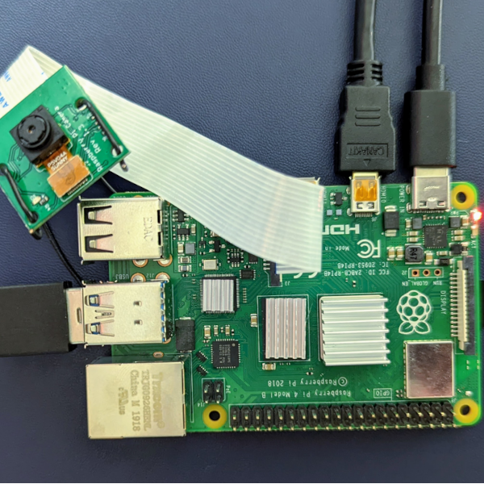

# Ecosystem

Explore tutorials that cover tools and frameworks in
the PyTorch ecosystem. These practical guides will help you leverage
PyTorch's extensive ecosystem for everything from experimentation
to production deployment.

---

[#### Hyperparameter Tuning Tutorial

Learn how to use Ray Tune to find the best performing set of hyperparameters for your model.

Model-Optimization,Best-Practice,Ecosystem,Ray-Distributed,Parallel-and-Distributed-Training

](beginner/hyperparameter_tuning_tutorial.html)

[#### Serving PyTorch Tutorial

Deploy and scale a PyTorch model with Ray Serve.

Production,Best-Practice,Ray-Distributed,Ecosystem

](beginner/serving_tutorial.html)

[#### Multi-Objective Neural Architecture Search with Ax

Learn how to use Ax to search over architectures find optimal tradeoffs between accuracy and latency.

Model-Optimization,Best-Practice,Ax,TorchX,Ecosystem

](intermediate/ax_multiobjective_nas_tutorial.html)

[#### Performance Profiling in TensorBoard

Learn how to use the TensorBoard plugin to profile and analyze your model's performance.

Model-Optimization,Best-Practice,Profiling,TensorBoard,Ecosystem

](intermediate/tensorboard_profiler_tutorial.html)

[#### Real Time Inference on Raspberry Pi 4

This tutorial covers how to run quantized and fused models on a Raspberry Pi 4 at 30 fps.

Model-Optimization,Image/Video,Quantization,Ecosystem

](intermediate/realtime_rpi.html)

[#### Memory Profiling with Mosaic

Learn how to use the Mosaic memory profiler to visualize GPU memory usage and identify memory optimization opportunities in PyTorch models.

Model-Optimization,Best-Practice,Profiling,Ecosystem

](beginner/mosaic_memory_profiling_tutorial.html)

[#### Distributed Training with Ray Train

Pre-train a transformer language model across multiple GPUs using PyTorch and Ray Train.

Text,Best-Practice,Ecosystem,Ray-Distributed,Parallel-and-Distributed-Training

](beginner/distributed_training_with_ray_tutorial.html)