# Welcome to PyTorch Tutorials

**What's new in PyTorch tutorials?**

- [Data Loading Optimization in PyTorch](https://docs.pytorch.org/tutorials/intermediate/intermediate_data_loading_tutorial.html)
- [Distributed Training with Ray Train](https://docs.pytorch.org/tutorials/beginner/distributed_training_with_ray_tutorial.html)
- [Serve PyTorch models at scale with Ray Serve](https://docs.pytorch.org/tutorials/beginner/serving_tutorial.html)
- [Hyperparameter tuning using Ray Tune](https://docs.pytorch.org/tutorials/beginner/hyperparameter_tuning_tutorial.html)
- [Memory Profiling with Mosaic](https://docs.pytorch.org/tutorials/beginner/mosaic_memory_profiling_tutorial.html)
- [Using Variable Length Attention in PyTorch](https://docs.pytorch.org/tutorials/intermediate/variable_length_attention_tutorial.html)
- [DebugMode: Recording Dispatched Operations and Numerical Debugging](https://docs.pytorch.org/tutorials/recipes/debug_mode_tutorial.html)

### Learn the Basics

Familiarize yourself with PyTorch concepts and modules. Learn how to load data, build deep neural networks, train and save your models in this quickstart guide.

[Get started with PyTorch](beginner/basics/intro.html)

### PyTorch Recipes

Bite-size, ready-to-deploy PyTorch code examples.

[Explore Recipes](recipes_index.html)

---

[#### Learn the Basics

A step-by-step guide to building a complete ML workflow with PyTorch.

Getting-Started

](beginner/basics/intro.html)

[#### Introduction to PyTorch on YouTube

An introduction to building a complete ML workflow with PyTorch. Follows the PyTorch Beginner Series on YouTube.

Getting-Started

](beginner/introyt/introyt_index.html)

[#### Learning PyTorch with Examples

This tutorial introduces the fundamental concepts of PyTorch through self-contained examples.

Getting-Started

](beginner/pytorch_with_examples.html)

[#### What is torch.nn really?

Use torch.nn to create and train a neural network.

Getting-Started

](beginner/nn_tutorial.html)

[#### Visualizing Models, Data, and Training with TensorBoard

Learn to use TensorBoard to visualize data and model training.

Interpretability,Getting-Started,TensorBoard

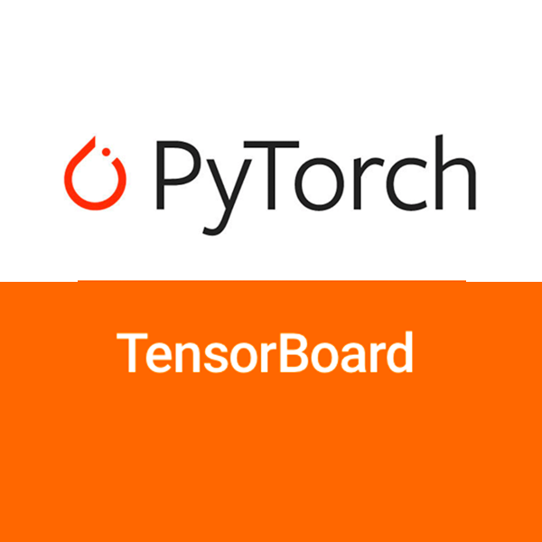](intermediate/tensorboard_tutorial.html)

[#### Good usage of `non_blocking` and `pin_memory()` in PyTorch

A guide on best practices to copy data from CPU to GPU.

Getting-Started

](intermediate/pinmem_nonblock.html)

[#### Data Loading Optimization in PyTorch

Optimize DataLoader configuration with num_workers, pin_memory, persistent_workers for maximum training throughput.

Getting-Started,Best-Practice

](intermediate/intermediate_data_loading_tutorial.html)

[#### Understanding requires_grad, retain_grad, Leaf, and Non-leaf Tensors

Learn the subtleties of requires_grad, retain_grad, leaf, and non-leaf tensors

Getting-Started

](beginner/understanding_leaf_vs_nonleaf_tutorial.html)

[#### Visualizing Gradients in PyTorch

Visualize the gradient flow of a network.

Getting-Started

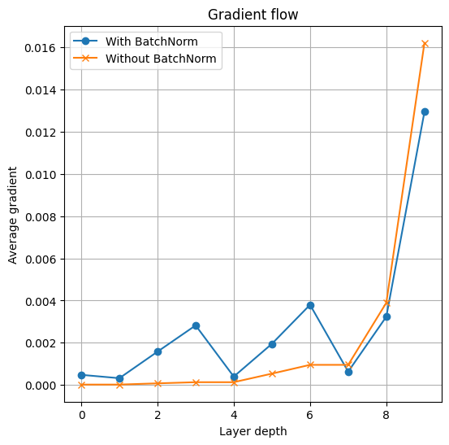](intermediate/visualizing_gradients_tutorial.html)

[#### TorchVision Object Detection Finetuning Tutorial

Finetune a pre-trained Mask R-CNN model.

Image/Video

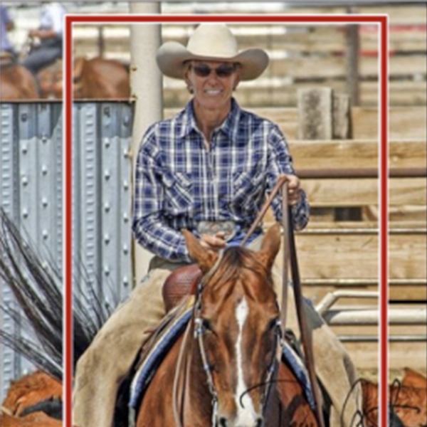](intermediate/torchvision_tutorial.html)

[#### Transfer Learning for Computer Vision Tutorial

Train a convolutional neural network for image classification using transfer learning.

Image/Video

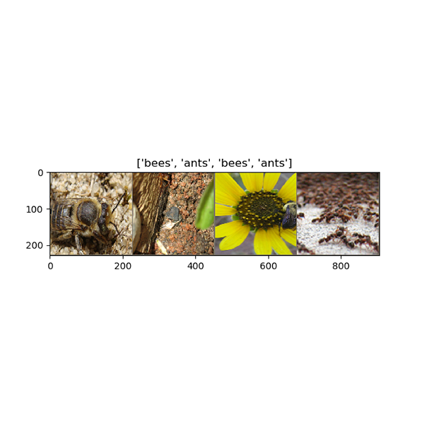](beginner/transfer_learning_tutorial.html)

[#### Adversarial Example Generation

Train a convolutional neural network for image classification using transfer learning.

Image/Video

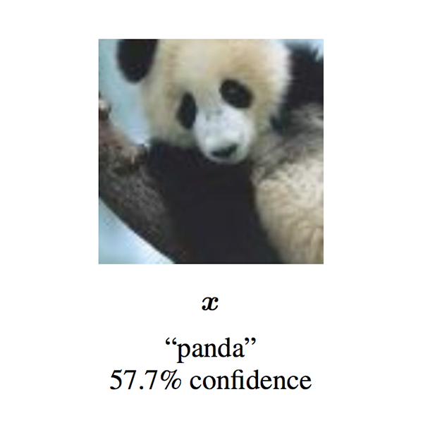](beginner/fgsm_tutorial.html)

[#### DCGAN Tutorial

Train a generative adversarial network (GAN) to generate new celebrities.

Image/Video

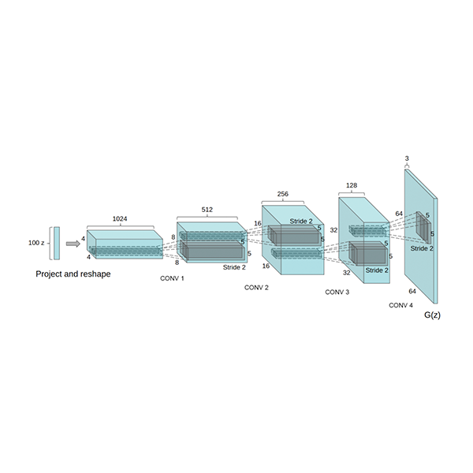](beginner/dcgan_faces_tutorial.html)

[#### Spatial Transformer Networks Tutorial

Learn how to augment your network using a visual attention mechanism.

Image/Video

](intermediate/spatial_transformer_tutorial.html)

[#### Semi-Supervised Learning Tutorial Based on USB

Learn how to train semi-supervised learning algorithms (on custom data) using USB and PyTorch.

Image/Video

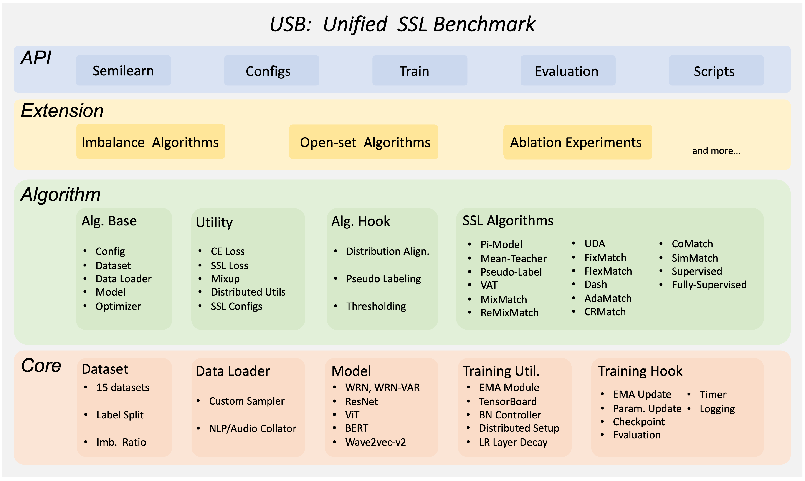](advanced/usb_semisup_learn.html)

[#### Distributed Training with Ray Train

Pre-train a transformer language model across multiple GPUs using PyTorch and Ray Train.

Text,Best-Practice,Ray-Distributed,Parallel-and-Distributed-Training

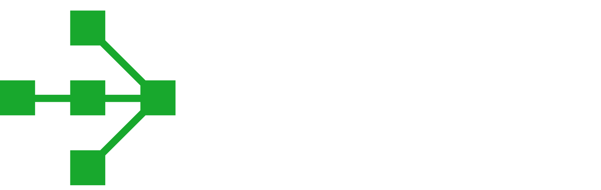](beginner/distributed_training_with_ray_tutorial.html)

[#### Audio IO

Learn to load data with torchaudio.

Audio

](beginner/audio_io_tutorial.html)

[#### Audio Resampling

Learn to resample audio waveforms using torchaudio.

Audio

](beginner/audio_resampling_tutorial.html)

[#### Audio Data Augmentation

Learn to apply data augmentations using torchaudio.

Audio

](beginner/audio_data_augmentation_tutorial.html)

[#### Audio Feature Extractions

Learn to extract features using torchaudio.

Audio

](beginner/audio_feature_extractions_tutorial.html)

[#### Audio Feature Augmentation

Learn to augment features using torchaudio.

Audio

](beginner/audio_feature_augmentation_tutorial.html)

[#### Audio Datasets

Learn to use torchaudio datasets.

Audio

](beginner/audio_datasets_tutorial.html)

[#### Automatic Speech Recognition with Wav2Vec2 in torchaudio

Learn how to use torchaudio's pretrained models for building a speech recognition application.

Audio

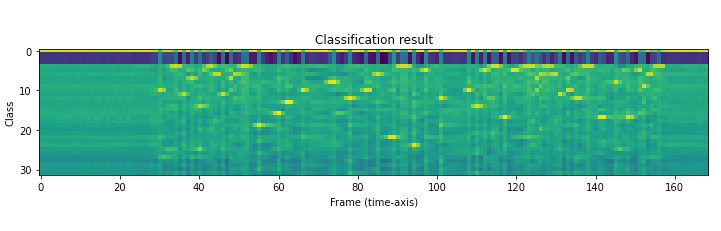](intermediate/speech_recognition_pipeline_tutorial.html)

[#### Speech Command Classification

Learn how to correctly format an audio dataset and then train/test an audio classifier network on the dataset.

Audio

](intermediate/speech_command_classification_with_torchaudio_tutorial.html)

[#### Text-to-Speech with torchaudio

Learn how to use torchaudio's pretrained models for building a text-to-speech application.

Audio

](intermediate/text_to_speech_with_torchaudio.html)

[#### Forced Alignment with Wav2Vec2 in torchaudio

Learn how to use torchaudio's Wav2Vec2 pretrained models for aligning text to speech

Audio

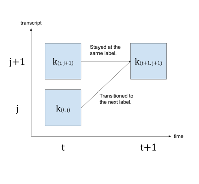](intermediate/forced_alignment_with_torchaudio_tutorial.html)

[#### NLP from Scratch: Classifying Names with a Character-level RNN

Build and train a basic character-level RNN to classify word from scratch without the use of torchtext. First in a series of three tutorials.

NLP

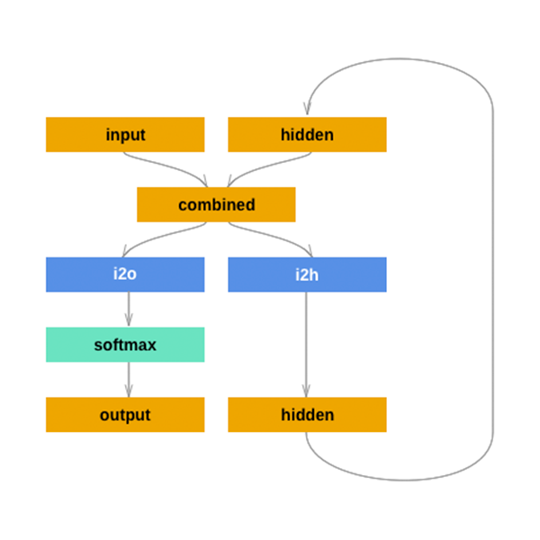](intermediate/char_rnn_classification_tutorial)

[#### NLP from Scratch: Generating Names with a Character-level RNN

After using character-level RNN to classify names, learn how to generate names from languages. Second in a series of three tutorials.

NLP

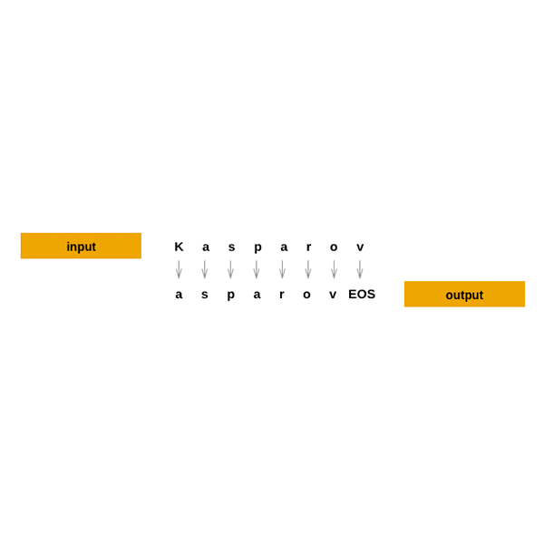](intermediate/char_rnn_generation_tutorial.html)

[#### NLP from Scratch: Translation with a Sequence-to-sequence Network and Attention

This is the third and final tutorial on doing "NLP From Scratch", where we write our own classes and functions to preprocess the data to do our NLP modeling tasks.

NLP

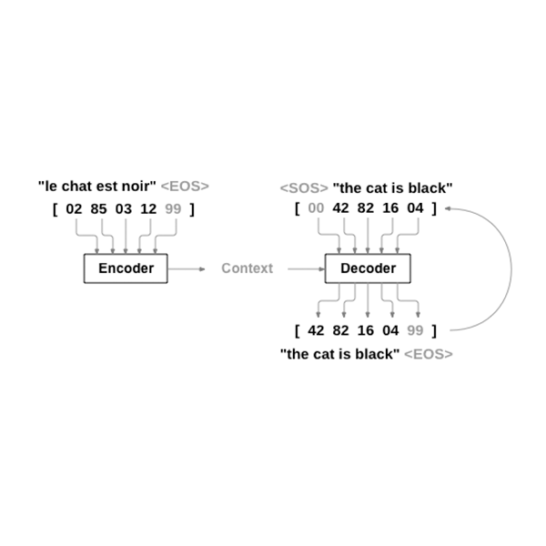](intermediate/seq2seq_translation_tutorial.html)

[#### Exporting a PyTorch model to ONNX using TorchDynamo backend and Running it using ONNX Runtime

Build a image classifier model in PyTorch and convert it to ONNX before deploying it with ONNX Runtime.

Production,ONNX,Backends

](beginner/onnx/export_simple_model_to_onnx_tutorial.html)

[#### Extending the ONNX exporter operator support

Demonstrate end-to-end how to address unsupported operators in ONNX.

Production,ONNX,Backends

](beginner/onnx/onnx_registry_tutorial.html)

[#### Exporting a model with control flow to ONNX

Demonstrate how to handle control flow logic while exporting a PyTorch model to ONNX.

Production,ONNX,Backends

](beginner/onnx/export_control_flow_model_to_onnx_tutorial.html)

[#### Reinforcement Learning (DQN)

Learn how to use PyTorch to train a Deep Q Learning (DQN) agent on the CartPole-v0 task from the OpenAI Gym.

Reinforcement-Learning

](intermediate/reinforcement_q_learning.html)

[#### Reinforcement Learning (PPO) with TorchRL

Learn how to use PyTorch and TorchRL to train a Proximal Policy Optimization agent on the Inverted Pendulum task from Gym.

Reinforcement-Learning

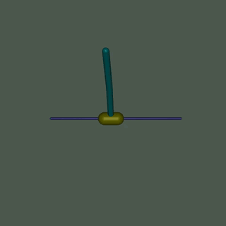](intermediate/reinforcement_ppo.html)

[#### Train a Mario-playing RL Agent

Use PyTorch to train a Double Q-learning agent to play Mario.

Reinforcement-Learning

](intermediate/mario_rl_tutorial.html)

[#### Recurrent DQN

Use TorchRL to train recurrent policies

Reinforcement-Learning

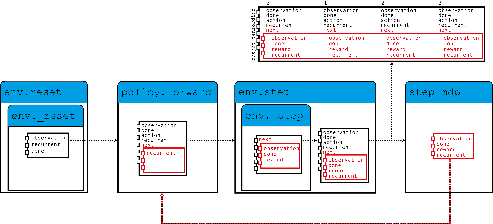](intermediate/dqn_with_rnn_tutorial.html)

[#### Code a DDPG Loss

Use TorchRL to code a DDPG Loss

Reinforcement-Learning

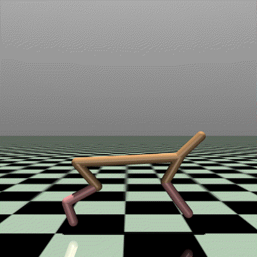](advanced/coding_ddpg.html)

[#### Writing your environment and transforms

Use TorchRL to code a Pendulum

Reinforcement-Learning

](advanced/pendulum.html)

[#### Serving PyTorch Tutorial

Deploy and scale a PyTorch model with Ray Serve.

Production,Best-Practice,Ray-Distributed,Ecosystem

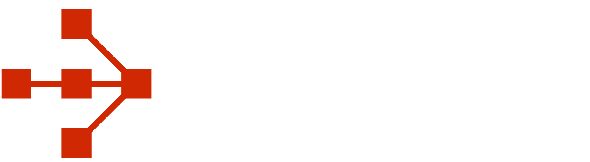](beginner/serving_tutorial.html)

[#### Profiling PyTorch

Learn how to profile a PyTorch application

Profiling

](beginner/profiler.html)

[#### Profiling PyTorch

Introduction to Holistic Trace Analysis

Profiling

](beginner/hta_intro_tutorial.html)

[#### Profiling PyTorch

Trace Diff using Holistic Trace Analysis

Profiling

](beginner/hta_trace_diff_tutorial.html)

[#### Memory Profiling with Mosaic

Learn how to use the Mosaic memory profiler to visualize GPU memory usage and identify memory optimization opportunities in PyTorch models.

Model-Optimization,Best-Practice,Profiling

](beginner/mosaic_memory_profiling_tutorial.html)

[#### Building a Simple Performance Profiler with FX

Build a simple FX interpreter to record the runtime of op, module, and function calls and report statistics

FX

](intermediate/fx_profiling_tutorial.html)

[#### (beta) Channels Last Memory Format in PyTorch

Get an overview of Channels Last memory format and understand how it is used to order NCHW tensors in memory preserving dimensions.

Memory-Format,Best-Practice,Frontend-APIs

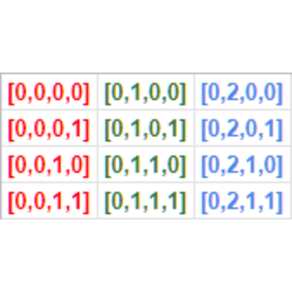](intermediate/memory_format_tutorial.html)

[#### Using the PyTorch C++ Frontend

Walk through an end-to-end example of training a model with the C++ frontend by training a DCGAN - a kind of generative model - to generate images of MNIST digits.

Frontend-APIs,C++

](advanced/cpp_frontend.html)

[#### PyTorch Custom Operators Landing Page

This is the landing page for all things related to custom operators in PyTorch.

Extending-PyTorch,Frontend-APIs,C++,CUDA

](advanced/custom_ops_landing_page.html)

[#### Custom Python Operators

Create Custom Operators in Python. Useful for black-boxing a Python function for use with torch.compile.

Extending-PyTorch,Frontend-APIs,C++,CUDA

](advanced/python_custom_ops.html)

[#### Compiled Autograd: Capturing a larger backward graph for ``torch.compile``

Learn how to use compiled autograd to capture a larger backward graph.

Model-Optimization,CUDA

](intermediate/compiled_autograd_tutorial)

[#### Custom C++ and CUDA Operators

How to extend PyTorch with custom C++ and CUDA operators.

Extending-PyTorch,Frontend-APIs,C++,CUDA

](advanced/cpp_custom_ops.html)

[#### Autograd in C++ Frontend

The autograd package helps build flexible and dynamic neural netorks. In this tutorial, explore several examples of doing autograd in PyTorch C++ frontend

Frontend-APIs,C++

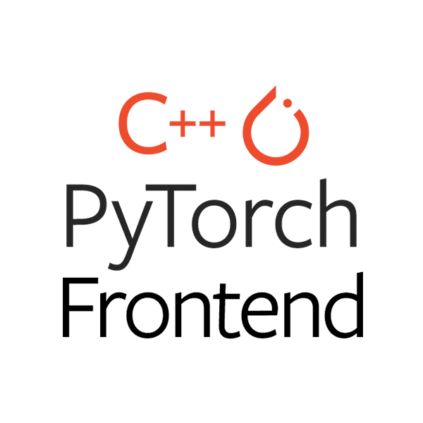](advanced/cpp_autograd.html)

[#### Registering a Dispatched Operator in C++

The dispatcher is an internal component of PyTorch which is responsible for figuring out what code should actually get run when you call a function like torch::add.

Extending-PyTorch,Frontend-APIs,C++

](advanced/dispatcher.html)

[#### Extending Dispatcher For a New Backend in C++

Learn how to extend the dispatcher to add a new device living outside of the pytorch/pytorch repo and maintain it to keep in sync with native PyTorch devices.

Extending-PyTorch,Frontend-APIs,C++

](advanced/extend_dispatcher.html)

[#### Facilitating New Backend Integration by PrivateUse1

Learn how to integrate a new backend living outside of the pytorch/pytorch repo and maintain it to keep in sync with the native PyTorch backend.

Extending-PyTorch,Frontend-APIs,C++

](advanced/privateuseone.html)

[#### Custom Function Tutorial: Double Backward

Learn how to write a custom autograd Function that supports double backward.

Extending-PyTorch,Frontend-APIs

](intermediate/custom_function_double_backward_tutorial.html)

[#### Custom Function Tutorial: Fusing Convolution and Batch Norm

Learn how to create a custom autograd Function that fuses batch norm into a convolution to improve memory usage.

Extending-PyTorch,Frontend-APIs

](intermediate/custom_function_conv_bn_tutorial.html)

[#### Forward-mode Automatic Differentiation

Learn how to use forward-mode automatic differentiation.

Frontend-APIs

](intermediate/forward_ad_usage.html)

[#### Jacobians, Hessians, hvp, vhp, and more

Learn how to compute advanced autodiff quantities using torch.func

Frontend-APIs

](intermediate/jacobians_hessians.html)

[#### Model Ensembling

Learn how to ensemble models using torch.vmap

Frontend-APIs

](intermediate/ensembling.html)

[#### Per-Sample-Gradients

Learn how to compute per-sample-gradients using torch.func

Frontend-APIs

](intermediate/per_sample_grads.html)

[#### Neural Tangent Kernels

Learn how to compute neural tangent kernels using torch.func

Frontend-APIs

](intermediate/neural_tangent_kernels.html)

[#### Performance Profiling in PyTorch

Learn how to use the PyTorch Profiler to benchmark your module's performance.

Model-Optimization,Best-Practice,Profiling

](beginner/profiler.html)

[#### Performance Profiling in TensorBoard

Learn how to use the TensorBoard plugin to profile and analyze your model's performance.

Model-Optimization,Best-Practice,Profiling,TensorBoard

](intermediate/tensorboard_profiler_tutorial.html)

[#### Hyperparameter Tuning Tutorial

Learn how to use Ray Tune to find the best performing set of hyperparameters for your model.

Model-Optimization,Best-Practice,Ray-Distributed,Parallel-and-Distributed-Training

](beginner/hyperparameter_tuning_tutorial.html)

[#### Parametrizations Tutorial

Learn how to use torch.nn.utils.parametrize to put constraints on your parameters (e.g. make them orthogonal, symmetric positive definite, low-rank...)

Model-Optimization,Best-Practice

](intermediate/parametrizations.html)

[#### Pruning Tutorial

Learn how to use torch.nn.utils.prune to sparsify your neural networks, and how to extend it to implement your own custom pruning technique.

Model-Optimization,Best-Practice

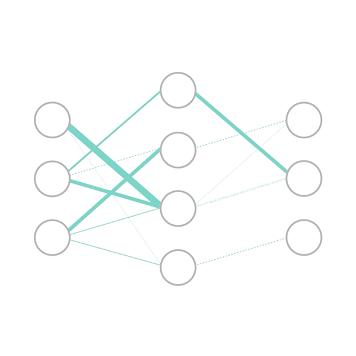](intermediate/pruning_tutorial.html)

[#### How to save memory by fusing the optimizer step into the backward pass

Learn a memory-saving technique through fusing the optimizer step into the backward pass using memory snapshots.

Model-Optimization,Best-Practice,CUDA,Frontend-APIs

](intermediate/optimizer_step_in_backward_tutorial.html)

[#### (beta) Accelerating BERT with semi-structured sparsity

Train BERT, prune it to be 2:4 sparse, and then accelerate it to achieve 2x inference speedups with semi-structured sparsity and torch.compile.

Text,Model-Optimization

](advanced/semi_structured_sparse.html)

[#### Multi-Objective Neural Architecture Search with Ax

Learn how to use Ax to search over architectures find optimal tradeoffs between accuracy and latency.

Model-Optimization,Best-Practice,Ax,TorchX

](intermediate/ax_multiobjective_nas_tutorial.html)

[#### torch.compile Tutorial

Speed up your models with minimal code changes using torch.compile, the latest PyTorch compiler solution.

Model-Optimization

](intermediate/torch_compile_tutorial.html)

[#### torch.compile End-to-End Tutorial

An example of applying torch.compile to a real model, demonstrating speedups.

Model-Optimization

](intermediate/torch_compile_full_example.html)

[#### Building a Convolution/Batch Norm fuser in torch.compile

Build a simple pattern matcher pass that fuses batch norm into convolution to improve performance during inference.

Model-Optimization

](intermediate/torch_compile_conv_bn_fuser.html)

[#### Inductor CPU Backend Debugging and Profiling

Learn the usage, debugging and performance profiling for ``torch.compile`` with Inductor CPU backend.

Model-Optimization

](intermediate/inductor_debug_cpu.html)

[#### (beta) Implementing High-Performance Transformers with SCALED DOT PRODUCT ATTENTION

This tutorial explores the new torch.nn.functional.scaled_dot_product_attention and how it can be used to construct Transformer components.

Model-Optimization,Attention,Transformer

](intermediate/scaled_dot_product_attention_tutorial.html)

[#### Knowledge Distillation in Convolutional Neural Networks

Learn how to improve the accuracy of lightweight models using more powerful models as teachers.

Model-Optimization,Image/Video

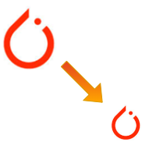](beginner/knowledge_distillation_tutorial.html)

[#### Accelerating PyTorch Transformers by replacing nn.Transformer with Nested Tensors and torch.compile()

This tutorial goes over recommended best practices for implementing Transformers with native PyTorch.

Transformer

](intermediate/transformer_building_blocks.html)

[#### PyTorch Distributed Overview

Briefly go over all concepts and features in the distributed package. Use this document to find the distributed training technology that can best serve your application.

Parallel-and-Distributed-Training

](beginner/dist_overview.html)

[#### Distributed Data Parallel in PyTorch - Video Tutorials

This series of video tutorials walks you through distributed training in PyTorch via DDP.

Parallel-and-Distributed-Training

](beginner/ddp_series_intro.html)

[#### Single-Machine Model Parallel Best Practices

Learn how to implement model parallel, a distributed training technique which splits a single model onto different GPUs, rather than replicating the entire model on each GPU

Parallel-and-Distributed-Training

](intermediate/model_parallel_tutorial.html)

[#### Getting Started with Distributed Data Parallel

Learn the basics of when to use distributed data paralle versus data parallel and work through an example to set it up.

Parallel-and-Distributed-Training

](intermediate/ddp_tutorial.html)

[#### Writing Distributed Applications with PyTorch

Set up the distributed package of PyTorch, use the different communication strategies, and go over some the internals of the package.

Parallel-and-Distributed-Training

](intermediate/dist_tuto.html)

[#### Large Scale Transformer model training with Tensor Parallel

Learn how to train large models with Tensor Parallel package.

Parallel-and-Distributed-Training

](intermediate/TP_tutorial.html)

[#### Customize Process Group Backends Using Cpp Extensions

Extend ProcessGroup with custom collective communication implementations.

Parallel-and-Distributed-Training

](intermediate/process_group_cpp_extension_tutorial.html)

[#### Getting Started with Distributed RPC Framework

Learn how to build distributed training using the torch.distributed.rpc package.

Parallel-and-Distributed-Training

](intermediate/rpc_tutorial.html)

[#### Implementing a Parameter Server Using Distributed RPC Framework

Walk through a through a simple example of implementing a parameter server using PyTorch's Distributed RPC framework.

Parallel-and-Distributed-Training

](intermediate/rpc_param_server_tutorial.html)

[#### Introduction to Distributed Pipeline Parallelism

Demonstrate how to implement pipeline parallelism using torch.distributed.pipelining

Parallel-and-Distributed-Training

](intermediate/pipelining_tutorial.html)

[#### Implementing Batch RPC Processing Using Asynchronous Executions

Learn how to use rpc.functions.async_execution to implement batch RPC

Parallel-and-Distributed-Training

](intermediate/rpc_async_execution.html)

[#### Combining Distributed DataParallel with Distributed RPC Framework

Walk through a through a simple example of how to combine distributed data parallelism with distributed model parallelism.

Parallel-and-Distributed-Training

](advanced/rpc_ddp_tutorial.html)

[#### Getting Started with Fully Sharded Data Parallel (FSDP2)

Learn how to train models with Fully Sharded Data Parallel (fully_shard) package.

Parallel-and-Distributed-Training

](intermediate/FSDP_tutorial.html)

[#### Introduction to Libuv TCPStore Backend

TCPStore now uses a new server backend for faster connection and better scalability.

Parallel-and-Distributed-Training

](intermediate/TCPStore_libuv_backend.html)

[#### Interactive Distributed Applications with Monarch

Learn how to spin up distributed applications using Monarch's singler controller model

Parallel-and-Distributed-Training

](intermediate/monarch_distributed_tutorial.html)

[#### Interactive Distributed Applications with Monarch

Learn how to use Monarch's actor framework with TorchTitan to simplify large-scale distributed training across SLURM clusters.

Parallel-and-Distributed-Training

](intermediate/monarch_distributed_tutorial.html)

[#### Exporting to ExecuTorch Tutorial

Learn about how to use ExecuTorch, a unified ML stack for lowering PyTorch models to edge devices.

Edge

](https://pytorch.org/executorch/stable/tutorials/export-to-executorch-tutorial.html)

[#### Running an ExecuTorch Model in C++ Tutorial

Learn how to load and execute an ExecuTorch model in C++

Edge

](https://pytorch.org/executorch/stable/running-a-model-cpp-tutorial.html)

[#### Using the ExecuTorch SDK to Profile a Model

Explore how to use the ExecuTorch SDK to profile, debug, and visualize ExecuTorch models

Edge

](https://docs.pytorch.org/executorch/main/tutorials/devtools-integration-tutorial.html)

[#### Building an ExecuTorch iOS Demo App

Explore how to set up the ExecuTorch iOS Demo App, which uses the MobileNet v3 model to process live camera images leveraging three different backends: XNNPACK, Core ML, and Metal Performance Shaders (MPS).

Edge

](https://github.com/meta-pytorch/executorch-examples/tree/main/mv3/apple/ExecuTorchDemo)

[#### Building an ExecuTorch Android Demo App

Learn how to set up the ExecuTorch Android Demo App for image segmentation tasks using the DeepLab v3 model and XNNPACK FP32 backend.

Edge

](https://github.com/meta-pytorch/executorch-examples/tree/main/dl3/android/DeepLabV3Demo#executorch-android-demo-app)

[#### Lowering a Model as a Delegate

Learn to accelerate your program using ExecuTorch by applying delegates through three methods: lowering the whole module, composing it with another module, and partitioning parts of a module.

Edge

](https://pytorch.org/executorch/stable/examples-end-to-end-to-lower-model-to-delegate.html)

[#### Introduction to TorchRec

TorchRec is a PyTorch domain library built to provide common sparsity & parallelism primitives needed for large-scale recommender systems.

TorchRec,Recommender

](intermediate/torchrec_intro_tutorial.html)

[#### Exploring TorchRec sharding

This tutorial covers the sharding schemes of embedding tables by using `EmbeddingPlanner` and `DistributedModelParallel` API.

TorchRec,Recommender

](advanced/sharding.html)

# Additional Resources

### Examples of PyTorch

A set of examples around PyTorch in Vision, Text, Reinforcement Learning that you can incorporate in your existing work.

[Check Out Examples](https://pytorch.org/examples?utm_source=examples&utm_medium=examples-landing)

### Run Tutorials on Google Colab

Learn how to copy tutorial data into Google Drive so that you can run tutorials on Google Colab.

[Open](beginner/colab.html)