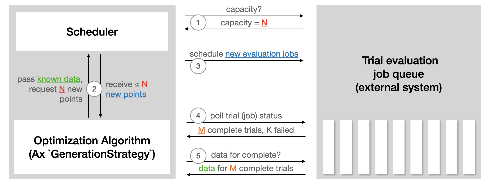

Note

Go to the end
to download the full example code.

# Multi-Objective NAS with Ax

**Authors:** [David Eriksson](https://github.com/dme65),
[Max Balandat](https://github.com/Balandat),
and the Adaptive Experimentation team at Meta.

In this tutorial, we show how to use [Ax](https://ax.dev/) to run
multi-objective neural architecture search (NAS) for a simple neural
network model on the popular MNIST dataset. While the underlying
methodology would typically be used for more complicated models and
larger datasets, we opt for a tutorial that is easily runnable
end-to-end on a laptop in less than 20 minutes.

In many NAS applications, there is a natural tradeoff between multiple
objectives of interest. For instance, when deploying models on-device
we may want to maximize model performance (for example, accuracy), while
simultaneously minimizing competing metrics like power consumption,
inference latency, or model size in order to satisfy deployment
constraints. Often, we may be able to reduce computational requirements
or latency of predictions substantially by accepting minimally lower
model performance. Principled methods for exploring such tradeoffs
efficiently are key enablers of scalable and sustainable AI, and have
many successful applications at Meta - see for instance our
[case study](https://research.facebook.com/blog/2021/07/optimizing-model-accuracy-and-latency-using-bayesian-multi-objective-neural-architecture-search/)
on a Natural Language Understanding model.

In our example here, we will tune the widths of two hidden layers,
the learning rate, the dropout probability, the batch size, and the
number of training epochs. The goal is to trade off performance
(accuracy on the validation set) and model size (the number of
model parameters).

This tutorial makes use of the following PyTorch libraries:

- [PyTorch Lightning](https://github.com/PyTorchLightning/pytorch-lightning) (specifying the model and training loop)
- [TorchX](https://github.com/pytorch/torchx) (for running training jobs remotely / asynchronously)
- [BoTorch](https://github.com/pytorch/botorch) (the Bayesian Optimization library powering Ax's algorithms)

## Defining the TorchX App

Our goal is to optimize the PyTorch Lightning training job defined in
[mnist_train_nas.py](https://github.com/pytorch/tutorials/tree/main/intermediate_source/mnist_train_nas.py).
To do this using TorchX, we write a helper function that takes in
the values of the architecture and hyperparameters of the training
job and creates a [TorchX AppDef](https://pytorch.org/torchx/latest/basics.html)
with the appropriate settings.

## Setting up the Runner

Ax's [Runner](https://ax.dev/api/core.html#ax.core.runner.Runner)
abstraction allows writing interfaces to various backends.
Ax already comes with Runner for TorchX, and so we just need to
configure it. For the purpose of this tutorial we run jobs locally
in a fully asynchronous fashion.

In order to launch them on a cluster, you can instead specify a
different TorchX scheduler and adjust the configuration appropriately.
For example, if you have a Kubernetes cluster, you just need to change the
scheduler from `local_cwd` to `kubernetes`).

```
# Make a temporary dir to log our results into
```

## Setting up the `SearchSpace`

First, we define our search space. Ax supports both range parameters
of type integer and float as well as choice parameters which can have
non-numerical types such as strings.
We will tune the hidden sizes, learning rate, dropout, and number of
epochs as range parameters and tune the batch size as an ordered choice
parameter to enforce it to be a power of 2.

## Setting up Metrics

Ax has the concept of a [Metric](https://ax.dev/api/core.html#metric)
that defines properties of outcomes and how observations are obtained
for these outcomes. This allows e.g. encoding how data is fetched from
some distributed execution backend and post-processed before being
passed as input to Ax.

In this tutorial we will use
[multi-objective optimization](https://ax.dev/tutorials/multiobjective_optimization.html)
with the goal of maximizing the validation accuracy and minimizing
the number of model parameters. The latter represents a simple proxy
of model latency, which is hard to estimate accurately for small ML
models (in an actual application we would benchmark the latency while
running the model on-device).

In our example TorchX will run the training jobs in a fully asynchronous
fashion locally and write the results to the `log_dir` based on the trial
index (see the `trainer()` function above). We will define a metric
class that is aware of that logging directory. By subclassing
[TensorboardCurveMetric](https://ax.dev/api/metrics.html?highlight=tensorboardcurvemetric#ax.metrics.tensorboard.TensorboardCurveMetric)
we get the logic to read and parse the TensorBoard logs for free.

Now we can instantiate the metrics for accuracy and the number of
model parameters. Here curve_name is the name of the metric in the
TensorBoard logs, while name is the metric name used internally
by Ax. We also specify lower_is_better to indicate the favorable
direction of the two metrics.

## Setting up the `OptimizationConfig`

The way to tell Ax what it should optimize is by means of an
[OptimizationConfig](https://ax.dev/api/core.html#module-ax.core.optimization_config).
Here we use a `MultiObjectiveOptimizationConfig` as we will
be performing multi-objective optimization.

Additionally, Ax supports placing constraints on the different
metrics by specifying objective thresholds, which bound the region
of interest in the outcome space that we want to explore. For this
example, we will constrain the validation accuracy to be at least
0.94 (94%) and the number of model parameters to be at most 80,000.

## Creating the Ax Experiment

In Ax, the [Experiment](https://ax.dev/api/core.html#ax.core.experiment.Experiment)
object is the object that stores all the information about the problem
setup.

## Choosing the Generation Strategy

A [GenerationStrategy](https://ax.dev/api/modelbridge.html#ax.modelbridge.generation_strategy.GenerationStrategy)
is the abstract representation of how we would like to perform the
optimization. While this can be customized (if you'd like to do so, see
[this tutorial](https://ax.dev/tutorials/generation_strategy.html)),
in most cases Ax can automatically determine an appropriate strategy
based on the search space, optimization config, and the total number
of trials we want to run.

Typically, Ax chooses to evaluate a number of random configurations
before starting a model-based Bayesian Optimization strategy.

## Configuring the Scheduler

The `Scheduler` acts as the loop control for the optimization.
It communicates with the backend to launch trials, check their status,
and retrieve results. In the case of this tutorial, it is simply reading
and parsing the locally saved logs. In a remote execution setting,
it would call APIs. The following illustration from the Ax
[Scheduler tutorial](https://ax.dev/tutorials/scheduler.html)
summarizes how the Scheduler interacts with external systems used to run
trial evaluations:



The `Scheduler` requires the `Experiment` and the `GenerationStrategy`.
A set of options can be passed in via `SchedulerOptions`. Here, we
configure the number of total evaluations as well as `max_pending_trials`,
the maximum number of trials that should run concurrently. In our
local setting, this is the number of training jobs running as individual
processes, while in a remote execution setting, this would be the number
of machines you want to use in parallel.

## Running the optimization

Now that everything is configured, we can let Ax run the optimization
in a fully automated fashion. The Scheduler will periodically check
the logs for the status of all currently running trials, and if a
trial completes the scheduler will update its status on the
experiment and fetch the observations needed for the Bayesian
optimization algorithm.

## Evaluating the results

We can now inspect the result of the optimization using helper
functions and visualizations included with Ax.

First, we generate a dataframe with a summary of the results
of the experiment. Each row in this dataframe corresponds to a
trial (that is, a training job that was run), and contains information
on the status of the trial, the parameter configuration that was
evaluated, and the metric values that were observed. This provides
an easy way to sanity check the optimization.

We can also visualize the Pareto frontier of tradeoffs between the
validation accuracy and the number of model parameters.

Tip

Ax uses Plotly to produce interactive plots, which allow you to
do things like zoom, crop, or hover in order to view details
of components of the plot. Try it out, and take a look at the
[visualization tutorial](https://ax.dev/tutorials/visualizations.html)
if you'd like to learn more).

The final optimization results are shown in the figure below where
the color corresponds to the iteration number for each trial.
We see that our method was able to successfully explore the
trade-offs and found both large models with high validation
accuracy as well as small models with comparatively lower
validation accuracy.

To better understand what our surrogate models have learned about
the black box objectives, we can take a look at the leave-one-out
cross validation results. Since our models are Gaussian Processes,
they not only provide point predictions but also uncertainty estimates
about these predictions. A good model means that the predicted means
(the points in the figure) are close to the 45 degree line and that the
confidence intervals cover the 45 degree line with the expected frequency
(here we use 95% confidence intervals, so we would expect them to contain
the true observation 95% of the time).

As the figures below show, the model size (`num_params`) metric is
much easier to model than the validation accuracy (`val_acc`) metric.

We can also make contour plots to better understand how the different
objectives depend on two of the input parameters. In the figure below,
we show the validation accuracy predicted by the model as a function
of the two hidden sizes. The validation accuracy clearly increases
as the hidden sizes increase.

Similarly, we show the number of model parameters as a function of
the hidden sizes in the figure below and see that it also increases
as a function of the hidden sizes (the dependency on `hidden_size_1`
is much larger).

## Acknowledgments

We thank the TorchX team (in particular Kiuk Chung and Tristan Rice)
for their help with integrating TorchX with Ax.

```
# %%%%%%RUNNABLE_CODE_REMOVED%%%%%%
```

**Total running time of the script:** (0 minutes 0.002 seconds)

[`Download Jupyter notebook: ax_multiobjective_nas_tutorial.ipynb`](../_downloads/ad03db8275f44695d56f05ca66e808fa/ax_multiobjective_nas_tutorial.ipynb)

[`Download Python source code: ax_multiobjective_nas_tutorial.py`](../_downloads/c0785c0d27d3df6cda96113d46c18927/ax_multiobjective_nas_tutorial.py)

[`Download zipped: ax_multiobjective_nas_tutorial.zip`](../_downloads/9bfc608198e84b9c1ae1a8e44a60fbc2/ax_multiobjective_nas_tutorial.zip)