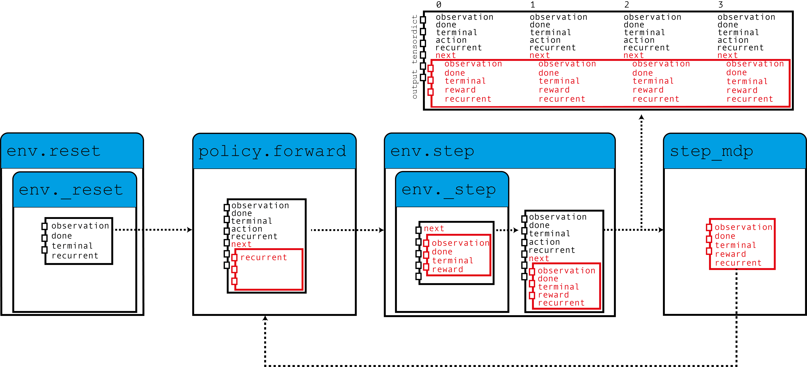

Note

Go to the end
to download the full example code.

# Recurrent DQN: Training recurrent policies

**Author**: [Vincent Moens](https://github.com/vmoens)

 What you will learn

- How to incorporating an RNN in an actor in TorchRL
- How to use that memory-based policy with a replay buffer and a loss module

 Prerequisites

- PyTorch v2.0.0
- gym[mujoco]
- tqdm

## Overview

Memory-based policies are crucial not only when the observations are partially
observable but also when the time dimension must be taken into account to
make informed decisions.

Recurrent neural network have long been a popular tool for memory-based
policies. The idea is to keep a recurrent state in memory between two
consecutive steps, and use this as an input to the policy along with the
current observation.

This tutorial shows how to incorporate an RNN in a policy using TorchRL.

Key learnings:

- Incorporating an RNN in an actor in TorchRL;
- Using that memory-based policy with a replay buffer and a loss module.

The core idea of using RNNs in TorchRL is to use TensorDict as a data carrier
for the hidden states from one step to another. We'll build a policy that
reads the previous recurrent state from the current TensorDict, and writes the
current recurrent states in the TensorDict of the next state:



As this figure shows, our environment populates the TensorDict with zeroed recurrent
states which are read by the policy together with the observation to produce an
action, and recurrent states that will be used for the next step.
When the `step_mdp()` function is called, the recurrent states
from the next state are brought to the current TensorDict. Let's see how this
is implemented in practice.

If you are running this in Google Colab, make sure you install the following dependencies:

```
!pip3 install torchrl
!pip3 install gym[mujoco]
!pip3 install tqdm
```

## Setup

```

```

## Environment

As usual, the first step is to build our environment: it helps us
define the problem and build the policy network accordingly. For this tutorial,
we'll be running a single pixel-based instance of the CartPole gym
environment with some custom transforms: turning to grayscale, resizing to
84x84, scaling down the rewards and normalizing the observations.

Note

The [`StepCounter`](https://docs.pytorch.org/rl/stable/reference/generated/torchrl.envs.transforms.StepCounter.html#torchrl.envs.transforms.StepCounter) transform is accessory. Since the CartPole
task goal is to make trajectories as long as possible, counting the steps
can help us track the performance of our policy.

Two transforms are important for the purpose of this tutorial:

- [`InitTracker`](https://docs.pytorch.org/rl/stable/reference/generated/torchrl.envs.transforms.InitTracker.html#torchrl.envs.transforms.InitTracker) will stamp the
calls to [`reset()`](https://docs.pytorch.org/rl/stable/reference/generated/torchrl.envs.EnvBase.html#id1) by adding a `"is_init"`
boolean mask in the TensorDict that will track which steps require a reset
of the RNN hidden states.
- The [`TensorDictPrimer`](https://docs.pytorch.org/rl/stable/reference/generated/torchrl.envs.transforms.TensorDictPrimer.html#torchrl.envs.transforms.TensorDictPrimer) transform is a bit more
technical. It is not required to use RNN policies. However, it
instructs the environment (and subsequently the collector) that some extra
keys are to be expected. Once added, a call to env.reset() will populate
the entries indicated in the primer with zeroed tensors. Knowing that
these tensors are expected by the policy, the collector will pass them on
during collection. Eventually, we'll be storing our hidden states in the
replay buffer, which will help us bootstrap the computation of the
RNN operations in the loss module (which would otherwise be initiated
with 0s). In summary: not including this transform will not impact hugely
the training of our policy, but it will make the recurrent keys disappear
from the collected data and the replay buffer, which will in turn lead to
a slightly less optimal training.
Fortunately, the [`LSTMModule`](https://docs.pytorch.org/rl/stable/reference/generated/torchrl.modules.LSTMModule.html#torchrl.modules.LSTMModule) we propose is
equipped with a helper method to build just that transform for us, so
we can wait until we build it!

As always, we need to initialize manually our normalization constants:

## Policy

Our policy will have 3 components: a [`ConvNet`](https://docs.pytorch.org/rl/stable/reference/generated/torchrl.modules.ConvNet.html#torchrl.modules.ConvNet)
backbone, an [`LSTMModule`](https://docs.pytorch.org/rl/stable/reference/generated/torchrl.modules.LSTMModule.html#torchrl.modules.LSTMModule) memory layer and a shallow
[`MLP`](https://docs.pytorch.org/rl/stable/reference/generated/torchrl.modules.MLP.html#torchrl.modules.MLP) block that will map the LSTM output onto the
action values.

### Convolutional network

We build a convolutional network flanked with a [`torch.nn.AdaptiveAvgPool2d`](https://docs.pytorch.org/docs/stable/generated/torch.nn.AdaptiveAvgPool2d.html#torch.nn.AdaptiveAvgPool2d)
that will squash the output in a vector of size 64. The [`ConvNet`](https://docs.pytorch.org/rl/stable/reference/generated/torchrl.modules.ConvNet.html#torchrl.modules.ConvNet)
can assist us with this:

we execute the first module on a batch of data to gather the size of the
output vector:

### LSTM Module

TorchRL provides a specialized [`LSTMModule`](https://docs.pytorch.org/rl/stable/reference/generated/torchrl.modules.LSTMModule.html#torchrl.modules.LSTMModule) class
to incorporate LSTMs in your code-base. It is a [`TensorDictModuleBase`](https://docs.pytorch.org/tensordict/stable/reference/generated/tensordict.nn.TensorDictModuleBase.html#tensordict.nn.TensorDictModuleBase)
subclass: as such, it has a set of `in_keys` and `out_keys` that indicate
what values should be expected to be read and written/updated during the
execution of the module. The class comes with customizable predefined
values for these attributes to facilitate its construction.

Note

*Usage limitations*: The class supports almost all LSTM features such as
dropout or multi-layered LSTMs.
However, to respect TorchRL's conventions, this LSTM must have the `batch_first`
attribute set to `True` which is **not** the default in PyTorch. However,
our [`LSTMModule`](https://docs.pytorch.org/rl/stable/reference/generated/torchrl.modules.LSTMModule.html#torchrl.modules.LSTMModule) changes this default
behavior, so we're good with a native call.

Also, the LSTM cannot have a `bidirectional` attribute set to `True` as
this wouldn't be usable in online settings. In this case, the default value
is the correct one.

Let us look at the LSTM Module class, specifically its in and out_keys:

We can see that these values contain the key we indicated as the in_key (and out_key)
as well as recurrent key names. The out_keys are preceded by a "next" prefix
that indicates that they will need to be written in the "next" TensorDict.
We use this convention (which can be overridden by passing the in_keys/out_keys
arguments) to make sure that a call to `step_mdp()` will
move the recurrent state to the root TensorDict, making it available to the
RNN during the following call (see figure in the intro).

As mentioned earlier, we have one more optional transform to add to our
environment to make sure that the recurrent states are passed to the buffer.
The [`make_tensordict_primer()`](https://docs.pytorch.org/rl/stable/reference/generated/torchrl.modules.LSTMModule.html#id0) method does
exactly that:

and that's it! We can print the environment to check that everything looks good now
that we have added the primer:

### MLP

We use a single-layer MLP to represent the action values we'll be using for
our policy.

and fill the bias with zeros:

### Using the Q-Values to select an action

The last part of our policy is the Q-Value Module.
The Q-Value module `QValueModule`
will read the `"action_values"` key that is produced by our MLP and
from it, gather the action that has the maximum value.
The only thing we need to do is to specify the action space, which can be done
either by passing a string or an action-spec. This allows us to use
Categorical (sometimes called "sparse") encoding or the one-hot version of it.

Note

TorchRL also provides a wrapper class [`torchrl.modules.QValueActor`](https://docs.pytorch.org/rl/stable/reference/generated/torchrl.modules.QValueActor.html#torchrl.modules.QValueActor) that
wraps a module in a Sequential together with a `QValueModule`
like we are doing explicitly here. There is little advantage to do this
and the process is less transparent, but the end results will be similar to
what we do here.

We can now put things together in a [`TensorDictSequential`](https://docs.pytorch.org/tensordict/stable/reference/generated/tensordict.nn.TensorDictSequential.html#tensordict.nn.TensorDictSequential)

DQN being a deterministic algorithm, exploration is a crucial part of it.
We'll be using an \(\epsilon\)-greedy policy with an epsilon of 0.2 decaying
progressively to 0.
This decay is achieved via a call to [`step()`](https://docs.pytorch.org/rl/stable/reference/generated/torchrl.modules.EGreedyModule.html#torchrl.modules.EGreedyModule.step)
(see training loop below).

### Using the model for the loss

The model as we've built it is well equipped to be used in sequential settings.
However, the class [`torch.nn.LSTM`](https://docs.pytorch.org/docs/stable/generated/torch.nn.LSTM.html#torch.nn.LSTM) can use a cuDNN-optimized backend
to run the RNN sequence faster on GPU device. We would not want to miss
such an opportunity to speed up our training loop!
To use it, we just need to tell the LSTM module to run on "recurrent-mode"
when used by the loss.
As we'll usually want to have two copies of the LSTM module, we do this by
calling a [`set_recurrent_mode()`](https://docs.pytorch.org/rl/stable/reference/generated/torchrl.modules.LSTMModule.html#torchrl.modules.LSTMModule.set_recurrent_mode) method that
will return a new instance of the LSTM (with shared weights) that will
assume that the input data is sequential in nature.

Because we still have a couple of uninitialized parameters we should
initialize them before creating an optimizer and such.

## DQN Loss

Out DQN loss requires us to pass the policy and, again, the action-space.
While this may seem redundant, it is important as we want to make sure that
the [`DQNLoss`](https://docs.pytorch.org/rl/stable/reference/generated/torchrl.objectives.DQNLoss.html#torchrl.objectives.DQNLoss) and the `QValueModule`
classes are compatible, but aren't strongly dependent on each other.

To use the Double-DQN, we ask for a `delay_value` argument that will
create a non-differentiable copy of the network parameters to be used
as a target network.

Since we are using a double DQN, we need to update the target parameters.
We'll use a `SoftUpdate` instance to carry out
this work.

## Collector and replay buffer

We build the simplest data collector there is. We'll try to train our algorithm
with a million frames, extending the buffer with 50 frames at a time. The buffer
will be designed to store 20 thousands trajectories of 50 steps each.
At each optimization step (16 per data collection), we'll collect 4 items
from our buffer, for a total of 200 transitions.
We'll use a [`LazyMemmapStorage`](https://docs.pytorch.org/rl/stable/reference/generated/torchrl.data.replay_buffers.LazyMemmapStorage.html#torchrl.data.replay_buffers.LazyMemmapStorage) storage to keep the data
on disk.

Note

For the sake of efficiency, we're only running a few thousands iterations
here. In a real setting, the total number of frames should be set to 1M.

## Training loop

To keep track of the progress, we will run the policy in the environment once
every 50 data collection, and plot the results after training.

Let's plot our results:

## Conclusion

We have seen how an RNN can be incorporated in a policy in TorchRL.
You should now be able:

- Create an LSTM module that acts as a [`TensorDictModule`](https://docs.pytorch.org/tensordict/stable/reference/generated/tensordict.nn.TensorDictModule.html#tensordict.nn.TensorDictModule)
- Indicate to the LSTM module that a reset is needed via an [`InitTracker`](https://docs.pytorch.org/rl/stable/reference/generated/torchrl.envs.transforms.InitTracker.html#torchrl.envs.transforms.InitTracker)
transform
- Incorporate this module in a policy and in a loss module
- Make sure that the collector is made aware of the recurrent state entries
such that they can be stored in the replay buffer along with the rest of
the data

## Further Reading

- The TorchRL documentation can be found [here](https://pytorch.org/rl/).

```
# %%%%%%RUNNABLE_CODE_REMOVED%%%%%%
```

[`Download Jupyter notebook: dqn_with_rnn_tutorial.ipynb`](../_downloads/224d2179034ef4c00cd9b86f2976062a/dqn_with_rnn_tutorial.ipynb)

[`Download Python source code: dqn_with_rnn_tutorial.py`](../_downloads/14b68b9764c79afe8ef88b11fc27bff7/dqn_with_rnn_tutorial.py)

[`Download zipped: dqn_with_rnn_tutorial.zip`](../_downloads/0fc9a70355f8b8b9fb173bb9e1f5c7e0/dqn_with_rnn_tutorial.zip)