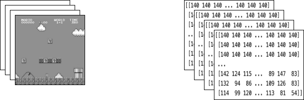

Note

Go to the end
to download the full example code.

# Train a Mario-playing RL Agent

**Authors:** [Yuansong Feng](https://github.com/YuansongFeng), [Suraj Subramanian](https://github.com/suraj813), [Howard Wang](https://github.com/hw26), [Steven Guo](https://github.com/GuoYuzhang).

This tutorial walks you through the fundamentals of Deep Reinforcement
Learning. At the end, you will implement an AI-powered Mario (using
[Double Deep Q-Networks](https://arxiv.org/pdf/1509.06461.pdf)) that
can play the game by itself.

Although no prior knowledge of RL is necessary for this tutorial, you
can familiarize yourself with these RL
[concepts](https://spinningup.openai.com/en/latest/spinningup/rl_intro.html),
and have this handy
[cheatsheet](https://colab.research.google.com/drive/1eN33dPVtdPViiS1njTW_-r-IYCDTFU7N)
as your companion. The full code is available
[here](https://github.com/yuansongFeng/MadMario/).


```
%%bash
pip install gym-super-mario-bros==7.4.0
pip install tensordict==0.3.0
pip install torchrl==0.3.0
```

```
# Gym is an OpenAI toolkit for RL

# NES Emulator for OpenAI Gym

# Super Mario environment for OpenAI Gym
```

## RL Definitions

**Environment** The world that an agent interacts with and learns from.

**Action** \(a\) : How the Agent responds to the Environment. The
set of all possible Actions is called *action-space*.

**State** \(s\) : The current characteristic of the Environment. The
set of all possible States the Environment can be in is called
*state-space*.

**Reward** \(r\) : Reward is the key feedback from Environment to
Agent. It is what drives the Agent to learn and to change its future
action. An aggregation of rewards over multiple time steps is called
**Return**.

**Optimal Action-Value function** \(Q^*(s,a)\) : Gives the expected
return if you start in state \(s\), take an arbitrary action
\(a\), and then for each future time step take the action that
maximizes returns. \(Q\) can be said to stand for the "quality" of
the action in a state. We try to approximate this function.

## Environment

### Initialize Environment

In Mario, the environment consists of tubes, mushrooms and other
components.

When Mario makes an action, the environment responds with the changed
(next) state, reward and other info.

```
# Initialize Super Mario environment (in v0.26 change render mode to 'human' to see results on the screen)

# Limit the action-space to
# 0. walk right
# 1. jump right
```

### Preprocess Environment

Environment data is returned to the agent in `next_state`. As you saw
above, each state is represented by a `[3, 240, 256]` size array.
Often that is more information than our agent needs; for instance,
Mario's actions do not depend on the color of the pipes or the sky!

We use **Wrappers** to preprocess environment data before sending it to
the agent.

`GrayScaleObservation` is a common wrapper to transform an RGB image
to grayscale; doing so reduces the size of the state representation
without losing useful information. Now the size of each state:
`[1, 240, 256]`

`ResizeObservation` downsamples each observation into a square image.
New size: `[1, 84, 84]`

`SkipFrame` is a custom wrapper that inherits from `gym.Wrapper` and
implements the `step()` function. Because consecutive frames don't
vary much, we can skip n-intermediate frames without losing much
information. The n-th frame aggregates rewards accumulated over each
skipped frame.

`FrameStack` is a wrapper that allows us to squash consecutive frames
of the environment into a single observation point to feed to our
learning model. This way, we can identify if Mario was landing or
jumping based on the direction of his movement in the previous several
frames.

```
# Apply Wrappers to environment
```

After applying the above wrappers to the environment, the final wrapped
state consists of 4 gray-scaled consecutive frames stacked together, as
shown above in the image on the left. Each time Mario makes an action,
the environment responds with a state of this structure. The structure
is represented by a 3-D array of size `[4, 84, 84]`.



## Agent

We create a class `Mario` to represent our agent in the game. Mario
should be able to:

- **Act** according to the optimal action policy based on the current
state (of the environment).
- **Remember** experiences. Experience = (current state, current
action, reward, next state). Mario *caches* and later *recalls* his
experiences to update his action policy.
- **Learn** a better action policy over time

In the following sections, we will populate Mario's parameters and
define his functions.

### Act

For any given state, an agent can choose to do the most optimal action
(**exploit**) or a random action (**explore**).

Mario randomly explores with a chance of `self.exploration_rate`; when
he chooses to exploit, he relies on `MarioNet` (implemented in
`Learn` section) to provide the most optimal action.

### Cache and Recall

These two functions serve as Mario's "memory" process.

`cache()`: Each time Mario performs an action, he stores the
`experience` to his memory. His experience includes the current
*state*, *action* performed, *reward* from the action, the *next state*,
and whether the game is *done*.

`recall()`: Mario randomly samples a batch of experiences from his
memory, and uses that to learn the game.

### Learn

Mario uses the [DDQN algorithm](https://arxiv.org/pdf/1509.06461)
under the hood. DDQN uses two ConvNets - \(Q_{online}\) and
\(Q_{target}\) - that independently approximate the optimal
action-value function.

In our implementation, we share feature generator `features` across
\(Q_{online}\) and \(Q_{target}\), but maintain separate FC
classifiers for each. \(\theta_{target}\) (the parameters of
\(Q_{target}\)) is frozen to prevent updating by backprop. Instead,
it is periodically synced with \(\theta_{online}\) (more on this
later).

#### Neural Network

#### TD Estimate & TD Target

Two values are involved in learning:

**TD Estimate** - the predicted optimal \(Q^*\) for a given state
\(s\)

\[{TD}_e = Q_{online}^*(s,a)\]

**TD Target** - aggregation of current reward and the estimated
\(Q^*\) in the next state \(s'\)

\[a' = argmax_{a} Q_{online}(s', a)\]

\[{TD}_t = r + \gamma Q_{target}^*(s',a')\]

Because we don't know what next action \(a'\) will be, we use the
action \(a'\) maximizes \(Q_{online}\) in the next state
\(s'\).

Notice we use the
[@torch.no_grad()](https://pytorch.org/docs/stable/generated/torch.no_grad.html#no-grad)
decorator on `td_target()` to disable gradient calculations here
(because we don't need to backpropagate on \(\theta_{target}\)).

#### Updating the model

As Mario samples inputs from his replay buffer, we compute \(TD_t\)
and \(TD_e\) and backpropagate this loss down \(Q_{online}\) to
update its parameters \(\theta_{online}\) (\(\alpha\) is the
learning rate `lr` passed to the `optimizer`)

\[\theta_{online} \leftarrow \theta_{online} + \alpha \nabla(TD_e - TD_t)\]

\(\theta_{target}\) does not update through backpropagation.
Instead, we periodically copy \(\theta_{online}\) to
\(\theta_{target}\)

\[\theta_{target} \leftarrow \theta_{online}\]

#### Save checkpoint

#### Putting it all together

### Logging

## Let's play!

In this example we run the training loop for 40 episodes, but for Mario to truly learn the ways of
his world, we suggest running the loop for at least 40,000 episodes!

## Conclusion

In this tutorial, we saw how we can use PyTorch to train a game-playing AI. You can use the same methods
to train an AI to play any of the games at the [OpenAI gym](https://gym.openai.com/). Hope you enjoyed this tutorial, feel free to reach us at
[our github](https://github.com/yuansongFeng/MadMario/)!

```
# %%%%%%RUNNABLE_CODE_REMOVED%%%%%%
```

**Total running time of the script:** (0 minutes 0.002 seconds)

[`Download Jupyter notebook: mario_rl_tutorial.ipynb`](../_downloads/c195adbae0504b6504c93e0fd18235ce/mario_rl_tutorial.ipynb)

[`Download Python source code: mario_rl_tutorial.py`](../_downloads/38360df5715ca8f0d232e62f3a303840/mario_rl_tutorial.py)

[`Download zipped: mario_rl_tutorial.zip`](../_downloads/9f5c7929209c871226bd9fa61bf4e633/mario_rl_tutorial.zip)