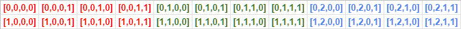
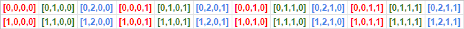

Note

Go to the end
to download the full example code.

# Channels Last Memory Format in PyTorch

**Author**: [Vitaly Fedyunin](https://github.com/VitalyFedyunin)

 What you will learn

- What is the channels last memory format in PyTorch?
- How can it be used to improve performance on certain operators?

 Prerequisites

- PyTorch v1.5.0
- A CUDA-capable GPU

The channels last memory format is an alternative way of ordering NCHW tensors in memory preserving dimensions ordering. Channels last tensors ordered in such a way that channels become the densest dimension (aka storing images pixel-per-pixel).

For example, classic (contiguous) storage of NCHW tensor (in our case it is two 4x4 images with 3 color channels) look like this:



Channels last memory format orders data differently:



Pytorch supports memory formats by utilizing the existing strides structure.
For example, 10x3x16x16 batch in Channels last format will have strides equal to (768, 1, 48, 3).

Channels last memory format is implemented for 4D NCHW Tensors only.

## Memory Format API

Here is how to convert tensors between contiguous and channels
last memory formats.

Classic PyTorch contiguous tensor

Conversion operator

Back to contiguous

Alternative option

Format checks

There are minor difference between the two APIs `to` and
`contiguous`. We suggest to stick with `to` when explicitly
converting memory format of tensor.

For general cases the two APIs behave the same. However in special
cases for a 4D tensor with size `NCHW` when either: `C==1` or
`H==1 && W==1`, only `to` would generate a proper stride to
represent channels last memory format.

This is because in either of the two cases above, the memory format
of a tensor is ambiguous, i.e. a contiguous tensor with size
`N1HW` is both `contiguous` and channels last in memory storage.
Therefore, they are already considered as `is_contiguous`
for the given memory format and hence `contiguous` call becomes a
no-op and would not update the stride. On the contrary, `to`
would restride tensor with a meaningful stride on dimensions whose
sizes are 1 in order to properly represent the intended memory
format

Same thing applies to explicit permutation API `permute`. In
special case where ambiguity could occur, `permute` does not
guarantee to produce a stride that properly carry the intended
memory format. We suggest to use `to` with explicit memory format
to avoid unintended behavior.

And a side note that in the extreme case, where three non-batch
dimensions are all equal to `1` (`C==1 && H==1 && W==1`),
current implementation cannot mark a tensor as channels last memory
format.

Create as channels last

`clone` preserves memory format

`to`, `cuda`, `float` ... preserves memory format

`empty_like`, `*_like` operators preserves memory format

Pointwise operators preserves memory format

`Conv`, `Batchnorm` modules using `cudnn` backends support channels last
(only works for cuDNN >= 7.6). Convolution modules, unlike binary
p-wise operator, have channels last as the dominating memory format.
If all inputs are in contiguous memory format, the operator
produces output in contiguous memory format. Otherwise, output will
be in channels last memory format.

When input tensor reaches a operator without channels last support,
a permutation should automatically apply in the kernel to restore
contiguous on input tensor. This introduces overhead and stops the
channels last memory format propagation. Nevertheless, it guarantees
correct output.

## Performance Gains

Channels last memory format optimizations are available on both GPU and CPU.
On GPU, the most significant performance gains are observed on NVIDIA's
hardware with Tensor Cores support running on reduced precision
(`torch.float16`).
We were able to archive over 22% performance gains with channels last
comparing to contiguous format, both while utilizing
'AMP (Automated Mixed Precision)' training scripts.
Our scripts uses AMP supplied by NVIDIA
[NVIDIA/apex](https://github.com/NVIDIA/apex).

`python main_amp.py -a resnet50 --b 200 --workers 16 --opt-level O2 ./data`

```
# opt_level = O2
# keep_batchnorm_fp32 = None <class 'NoneType'>
# loss_scale = None <class 'NoneType'>
# CUDNN VERSION: 7603
# => creating model 'resnet50'
# Selected optimization level O2: FP16 training with FP32 batchnorm and FP32 master weights.
# Defaults for this optimization level are:
# enabled : True
# opt_level : O2
# cast_model_type : torch.float16
# patch_torch_functions : False
# keep_batchnorm_fp32 : True
# master_weights : True
# loss_scale : dynamic
# Processing user overrides (additional kwargs that are not None)...
# After processing overrides, optimization options are:
# enabled : True
# opt_level : O2
# cast_model_type : torch.float16
# patch_torch_functions : False
# keep_batchnorm_fp32 : True
# master_weights : True
# loss_scale : dynamic
# Epoch: [0][10/125] Time 0.866 (0.866) Speed 230.949 (230.949) Loss 0.6735125184 (0.6735) Prec@1 61.000 (61.000) Prec@5 100.000 (100.000)
# Epoch: [0][20/125] Time 0.259 (0.562) Speed 773.481 (355.693) Loss 0.6968704462 (0.6852) Prec@1 55.000 (58.000) Prec@5 100.000 (100.000)
# Epoch: [0][30/125] Time 0.258 (0.461) Speed 775.089 (433.965) Loss 0.7877287269 (0.7194) Prec@1 51.500 (55.833) Prec@5 100.000 (100.000)
# Epoch: [0][40/125] Time 0.259 (0.410) Speed 771.710 (487.281) Loss 0.8285319805 (0.7467) Prec@1 48.500 (54.000) Prec@5 100.000 (100.000)
# Epoch: [0][50/125] Time 0.260 (0.380) Speed 770.090 (525.908) Loss 0.7370464802 (0.7447) Prec@1 56.500 (54.500) Prec@5 100.000 (100.000)
# Epoch: [0][60/125] Time 0.258 (0.360) Speed 775.623 (555.728) Loss 0.7592862844 (0.7472) Prec@1 51.000 (53.917) Prec@5 100.000 (100.000)
# Epoch: [0][70/125] Time 0.258 (0.345) Speed 774.746 (579.115) Loss 1.9698858261 (0.9218) Prec@1 49.500 (53.286) Prec@5 100.000 (100.000)
# Epoch: [0][80/125] Time 0.260 (0.335) Speed 770.324 (597.659) Loss 2.2505953312 (1.0879) Prec@1 50.500 (52.938) Prec@5 100.000 (100.000)
```

Passing `--channels-last true` allows running a model in Channels last format with observed 22% performance gain.

`python main_amp.py -a resnet50 --b 200 --workers 16 --opt-level O2 --channels-last true ./data`

```
# opt_level = O2
# keep_batchnorm_fp32 = None <class 'NoneType'>
# loss_scale = None <class 'NoneType'>
#
# CUDNN VERSION: 7603
#
# => creating model 'resnet50'
# Selected optimization level O2: FP16 training with FP32 batchnorm and FP32 master weights.
#
# Defaults for this optimization level are:
# enabled : True
# opt_level : O2
# cast_model_type : torch.float16
# patch_torch_functions : False
# keep_batchnorm_fp32 : True
# master_weights : True
# loss_scale : dynamic
# Processing user overrides (additional kwargs that are not None)...
# After processing overrides, optimization options are:
# enabled : True
# opt_level : O2
# cast_model_type : torch.float16
# patch_torch_functions : False
# keep_batchnorm_fp32 : True
# master_weights : True
# loss_scale : dynamic
#
# Epoch: [0][10/125] Time 0.767 (0.767) Speed 260.785 (260.785) Loss 0.7579724789 (0.7580) Prec@1 53.500 (53.500) Prec@5 100.000 (100.000)
# Epoch: [0][20/125] Time 0.198 (0.482) Speed 1012.135 (414.716) Loss 0.7007197738 (0.7293) Prec@1 49.000 (51.250) Prec@5 100.000 (100.000)
# Epoch: [0][30/125] Time 0.198 (0.387) Speed 1010.977 (516.198) Loss 0.7113101482 (0.7233) Prec@1 55.500 (52.667) Prec@5 100.000 (100.000)
# Epoch: [0][40/125] Time 0.197 (0.340) Speed 1013.023 (588.333) Loss 0.8943189979 (0.7661) Prec@1 54.000 (53.000) Prec@5 100.000 (100.000)
# Epoch: [0][50/125] Time 0.198 (0.312) Speed 1010.541 (641.977) Loss 1.7113249302 (0.9551) Prec@1 51.000 (52.600) Prec@5 100.000 (100.000)
# Epoch: [0][60/125] Time 0.198 (0.293) Speed 1011.163 (683.574) Loss 5.8537774086 (1.7716) Prec@1 50.500 (52.250) Prec@5 100.000 (100.000)
# Epoch: [0][70/125] Time 0.198 (0.279) Speed 1011.453 (716.767) Loss 5.7595844269 (2.3413) Prec@1 46.500 (51.429) Prec@5 100.000 (100.000)
# Epoch: [0][80/125] Time 0.198 (0.269) Speed 1011.827 (743.883) Loss 2.8196096420 (2.4011) Prec@1 47.500 (50.938) Prec@5 100.000 (100.000)
```

The following list of models has the full support of Channels last and showing 8%-35% performance gains on Volta devices:
`alexnet`, `mnasnet0_5`, `mnasnet0_75`, `mnasnet1_0`, `mnasnet1_3`, `mobilenet_v2`, `resnet101`, `resnet152`, `resnet18`, `resnet34`, `resnet50`, `resnext50_32x4d`, `shufflenet_v2_x0_5`, `shufflenet_v2_x1_0`, `shufflenet_v2_x1_5`, `shufflenet_v2_x2_0`, `squeezenet1_0`, `squeezenet1_1`, `vgg11`, `vgg11_bn`, `vgg13`, `vgg13_bn`, `vgg16`, `vgg16_bn`, `vgg19`, `vgg19_bn`, `wide_resnet101_2`, `wide_resnet50_2`

The following list of models has the full support of Channels last and showing 26%-76% performance gains on Intel(R) Xeon(R) Ice Lake (or newer) CPUs:
`alexnet`, `densenet121`, `densenet161`, `densenet169`, `googlenet`, `inception_v3`, `mnasnet0_5`, `mnasnet1_0`, `resnet101`, `resnet152`, `resnet18`, `resnet34`, `resnet50`, `resnext101_32x8d`, `resnext50_32x4d`, `shufflenet_v2_x0_5`, `shufflenet_v2_x1_0`, `squeezenet1_0`, `squeezenet1_1`, `vgg11`, `vgg11_bn`, `vgg13`, `vgg13_bn`, `vgg16`, `vgg16_bn`, `vgg19`, `vgg19_bn`, `wide_resnet101_2`, `wide_resnet50_2`

## Converting existing models

Channels last support is not limited by existing models, as any
model can be converted to channels last and propagate format through
the graph as soon as input (or certain weight) is formatted
correctly.

```
# Need to be done once, after model initialization (or load)

# Need to be done for every input
```

However, not all operators fully converted to support channels last
(usually returning contiguous output instead). In the example posted
above, layers that does not support channels last will stop the
memory format propagation. In spite of that, as we have converted the
model to channels last format, that means each convolution layer,
which has its 4 dimensional weight in channels last memory format,
will restore channels last memory format and benefit from faster
kernels.

But operators that does not support channels last does introduce
overhead by permutation. Optionally, you can investigate and identify
operators in your model that does not support channels last, if you
want to improve the performance of converted model.

That means you need to verify the list of used operators
against supported operators list [pytorch/pytorch](https://github.com/pytorch/pytorch/wiki/Operators-with-Channels-Last-support),
or introduce memory format checks into eager execution mode and run your model.

After running the code below, operators will raise an exception if the output of the
operator doesn't match the memory format of the input.

If you found an operator that doesn't support channels last tensors
and you want to contribute, feel free to use following developers
guide [pytorch/pytorch](https://github.com/pytorch/pytorch/wiki/Writing-memory-format-aware-operators).

Code below is to recover the attributes of torch.

## Work to do

There are still many things to do, such as:

- Resolving ambiguity of `N1HW` and `NC11` Tensors;
- Testing of Distributed Training support;
- Improving operators coverage.

If you have feedback and/or suggestions for improvement, please let us
know by creating [an issue](https://github.com/pytorch/pytorch/issues).

## Conclusion

This tutorial introduced the "channels last" memory format and demonstrated
how to use it for performance gains. For a practical example of accelerating
vision models using channels last, see the post
[here](https://pytorch.org/blog/accelerating-pytorch-vision-models-with-channels-last-on-cpu/).

```
# %%%%%%RUNNABLE_CODE_REMOVED%%%%%%
```

**Total running time of the script:** (0 minutes 0.002 seconds)

[`Download Jupyter notebook: memory_format_tutorial.ipynb`](../_downloads/f11c58c36c9b8a5daf09d3f9a792ef84/memory_format_tutorial.ipynb)

[`Download Python source code: memory_format_tutorial.py`](../_downloads/591028d309d0401740cd71eb6b14bf93/memory_format_tutorial.py)

[`Download zipped: memory_format_tutorial.zip`](../_downloads/5597f45e0443e4b44273c796119bef90/memory_format_tutorial.zip)