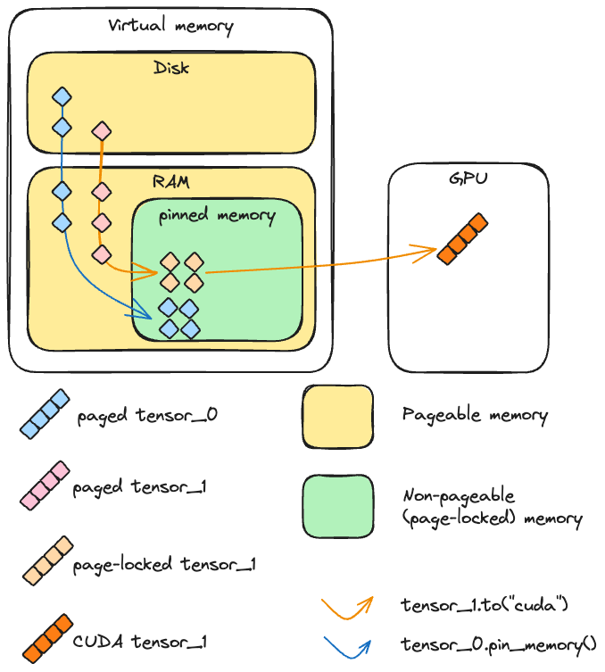
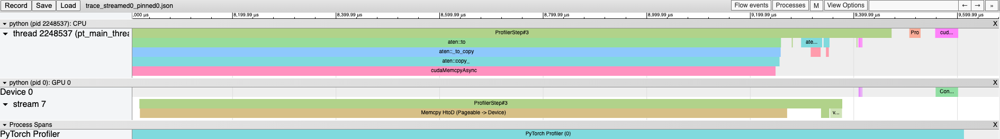
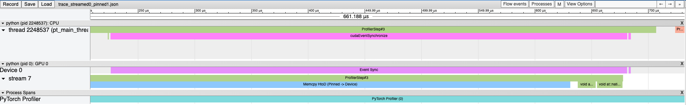
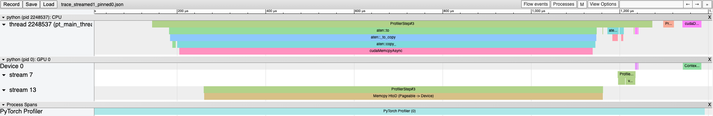
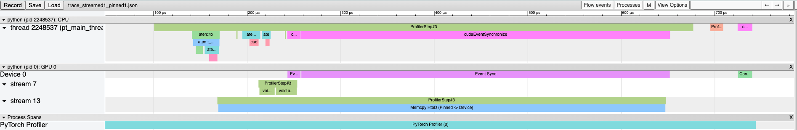

Note

Go to the end
to download the full example code.

# A guide on good usage of `non_blocking` and `pin_memory()` in PyTorch

**Author**: [Vincent Moens](https://github.com/vmoens)

## Introduction

Transferring data from the CPU to the GPU is fundamental in many PyTorch applications.
It's crucial for users to understand the most effective tools and options available for moving data between devices.
This tutorial examines two key methods for device-to-device data transfer in PyTorch:
`pin_memory()` and `to()` with the `non_blocking=True` option.

### What you will learn

Optimizing the transfer of tensors from the CPU to the GPU can be achieved through asynchronous transfers and memory
pinning. However, there are important considerations:

- Using `tensor.pin_memory().to(device, non_blocking=True)` can be up to twice as slow as a straightforward `tensor.to(device)`.
- Generally, `tensor.to(device, non_blocking=True)` is an effective choice for enhancing transfer speed.
- While `cpu_tensor.to("cuda", non_blocking=True).mean()` executes correctly, attempting
`cuda_tensor.to("cpu", non_blocking=True).mean()` will result in erroneous outputs.

### Preamble

The performance reported in this tutorial are conditioned on the system used to build the tutorial.
Although the conclusions are applicable across different systems, the specific observations may vary slightly
depending on the hardware available, especially on older hardware.
The primary objective of this tutorial is to offer a theoretical framework for understanding CPU to GPU data transfers.
However, any design decisions should be tailored to individual cases and guided by benchmarked throughput measurements,
as well as the specific requirements of the task at hand.

This tutorial requires tensordict to be installed. If you don't have tensordict in your environment yet, install it
by running the following command in a separate cell:

```
# Install tensordict with the following command
!pip3 install tensordict
```

We start by outlining the theory surrounding these concepts, and then move to concrete test examples of the features.

## Background

### Memory management basics

When one creates a CPU tensor in PyTorch, the content of this tensor needs to be placed
in memory. The memory we talk about here is a rather complex concept worth looking at carefully.
We distinguish two types of memory that are handled by the Memory Management Unit: the RAM (for simplicity)
and the swap space on disk (which may or may not be the hard drive). Together, the available space in disk and RAM (physical memory)
make up the virtual memory, which is an abstraction of the total resources available.
In short, the virtual memory makes it so that the available space is larger than what can be found on RAM in isolation
and creates the illusion that the main memory is larger than it actually is.

In normal circumstances, a regular CPU tensor is pageable which means that it is divided in blocks called pages that
can live anywhere in the virtual memory (both in RAM or on disk). As mentioned earlier, this has the advantage that
the memory seems larger than what the main memory actually is.

Typically, when a program accesses a page that is not in RAM, a "page fault" occurs and the operating system (OS) then brings
back this page into RAM ("swap in" or "page in").
In turn, the OS may have to swap out (or "page out") another page to make room for the new page.

In contrast to pageable memory, a pinned (or page-locked or non-pageable) memory is a type of memory that cannot
be swapped out to disk.
It allows for faster and more predictable access times, but has the downside that it is more limited than the
pageable memory (aka the main memory).



### CUDA and (non-)pageable memory

To understand how CUDA copies a tensor from CPU to CUDA, let's consider the two scenarios above:

- If the memory is page-locked, the device can access the memory directly in the main memory. The memory addresses are well
defined and functions that need to read these data can be significantly accelerated.
- If the memory is pageable, all the pages will have to be brought to the main memory before being sent to the GPU.
This operation may take time and is less predictable than when executed on page-locked tensors.

More precisely, when CUDA sends pageable data from CPU to GPU, it must first create a page-locked copy of that data
before making the transfer.

### Asynchronous vs. Synchronous Operations with `non_blocking=True` (CUDA `cudaMemcpyAsync`)

When executing a copy from a host (such as, CPU) to a device (such as, GPU), the CUDA toolkit offers modalities to do these
operations synchronously or asynchronously with respect to the host.

In practice, when calling `to()`, PyTorch always makes a call to
[cudaMemcpyAsync](https://docs.nvidia.com/cuda/cuda-runtime-api/group__CUDART__MEMORY.html#group__CUDART__MEMORY_1g85073372f776b4c4d5f89f7124b7bf79).
If `non_blocking=False` (default), a `cudaStreamSynchronize` will be called after each and every `cudaMemcpyAsync`, making
the call to `to()` blocking in the main thread.
If `non_blocking=True`, no synchronization is triggered, and the main thread on the host is not blocked.
Therefore, from the host perspective, multiple tensors can be sent to the device simultaneously,
as the thread does not need to wait for one transfer to be completed to initiate the other.

Note

In general, the transfer is blocking on the device side (even if it isn't on the host side):
the copy on the device cannot occur while another operation is being executed.
However, in some advanced scenarios, a copy and a kernel execution can be done simultaneously on the GPU side.
As the following example will show, three requirements must be met to enable this:

1. The device must have at least one free DMA (Direct Memory Access) engine. Modern GPU architectures such as Volterra,
Tesla, or H100 devices have more than one DMA engine.
2. The transfer must be done on a separate, non-default cuda stream. In PyTorch, cuda streams can be handled using
`Stream`.
3. The source data must be in pinned memory.

We demonstrate this by running profiles on the following script.

```
# The function we want to profile

# Our profiler: profiles the `inner` function and stores the results in a .json file
```

Loading these profile traces in chrome (`chrome://tracing`) shows the following results: first, let's see
what happens if both the arithmetic operation on `t3_cuda` is executed after the pageable tensor is sent to GPU
in the main stream:



Using a pinned tensor doesn't change the trace much, both operations are still executed consecutively:



Sending a pageable tensor to GPU on a separate stream is also a blocking operation:



Only pinned tensors copies to GPU on a separate stream overlap with another cuda kernel executed on
the main stream:



## A PyTorch perspective

### `pin_memory()`

PyTorch offers the possibility to create and send tensors to page-locked memory through the
`pin_memory()` method and constructor arguments.
CPU tensors on a machine where CUDA is initialized can be cast to pinned memory through the `pin_memory()`
method. Importantly, `pin_memory` is blocking on the main thread of the host: it will wait for the tensor to be copied to
page-locked memory before executing the next operation.
New tensors can be directly created in pinned memory with functions like `zeros()`, `ones()` and other
constructors.

Let us check the speed of pinning memory and sending tensors to CUDA:

```
# A tensor in pageable memory

# A tensor in page-locked (pinned) memory

# Runtimes:

# Ratios:

# Create a figure with the results

# Clear tensors
```

We can observe that casting a pinned-memory tensor to GPU is indeed much faster than a pageable tensor, because under
the hood, a pageable tensor must be copied to pinned memory before being sent to GPU.

However, contrary to a somewhat common belief, calling `pin_memory()` on a pageable tensor before
casting it to GPU should not bring any significant speed-up, on the contrary this call is usually slower than just
executing the transfer. This makes sense, since we're actually asking Python to execute an operation that CUDA will
perform anyway before copying the data from host to device.

Note

The PyTorch implementation of
[pin_memory](https://github.com/pytorch/pytorch/blob/5298acb5c76855bc5a99ae10016efc86b27949bd/aten/src/ATen/native/Memory.cpp#L58)
which relies on creating a brand new storage in pinned memory through [cudaHostAlloc](https://docs.nvidia.com/cuda/cuda-runtime-api/group__CUDART__MEMORY.html#group__CUDART__MEMORY_1gb65da58f444e7230d3322b6126bb4902)
could be, in rare cases, faster than transitioning data in chunks as `cudaMemcpy` does.
Here too, the observation may vary depending on the available hardware, the size of the tensors being sent or
the amount of available RAM.

### `non_blocking=True`

As mentioned earlier, many PyTorch operations have the option of being executed asynchronously with respect to the host
through the `non_blocking` argument.

Here, to account accurately of the benefits of using `non_blocking`, we will design a slightly more complex
experiment since we want to assess how fast it is to send multiple tensors to GPU with and without calling
`non_blocking`.

```
# A simple loop that copies all tensors to cuda

# A loop that copies all tensors to cuda asynchronously

# Create a list of tensors

# Ratio

# Plot the results
```

To get a better sense of what is happening here, let us profile these two functions:

Let's see the call stack with a regular `to(device)` first:

and now the `non_blocking` version:

The results are without any doubt better when using `non_blocking=True`, as all transfers are initiated simultaneously
on the host side and only one synchronization is done.

The benefit will vary depending on the number and the size of the tensors as well as depending on the hardware being
used.

Note

Interestingly, the blocking `to("cuda")` actually performs the same asynchronous device casting operation
(`cudaMemcpyAsync`) as the one with `non_blocking=True` with a synchronization point after each copy.

### Synergies

Now that we have made the point that data transfer of tensors already in pinned memory to GPU is faster than from
pageable memory, and that we know that doing these transfers asynchronously is also faster than synchronously, we can
benchmark combinations of these approaches. First, let's write a couple of new functions that will call `pin_memory`
and `to(device)` on each tensor:

The benefits of using `pin_memory()` are more pronounced for
somewhat large batches of large tensors:

```
# Plot

# Add some text for labels, title and custom x-axis tick labels, etc.
```

### Other copy directions (GPU -> CPU, CPU -> MPS)

Until now, we have operated under the assumption that asynchronous copies from the CPU to the GPU are safe.
This is generally true because CUDA automatically handles synchronization to ensure that the data being accessed is
valid at read time __whenever the tensor is in pageable memory__.

However, in other cases we cannot make the same assumption: when a tensor is placed in pinned memory, mutating the
original copy after calling the host-to-device transfer may corrupt the data received on GPU.
Similarly, when a transfer is achieved in the opposite direction, from GPU to CPU, or from any device that is not CPU
or GPU to any device that is not a CUDA-handled GPU (such as, MPS), there is no guarantee that the data read on GPU is
valid without explicit synchronization.

In these scenarios, these transfers offer no assurance that the copy will be complete at the time of
data access. Consequently, the data on the host might be incomplete or incorrect, effectively rendering it garbage.

Let's first demonstrate this with a pinned-memory tensor:

Using a pageable tensor always works:

Now let's demonstrate that CUDA to CPU also fails to produce reliable outputs without synchronization:

Generally, asynchronous copies to a device are safe without explicit synchronization only when the target is a
CUDA-enabled device and the original tensor is in pageable memory.

In summary, copying data from CPU to GPU is safe when using `non_blocking=True`, but for any other direction,
`non_blocking=True` can still be used but the user must make sure that a device synchronization is executed before
the data is accessed.

## Practical recommendations

We can now wrap up some early recommendations based on our observations:

In general, `non_blocking=True` will provide good throughput, regardless of whether the original tensor is or
isn't in pinned memory.
If the tensor is already in pinned memory, the transfer can be accelerated, but sending it to
pin memory manually from python main thread is a blocking operation on the host, and hence will annihilate much of
the benefit of using `non_blocking=True` (as CUDA does the pin_memory transfer anyway).

One might now legitimately ask what use there is for the `pin_memory()` method.
In the following section, we will explore further how this can be used to accelerate the data transfer even more.

## Additional considerations

PyTorch notoriously provides a `DataLoader` class whose constructor accepts a
`pin_memory` argument.
Considering our previous discussion on `pin_memory`, you might wonder how the `DataLoader` manages to
accelerate data transfers if memory pinning is inherently blocking.

The key lies in the DataLoader's use of a separate thread to handle the transfer of data from pageable to pinned
memory, thus preventing any blockage in the main thread.

To illustrate this, we will use the TensorDict primitive from the homonymous library.
When invoking [`to()`](https://docs.pytorch.org/tensordict/stable/reference/generated/tensordict.TensorDict.html#tensordict.TensorDict.to), the default behavior is to send tensors to the device asynchronously,
followed by a single call to `torch.device.synchronize()` afterwards.

Additionally, `TensorDict.to()` includes a `non_blocking_pin` option which initiates multiple threads to execute
`pin_memory()` before proceeding with to `to(device)`.
This approach can further accelerate data transfers, as demonstrated in the following example.

```
# Create the dataset

# Runtimes

# Rations

# Figure
```

In this example, we are transferring many large tensors from the CPU to the GPU.
This scenario is ideal for utilizing multithreaded `pin_memory()`, which can significantly enhance performance.
However, if the tensors are small, the overhead associated with multithreading may outweigh the benefits.
Similarly, if there are only a few tensors, the advantages of pinning tensors on separate threads become limited.

As an additional note, while it might seem advantageous to create permanent buffers in pinned memory to shuttle
tensors from pageable memory before transferring them to the GPU, this strategy does not necessarily expedite
computation. The inherent bottleneck caused by copying data into pinned memory remains a limiting factor.

Moreover, transferring data that resides on disk (whether in shared memory or files) to the GPU typically requires an
intermediate step of copying the data into pinned memory (located in RAM).
Utilizing non_blocking for large data transfers in this context can significantly increase RAM consumption,
potentially leading to adverse effects.

In practice, there is no one-size-fits-all solution.
The effectiveness of using multithreaded `pin_memory` combined with `non_blocking` transfers depends on a
variety of factors, including the specific system, operating system, hardware, and the nature of the tasks
being executed.
Here is a list of factors to check when trying to speed-up data transfers between CPU and GPU, or comparing
throughput's across scenarios:

- **Number of available cores**

How many CPU cores are available? Is the system shared with other users or processes that might compete for
resources?
- **Core utilization**

Are the CPU cores heavily utilized by other processes? Does the application perform other CPU-intensive tasks
concurrently with data transfers?
- **Memory utilization**

How much pageable and page-locked memory is currently being used? Is there sufficient free memory to allocate
additional pinned memory without affecting system performance? Remember that nothing comes for free, for instance
`pin_memory` will consume RAM and may impact other tasks.
- **CUDA Device Capabilities**

Does the GPU support multiple DMA engines for concurrent data transfers? What are the specific capabilities and
limitations of the CUDA device being used?
- **Number of tensors to be sent**

How many tensors are transferred in a typical operation?
- **Size of the tensors to be sent**

What is the size of the tensors being transferred? A few large tensors or many small tensors may not benefit from
the same transfer program.
- **System Architecture**

How is the system's architecture influencing data transfer speeds (for example, bus speeds, network latency)?

Additionally, allocating a large number of tensors or sizable tensors in pinned memory can monopolize a substantial
portion of RAM.
This reduces the available memory for other critical operations, such as paging, which can negatively impact the
overall performance of an algorithm.

## Conclusion

Throughout this tutorial, we have explored several critical factors that influence transfer speeds and memory
management when sending tensors from the host to the device. We've learned that using `non_blocking=True` generally
accelerates data transfers, and that `pin_memory()` can also enhance performance if implemented
correctly. However, these techniques require careful design and calibration to be effective.

Remember that profiling your code and keeping an eye on the memory consumption are essential to optimize resource
usage and achieve the best possible performance.

## Additional resources

If you are dealing with issues with memory copies when using CUDA devices or want to learn more about
what was discussed in this tutorial, check the following references:

- [CUDA toolkit memory management doc](https://docs.nvidia.com/cuda/cuda-runtime-api/group__CUDART__MEMORY.html);
- [CUDA pin-memory note](https://forums.developer.nvidia.com/t/pinned-memory/268474);
- [How to Optimize Data Transfers in CUDA C/C++](https://developer.nvidia.com/blog/how-optimize-data-transfers-cuda-cc/);
- [tensordict doc](https://pytorch.org/tensordict/stable/index.html) and [repo](https://github.com/pytorch/tensordict).

```
# %%%%%%RUNNABLE_CODE_REMOVED%%%%%%
```

**Total running time of the script:** (0 minutes 0.003 seconds)

[`Download Jupyter notebook: pinmem_nonblock.ipynb`](../_downloads/6a760a243fcbf87fb3368be3d4d860ee/pinmem_nonblock.ipynb)

[`Download Python source code: pinmem_nonblock.py`](../_downloads/562d6bd0e2a429f010fcf8007f6a7cac/pinmem_nonblock.py)

[`Download zipped: pinmem_nonblock.zip`](../_downloads/54407d14cdf41a1a53e1378e68df1aa4/pinmem_nonblock.zip)