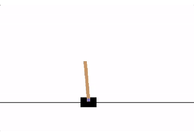
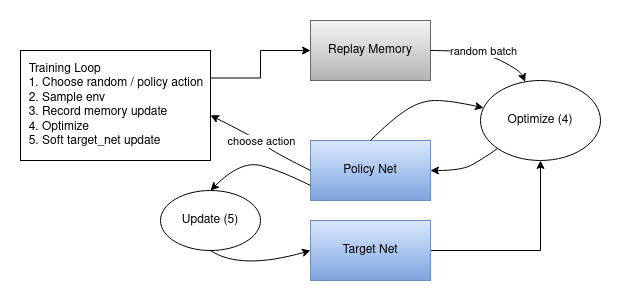

Note

Go to the end
to download the full example code.

# Reinforcement Learning (DQN) Tutorial

**Author**: [Adam Paszke](https://github.com/apaszke)

[Mark Towers](https://github.com/pseudo-rnd-thoughts)

This tutorial shows how to use PyTorch to train a Deep Q Learning (DQN) agent
on the CartPole-v1 task from [Gymnasium](https://gymnasium.farama.org).

You might find it helpful to read the original [Deep Q Learning (DQN)](https://arxiv.org/abs/1312.5602) paper

**Task**

The agent has to decide between two actions - moving the cart left or
right - so that the pole attached to it stays upright. You can find more
information about the environment and other more challenging environments at
[Gymnasium's website](https://gymnasium.farama.org/environments/classic_control/cart_pole/).



CartPole

As the agent observes the current state of the environment and chooses
an action, the environment *transitions* to a new state, and also
returns a reward that indicates the consequences of the action. In this
task, rewards are +1 for every incremental timestep and the environment
terminates if the pole falls over too far or the cart moves more than 2.4
units away from center. This means better performing scenarios will run
for longer duration, accumulating larger return.

The CartPole task is designed so that the inputs to the agent are 4 real
values representing the environment state (position, velocity, etc.).
We take these 4 inputs without any scaling and pass them through a
small fully-connected network with 2 outputs, one for each action.
The network is trained to predict the expected value for each action,
given the input state. The action with the highest expected value is
then chosen.

**Packages**

First, let's import needed packages. Firstly, we need
[gymnasium](https://gymnasium.farama.org/) for the environment,
installed by using pip. This is a fork of the original OpenAI
Gym project and maintained by the same team since Gym v0.19.
If you are running this in Google Colab, run:

```
%%bash
pip3 install gymnasium[classic_control]
```

We'll also use the following from PyTorch:

- neural networks (`torch.nn`)
- optimization (`torch.optim`)
- automatic differentiation (`torch.autograd`)

```
# set up matplotlib

# if GPU is to be used

# To ensure reproducibility during training, you can fix the random seeds
# by uncommenting the lines below. This makes the results consistent across
# runs, which is helpful for debugging or comparing different approaches.
#
# That said, allowing randomness can be beneficial in practice, as it lets
# the model explore different training trajectories.

# seed = 42
# random.seed(seed)
# torch.manual_seed(seed)
# env.reset(seed=seed)
# env.action_space.seed(seed)
# env.observation_space.seed(seed)
# if torch.cuda.is_available():
# torch.cuda.manual_seed(seed)
```

## Replay Memory

We'll be using experience replay memory for training our DQN. It stores
the transitions that the agent observes, allowing us to reuse this data
later. By sampling from it randomly, the transitions that build up a
batch are decorrelated. It has been shown that this greatly stabilizes
and improves the DQN training procedure.

For this, we're going to need two classes:

- `Transition` - a named tuple representing a single transition in
our environment. It essentially maps (state, action) pairs
to their (next_state, reward) result, with the state being the
screen difference image as described later on.
- `ReplayMemory` - a cyclic buffer of bounded size that holds the
transitions observed recently. It also implements a `.sample()`
method for selecting a random batch of transitions for training.

Now, let's define our model. But first, let's quickly recap what a DQN is.

## DQN algorithm

Our environment is deterministic, so all equations presented here are
also formulated deterministically for the sake of simplicity. In the
reinforcement learning literature, they would also contain expectations
over stochastic transitions in the environment.

Our aim will be to train a policy that tries to maximize the discounted,
cumulative reward
\(R_{t_0} = \sum_{t=t_0}^{\infty} \gamma^{t - t_0} r_t\), where
\(R_{t_0}\) is also known as the *return*. The discount,
\(\gamma\), should be a constant between \(0\) and \(1\)
that ensures the sum converges. A lower \(\gamma\) makes
rewards from the uncertain far future less important for our agent
than the ones in the near future that it can be fairly confident
about. It also encourages agents to collect reward closer in time
than equivalent rewards that are temporally far away in the future.

The main idea behind Q-learning is that if we had a function
\(Q^*: State \times Action \rightarrow \mathbb{R}\), that could tell
us what our return would be, if we were to take an action in a given
state, then we could easily construct a policy that maximizes our
rewards:

\[\pi^*(s) = \arg\!\max_a \ Q^*(s, a)

\]

However, we don't know everything about the world, so we don't have
access to \(Q^*\). But, since neural networks are universal function
approximators, we can simply create one and train it to resemble
\(Q^*\).

For our training update rule, we'll use a fact that every \(Q\)
function for some policy obeys the Bellman equation:

\[Q^{\pi}(s, a) = r + \gamma Q^{\pi}(s', \pi(s'))

\]

The difference between the two sides of the equality is known as the
temporal difference error, \(\delta\):

\[\delta = Q(s, a) - (r + \gamma \max_a' Q(s', a))

\]

To minimize this error, we will use the [Huber
loss](https://en.wikipedia.org/wiki/Huber_loss). The Huber loss acts
like the mean squared error when the error is small, but like the mean
absolute error when the error is large - this makes it more robust to
outliers when the estimates of \(Q\) are very noisy. We calculate
this over a batch of transitions, \(B\), sampled from the replay
memory:

\[\mathcal{L} = \frac{1}{|B|}\sum_{(s, a, s', r) \ \in \ B} \mathcal{L}(\delta)\]

\[\text{where} \quad \mathcal{L}(\delta) = \begin{cases}
 \frac{1}{2}{\delta^2} & \text{for } |\delta| \le 1, \\
 |\delta| - \frac{1}{2} & \text{otherwise.}
\end{cases}\]

### Q-network

Our model will be a feed forward neural network that takes in the
difference between the current and previous screen patches. It has two
outputs, representing \(Q(s, \mathrm{left})\) and
\(Q(s, \mathrm{right})\) (where \(s\) is the input to the
network). In effect, the network is trying to predict the *expected return* of
taking each action given the current input.

## Training

### Hyperparameters and utilities

This cell instantiates our model and its optimizer, and defines some
utilities:

- `select_action` - will select an action according to an epsilon
greedy policy. Simply put, we'll sometimes use our model for choosing
the action, and sometimes we'll just sample one uniformly. The
probability of choosing a random action will start at `EPS_START`
and will decay exponentially towards `EPS_END`. `EPS_DECAY`
controls the rate of the decay.
- `plot_durations` - a helper for plotting the duration of episodes,
along with an average over the last 100 episodes (the measure used in
the official evaluations). The plot will be underneath the cell
containing the main training loop, and will update after every
episode.

```
# BATCH_SIZE is the number of transitions sampled from the replay buffer
# GAMMA is the discount factor as mentioned in the previous section
# EPS_START is the starting value of epsilon
# EPS_END is the final value of epsilon
# EPS_DECAY controls the rate of exponential decay of epsilon, higher means a slower decay
# TAU is the update rate of the target network
# LR is the learning rate of the ``AdamW`` optimizer

# Get number of actions from gym action space

# Get the number of state observations
```

### Training loop

Finally, the code for training our model.

Here, you can find an `optimize_model` function that performs a
single step of the optimization. It first samples a batch, concatenates
all the tensors into a single one, computes \(Q(s_t, a_t)\) and
\(V(s_{t+1}) = \max_a Q(s_{t+1}, a)\), and combines them into our
loss. By definition we set \(V(s) = 0\) if \(s\) is a terminal
state. We also use a target network to compute \(V(s_{t+1})\) for
added stability. The target network is updated at every step with a
[soft update](https://arxiv.org/pdf/1509.02971.pdf) controlled by
the hyperparameter `TAU`, which was previously defined.

Below, you can find the main training loop. At the beginning we reset
the environment and obtain the initial `state` Tensor. Then, we sample
an action, execute it, observe the next state and the reward (always
1), and optimize our model once. When the episode ends (our model
fails), we restart the loop.

Below, num_episodes is set to 600 if a GPU is available, otherwise 50
episodes are scheduled so training does not take too long. However, 50
episodes is insufficient for to observe good performance on CartPole.
You should see the model constantly achieve 500 steps within 600 training
episodes. Training RL agents can be a noisy process, so restarting training
can produce better results if convergence is not observed.

Here is the diagram that illustrates the overall resulting data flow.



Actions are chosen either randomly or based on a policy, getting the next
step sample from the gym environment. We record the results in the
replay memory and also run optimization step on every iteration.
Optimization picks a random batch from the replay memory to do training of the
new policy. The "older" target_net is also used in optimization to compute the
expected Q values. A soft update of its weights are performed at every step.

```
# %%%%%%RUNNABLE_CODE_REMOVED%%%%%%
```

**Total running time of the script:** (0 minutes 0.003 seconds)

[`Download Jupyter notebook: reinforcement_q_learning.ipynb`](../_downloads/9da0471a9eeb2351a488cd4b44fc6bbf/reinforcement_q_learning.ipynb)

[`Download Python source code: reinforcement_q_learning.py`](../_downloads/6ea0e49c7d0da2713588ef1a3b64eb35/reinforcement_q_learning.py)

[`Download zipped: reinforcement_q_learning.zip`](../_downloads/4688eaf2bedafbdc28e62bfc388d2b6d/reinforcement_q_learning.zip)