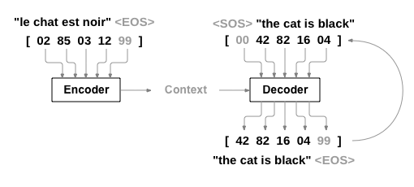
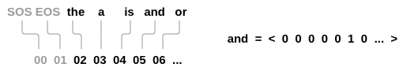
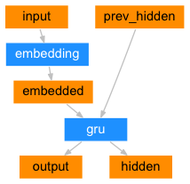
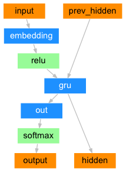
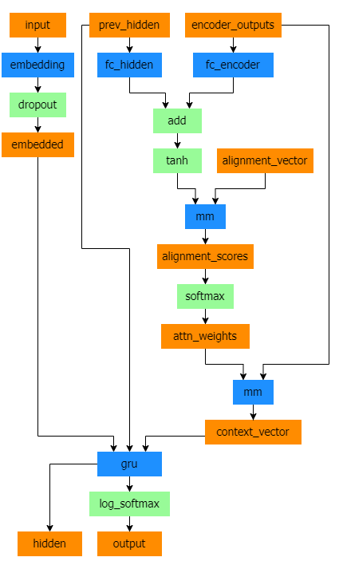

Note

Go to the end
to download the full example code.

# NLP From Scratch: Translation with a Sequence to Sequence Network and Attention

**Author**: [Sean Robertson](https://github.com/spro)

This tutorials is part of a three-part series:

- [NLP From Scratch: Classifying Names with a Character-Level RNN](https://pytorch.org/tutorials/intermediate/char_rnn_classification_tutorial.html)
- [NLP From Scratch: Generating Names with a Character-Level RNN](https://pytorch.org/tutorials/intermediate/char_rnn_generation_tutorial.html)
- [NLP From Scratch: Translation with a Sequence to Sequence Network and Attention](https://pytorch.org/tutorials/intermediate/seq2seq_translation_tutorial.html)

This is the third and final tutorial on doing **NLP From Scratch**, where we
write our own classes and functions to preprocess the data to do our NLP
modeling tasks.

In this project we will be teaching a neural network to translate from
French to English.

```
[KEY: > input, = target, < output]

> il est en train de peindre un tableau .
= he is painting a picture .
< he is painting a picture .

> pourquoi ne pas essayer ce vin delicieux ?
= why not try that delicious wine ?
< why not try that delicious wine ?

> elle n est pas poete mais romanciere .
= she is not a poet but a novelist .
< she not not a poet but a novelist .

> vous etes trop maigre .
= you re too skinny .
< you re all alone .
```

... to varying degrees of success.

This is made possible by the simple but powerful idea of the [sequence
to sequence network](https://arxiv.org/abs/1409.3215), in which two
recurrent neural networks work together to transform one sequence to
another. An encoder network condenses an input sequence into a vector,
and a decoder network unfolds that vector into a new sequence.



To improve upon this model we'll use an [attention
mechanism](https://arxiv.org/abs/1409.0473), which lets the decoder
learn to focus over a specific range of the input sequence.

**Recommended Reading:**

I assume you have at least installed PyTorch, know Python, and
understand Tensors:

- [https://pytorch.org/](https://pytorch.org/) For installation instructions
- [Deep Learning with PyTorch: A 60 Minute Blitz](../beginner/deep_learning_60min_blitz.html) to get started with PyTorch in general
- [Learning PyTorch with Examples](../beginner/pytorch_with_examples.html) for a wide and deep overview
- [PyTorch for Former Torch Users](../beginner/former_torchies_tutorial.html) if you are former Lua Torch user

It would also be useful to know about Sequence to Sequence networks and
how they work:

- [Learning Phrase Representations using RNN Encoder-Decoder for
Statistical Machine Translation](https://arxiv.org/abs/1406.1078)
- [Sequence to Sequence Learning with Neural
Networks](https://arxiv.org/abs/1409.3215)
- [Neural Machine Translation by Jointly Learning to Align and
Translate](https://arxiv.org/abs/1409.0473)
- [A Neural Conversational Model](https://arxiv.org/abs/1506.05869)

You will also find the previous tutorials on
[NLP From Scratch: Classifying Names with a Character-Level RNN](char_rnn_classification_tutorial.html)
and [NLP From Scratch: Generating Names with a Character-Level RNN](char_rnn_generation_tutorial.html)
helpful as those concepts are very similar to the Encoder and Decoder
models, respectively.

**Requirements**

## Loading data files

The data for this project is a set of many thousands of English to
French translation pairs.

[This question on Open Data Stack
Exchange](https://opendata.stackexchange.com/questions/3888/dataset-of-sentences-translated-into-many-languages)
pointed me to the open translation site [https://tatoeba.org/](https://tatoeba.org/) which has
downloads available at [https://tatoeba.org/eng/downloads](https://tatoeba.org/eng/downloads) - and better
yet, someone did the extra work of splitting language pairs into
individual text files here: [https://www.manythings.org/anki/](https://www.manythings.org/anki/)

The English to French pairs are too big to include in the repository, so
download to `data/eng-fra.txt` before continuing. The file is a tab
separated list of translation pairs:

```
I am cold. J'ai froid.
```

Note

Download the data from
[here](https://download.pytorch.org/tutorial/data.zip)
and extract it to the current directory.

Similar to the character encoding used in the character-level RNN
tutorials, we will be representing each word in a language as a one-hot
vector, or giant vector of zeros except for a single one (at the index
of the word). Compared to the dozens of characters that might exist in a
language, there are many many more words, so the encoding vector is much
larger. We will however cheat a bit and trim the data to only use a few
thousand words per language.



We'll need a unique index per word to use as the inputs and targets of
the networks later. To keep track of all this we will use a helper class
called `Lang` which has word → index (`word2index`) and index → word
(`index2word`) dictionaries, as well as a count of each word
`word2count` which will be used to replace rare words later.

The files are all in Unicode, to simplify we will turn Unicode
characters to ASCII, make everything lowercase, and trim most
punctuation.

```
# Turn a Unicode string to plain ASCII, thanks to
# https://stackoverflow.com/a/518232/2809427

# Lowercase, trim, and remove non-letter characters
```

To read the data file we will split the file into lines, and then split
lines into pairs. The files are all English → Other Language, so if we
want to translate from Other Language → English I added the `reverse`
flag to reverse the pairs.

Since there are a *lot* of example sentences and we want to train
something quickly, we'll trim the data set to only relatively short and
simple sentences. Here the maximum length is 10 words (that includes
ending punctuation) and we're filtering to sentences that translate to
the form "I am" or "He is" etc. (accounting for apostrophes replaced
earlier).

The full process for preparing the data is:

- Read text file and split into lines, split lines into pairs
- Normalize text, filter by length and content
- Make word lists from sentences in pairs

## The Seq2Seq Model

A Recurrent Neural Network, or RNN, is a network that operates on a
sequence and uses its own output as input for subsequent steps.

A [Sequence to Sequence network](https://arxiv.org/abs/1409.3215), or
seq2seq network, or [Encoder Decoder
network](https://arxiv.org/pdf/1406.1078v3.pdf), is a model
consisting of two RNNs called the encoder and decoder. The encoder reads
an input sequence and outputs a single vector, and the decoder reads
that vector to produce an output sequence.


Unlike sequence prediction with a single RNN, where every input
corresponds to an output, the seq2seq model frees us from sequence
length and order, which makes it ideal for translation between two
languages.

Consider the sentence `Je ne suis pas le chat noir` → `I am not the
black cat`. Most of the words in the input sentence have a direct
translation in the output sentence, but are in slightly different
orders, e.g. `chat noir` and `black cat`. Because of the `ne/pas`
construction there is also one more word in the input sentence. It would
be difficult to produce a correct translation directly from the sequence
of input words.

With a seq2seq model the encoder creates a single vector which, in the
ideal case, encodes the "meaning" of the input sequence into a single
vector -- a single point in some N dimensional space of sentences.

### The Encoder

The encoder of a seq2seq network is a RNN that outputs some value for
every word from the input sentence. For every input word the encoder
outputs a vector and a hidden state, and uses the hidden state for the
next input word.



### The Decoder

The decoder is another RNN that takes the encoder output vector(s) and
outputs a sequence of words to create the translation.

#### Simple Decoder

In the simplest seq2seq decoder we use only last output of the encoder.
This last output is sometimes called the *context vector* as it encodes
context from the entire sequence. This context vector is used as the
initial hidden state of the decoder.

At every step of decoding, the decoder is given an input token and
hidden state. The initial input token is the start-of-string `<SOS>`
token, and the first hidden state is the context vector (the encoder's
last hidden state).



I encourage you to train and observe the results of this model, but to
save space we'll be going straight for the gold and introducing the
Attention Mechanism.

#### Attention Decoder

If only the context vector is passed between the encoder and decoder,
that single vector carries the burden of encoding the entire sentence.

Attention allows the decoder network to "focus" on a different part of
the encoder's outputs for every step of the decoder's own outputs. First
we calculate a set of *attention weights*. These will be multiplied by
the encoder output vectors to create a weighted combination. The result
(called `attn_applied` in the code) should contain information about
that specific part of the input sequence, and thus help the decoder
choose the right output words.


Calculating the attention weights is done with another feed-forward
layer `attn`, using the decoder's input and hidden state as inputs.
Because there are sentences of all sizes in the training data, to
actually create and train this layer we have to choose a maximum
sentence length (input length, for encoder outputs) that it can apply
to. Sentences of the maximum length will use all the attention weights,
while shorter sentences will only use the first few.



Bahdanau attention, also known as additive attention, is a commonly used
attention mechanism in sequence-to-sequence models, particularly in neural
machine translation tasks. It was introduced by Bahdanau et al. in their
paper titled [Neural Machine Translation by Jointly Learning to Align and Translate](https://arxiv.org/pdf/1409.0473.pdf).
This attention mechanism employs a learned alignment model to compute attention
scores between the encoder and decoder hidden states. It utilizes a feed-forward
neural network to calculate alignment scores.

However, there are alternative attention mechanisms available, such as Luong attention,
which computes attention scores by taking the dot product between the decoder hidden
state and the encoder hidden states. It does not involve the non-linear transformation
used in Bahdanau attention.

In this tutorial, we will be using Bahdanau attention. However, it would be a valuable
exercise to explore modifying the attention mechanism to use Luong attention.

Note

There are other forms of attention that work around the length
limitation by using a relative position approach. Read about "local
attention" in [Effective Approaches to Attention-based Neural Machine
Translation](https://arxiv.org/abs/1508.04025).

## Training

### Preparing Training Data

To train, for each pair we will need an input tensor (indexes of the
words in the input sentence) and target tensor (indexes of the words in
the target sentence). While creating these vectors we will append the
EOS token to both sequences.

### Training the Model

To train we run the input sentence through the encoder, and keep track
of every output and the latest hidden state. Then the decoder is given
the `<SOS>` token as its first input, and the last hidden state of the
encoder as its first hidden state.

"Teacher forcing" is the concept of using the real target outputs as
each next input, instead of using the decoder's guess as the next input.
Using teacher forcing causes it to converge faster but [when the trained
network is exploited, it may exhibit
instability](http://citeseerx.ist.psu.edu/viewdoc/download?doi=10.1.1.378.4095&rep=rep1&type=pdf).

You can observe outputs of teacher-forced networks that read with
coherent grammar but wander far from the correct translation -
intuitively it has learned to represent the output grammar and can "pick
up" the meaning once the teacher tells it the first few words, but it
has not properly learned how to create the sentence from the translation
in the first place.

Because of the freedom PyTorch's autograd gives us, we can randomly
choose to use teacher forcing or not with a simple if statement. Turn
`teacher_forcing_ratio` up to use more of it.

This is a helper function to print time elapsed and estimated time
remaining given the current time and progress %.

The whole training process looks like this:

- Start a timer
- Initialize optimizers and criterion
- Create set of training pairs
- Start empty losses array for plotting

Then we call `train` many times and occasionally print the progress (%
of examples, time so far, estimated time) and average loss.

### Plotting results

Plotting is done with matplotlib, using the array of loss values
`plot_losses` saved while training.

## Evaluation

Evaluation is mostly the same as training, but there are no targets so
we simply feed the decoder's predictions back to itself for each step.
Every time it predicts a word we add it to the output string, and if it
predicts the EOS token we stop there. We also store the decoder's
attention outputs for display later.

We can evaluate random sentences from the training set and print out the
input, target, and output to make some subjective quality judgements:

## Training and Evaluating

With all these helper functions in place (it looks like extra work, but
it makes it easier to run multiple experiments) we can actually
initialize a network and start training.

Remember that the input sentences were heavily filtered. For this small
dataset we can use relatively small networks of 256 hidden nodes and a
single GRU layer. After about 40 minutes on a MacBook CPU we'll get some
reasonable results.

Note

If you run this notebook you can train, interrupt the kernel,
evaluate, and continue training later. Comment out the lines where the
encoder and decoder are initialized and run `trainIters` again.

Set dropout layers to `eval` mode

### Visualizing Attention

A useful property of the attention mechanism is its highly interpretable
outputs. Because it is used to weight specific encoder outputs of the
input sequence, we can imagine looking where the network is focused most
at each time step.

You could simply run `plt.matshow(attentions)` to see attention output
displayed as a matrix. For a better viewing experience we will do the
extra work of adding axes and labels:

## Exercises

- Try with a different dataset

- Another language pair
- Human → Machine (e.g. IOT commands)
- Chat → Response
- Question → Answer
- Replace the embeddings with pretrained word embeddings such as `word2vec` or
`GloVe`
- Try with more layers, more hidden units, and more sentences. Compare
the training time and results.
- If you use a translation file where pairs have two of the same phrase
(`I am test \t I am test`), you can use this as an autoencoder. Try
this:

- Train as an autoencoder
- Save only the Encoder network
- Train a new Decoder for translation from there

```
# %%%%%%RUNNABLE_CODE_REMOVED%%%%%%
```

**Total running time of the script:** (0 minutes 0.002 seconds)

[`Download Jupyter notebook: seq2seq_translation_tutorial.ipynb`](../_downloads/032d653a4f5a9c1ec32b9fc7c989ffe1/seq2seq_translation_tutorial.ipynb)

[`Download Python source code: seq2seq_translation_tutorial.py`](../_downloads/3baf9960a4be104931872ff3ffda07b7/seq2seq_translation_tutorial.py)

[`Download zipped: seq2seq_translation_tutorial.zip`](../_downloads/aa412a8699f8766ba0890a542ef0d9c8/seq2seq_translation_tutorial.zip)