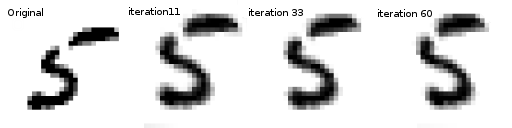
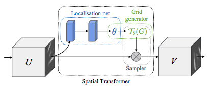
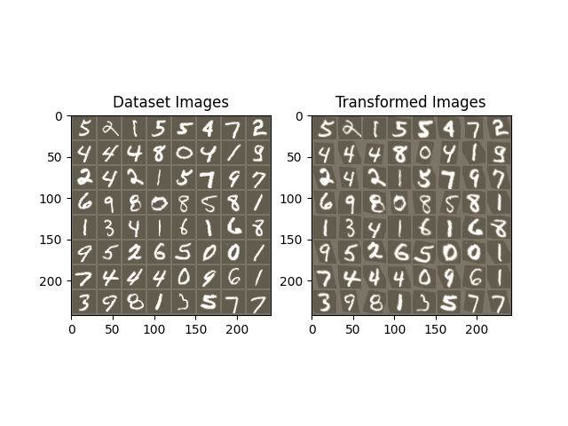

Note

Go to the end
to download the full example code.

# Spatial Transformer Networks Tutorial

**Author**: [Ghassen HAMROUNI](https://github.com/GHamrouni)



In this tutorial, you will learn how to augment your network using
a visual attention mechanism called spatial transformer
networks. You can read more about the spatial transformer
networks in the [DeepMind paper](https://arxiv.org/abs/1506.02025)

Spatial transformer networks are a generalization of differentiable
attention to any spatial transformation. Spatial transformer networks
(STN for short) allow a neural network to learn how to perform spatial
transformations on the input image in order to enhance the geometric
invariance of the model.
For example, it can crop a region of interest, scale and correct
the orientation of an image. It can be a useful mechanism because CNNs
are not invariant to rotation and scale and more general affine
transformations.

One of the best things about STN is the ability to simply plug it into
any existing CNN with very little modification.

```
# License: BSD
# Author: Ghassen Hamrouni

import torch
import torch.nn as nn
import torch.nn.functional as F
import torch.optim as optim
import torchvision
from torchvision import datasets, transforms
import matplotlib.pyplot as plt
import numpy as np

plt.ion() # interactive mode
```

```
<contextlib.ExitStack object at 0x7f87e998f6d0>
```

## Loading the data

In this post we experiment with the classic MNIST dataset. Using a
standard convolutional network augmented with a spatial transformer
network.

```
from six.moves import urllib
opener = urllib.request.build_opener()
opener.addheaders = [('User-agent', 'Mozilla/5.0')]
urllib.request.install_opener(opener)

device = torch.device("cuda" if torch.cuda.is_available() else "cpu")

# Training dataset
train_loader = torch.utils.data.DataLoader(
 datasets.MNIST(root='.', train=True, download=True,
 transform=transforms.Compose([
 transforms.ToTensor(),
 transforms.Normalize((0.1307,), (0.3081,))
 ])), batch_size=64, shuffle=True, num_workers=4)
# Test dataset
test_loader = torch.utils.data.DataLoader(
 datasets.MNIST(root='.', train=False, transform=transforms.Compose([
 transforms.ToTensor(),
 transforms.Normalize((0.1307,), (0.3081,))
 ])), batch_size=64, shuffle=True, num_workers=4)
```

```
0%| | 0.00/9.91M [00:00<?, ?B/s]
100%|██████████| 9.91M/9.91M [00:00<00:00, 121MB/s]

 0%| | 0.00/28.9k [00:00<?, ?B/s]
100%|██████████| 28.9k/28.9k [00:00<00:00, 41.3MB/s]

 0%| | 0.00/1.65M [00:00<?, ?B/s]
100%|██████████| 1.65M/1.65M [00:00<00:00, 167MB/s]

 0%| | 0.00/4.54k [00:00<?, ?B/s]
100%|██████████| 4.54k/4.54k [00:00<00:00, 27.7MB/s]
```

## Depicting spatial transformer networks

Spatial transformer networks boils down to three main components :

- The localization network is a regular CNN which regresses the
transformation parameters. The transformation is never learned
explicitly from this dataset, instead the network learns automatically
the spatial transformations that enhances the global accuracy.
- The grid generator generates a grid of coordinates in the input
image corresponding to each pixel from the output image.
- The sampler uses the parameters of the transformation and applies
it to the input image.



Note

We need the latest version of PyTorch that contains
affine_grid and grid_sample modules.

```
class Net(nn.Module):
 def __init__(self):
 super(Net, self).__init__()
 self.conv1 = nn.Conv2d(1, 10, kernel_size=5)
 self.conv2 = nn.Conv2d(10, 20, kernel_size=5)
 self.conv2_drop = nn.Dropout2d()
 self.fc1 = nn.Linear(320, 50)
 self.fc2 = nn.Linear(50, 10)

 # Spatial transformer localization-network
 self.localization = nn.Sequential(
 nn.Conv2d(1, 8, kernel_size=7),
 nn.MaxPool2d(2, stride=2),
 nn.ReLU(True),
 nn.Conv2d(8, 10, kernel_size=5),
 nn.MaxPool2d(2, stride=2),
 nn.ReLU(True)
 )

 # Regressor for the 3 * 2 affine matrix
 self.fc_loc = nn.Sequential(
 nn.Linear(10 * 3 * 3, 32),
 nn.ReLU(True),
 nn.Linear(32, 3 * 2)
 )

 # Initialize the weights/bias with identity transformation
 self.fc_loc[2].weight.data.zero_()
 self.fc_loc[2].bias.data.copy_(torch.tensor([1, 0, 0, 0, 1, 0], dtype=torch.float))

 # Spatial transformer network forward function
 def stn(self, x):
 xs = self.localization(x)
 xs = xs.view(-1, 10 * 3 * 3)
 theta = self.fc_loc(xs)
 theta = theta.view(-1, 2, 3)

 grid = F.affine_grid(theta, x.size())
 x = F.grid_sample(x, grid)

 return x

 def forward(self, x):
 # transform the input
 x = self.stn(x)

 # Perform the usual forward pass
 x = F.relu(F.max_pool2d(self.conv1(x), 2))
 x = F.relu(F.max_pool2d(self.conv2_drop(self.conv2(x)), 2))
 x = x.view(-1, 320)
 x = F.relu(self.fc1(x))
 x = F.dropout(x, training=self.training)
 x = self.fc2(x)
 return F.log_softmax(x, dim=1)

model = Net().to(device)
```

## Training the model

Now, let's use the SGD algorithm to train the model. The network is
learning the classification task in a supervised way. In the same time
the model is learning STN automatically in an end-to-end fashion.

```
optimizer = optim.SGD(model.parameters(), lr=0.01)

def train(epoch):
 model.train()
 for batch_idx, (data, target) in enumerate(train_loader):
 data, target = data.to(device), target.to(device)

 optimizer.zero_grad()
 output = model(data)
 loss = F.nll_loss(output, target)
 loss.backward()
 optimizer.step()
 if batch_idx % 500 == 0:
 print('Train Epoch: {} [{}/{} ({:.0f}%)]\tLoss: {:.6f}'.format(
 epoch, batch_idx * len(data), len(train_loader.dataset),
 100. * batch_idx / len(train_loader), loss.item()))
#
# A simple test procedure to measure the STN performances on MNIST.
#

def test():
 with torch.no_grad():
 model.eval()
 test_loss = 0
 correct = 0
 for data, target in test_loader:
 data, target = data.to(device), target.to(device)
 output = model(data)

 # sum up batch loss
 test_loss += F.nll_loss(output, target, size_average=False).item()
 # get the index of the max log-probability
 pred = output.max(1, keepdim=True)[1]
 correct += pred.eq(target.view_as(pred)).sum().item()

 test_loss /= len(test_loader.dataset)
 print('\nTest set: Average loss: {:.4f}, Accuracy: {}/{} ({:.0f}%)\n'
 .format(test_loss, correct, len(test_loader.dataset),
 100. * correct / len(test_loader.dataset)))
```

## Visualizing the STN results

Now, we will inspect the results of our learned visual attention
mechanism.

We define a small helper function in order to visualize the
transformations while training.

```
def convert_image_np(inp):
 """Convert a Tensor to numpy image."""
 inp = inp.numpy().transpose((1, 2, 0))
 mean = np.array([0.485, 0.456, 0.406])
 std = np.array([0.229, 0.224, 0.225])
 inp = std * inp + mean
 inp = np.clip(inp, 0, 1)
 return inp

# We want to visualize the output of the spatial transformers layer
# after the training, we visualize a batch of input images and
# the corresponding transformed batch using STN.

def visualize_stn():
 with torch.no_grad():
 # Get a batch of training data
 data = next(iter(test_loader))[0].to(device)

 input_tensor = data.cpu()
 transformed_input_tensor = model.stn(data).cpu()

 in_grid = convert_image_np(
 torchvision.utils.make_grid(input_tensor))

 out_grid = convert_image_np(
 torchvision.utils.make_grid(transformed_input_tensor))

 # Plot the results side-by-side
 f, axarr = plt.subplots(1, 2)
 axarr[0].imshow(in_grid)
 axarr[0].set_title('Dataset Images')

 axarr[1].imshow(out_grid)
 axarr[1].set_title('Transformed Images')

for epoch in range(1, 20 + 1):
 train(epoch)
 test()

# Visualize the STN transformation on some input batch
visualize_stn()

plt.ioff()
plt.show()
```



```
/var/lib/workspace/intermediate_source/spatial_transformer_tutorial.py:130: UserWarning: Default grid_sample and affine_grid behavior has changed to align_corners=False since 1.3.0. Please specify align_corners=True if the old behavior is desired. See the documentation of grid_sample for details.
 grid = F.affine_grid(theta, x.size())
/var/lib/workspace/intermediate_source/spatial_transformer_tutorial.py:131: UserWarning: Default grid_sample and affine_grid behavior has changed to align_corners=False since 1.3.0. Please specify align_corners=True if the old behavior is desired. See the documentation of grid_sample for details.
 x = F.grid_sample(x, grid)
Train Epoch: 1 [0/60000 (0%)] Loss: 2.296617
Train Epoch: 1 [32000/60000 (53%)] Loss: 0.960056
/usr/local/lib/python3.10/dist-packages/torch/nn/functional.py:3182: UserWarning: size_average and reduce args will be deprecated, please use reduction='sum' instead.
 reduction = _Reduction.legacy_get_string(size_average, reduce)

Test set: Average loss: 0.2456, Accuracy: 9339/10000 (93%)

Train Epoch: 2 [0/60000 (0%)] Loss: 0.536194
Train Epoch: 2 [32000/60000 (53%)] Loss: 0.260734

Test set: Average loss: 0.1153, Accuracy: 9659/10000 (97%)

Train Epoch: 3 [0/60000 (0%)] Loss: 0.460693
Train Epoch: 3 [32000/60000 (53%)] Loss: 0.262365

Test set: Average loss: 0.1627, Accuracy: 9508/10000 (95%)

Train Epoch: 4 [0/60000 (0%)] Loss: 0.524321
Train Epoch: 4 [32000/60000 (53%)] Loss: 0.191290

Test set: Average loss: 0.0773, Accuracy: 9748/10000 (97%)

Train Epoch: 5 [0/60000 (0%)] Loss: 0.263331
Train Epoch: 5 [32000/60000 (53%)] Loss: 0.110241

Test set: Average loss: 0.0626, Accuracy: 9813/10000 (98%)

Train Epoch: 6 [0/60000 (0%)] Loss: 0.167503
Train Epoch: 6 [32000/60000 (53%)] Loss: 0.171908

Test set: Average loss: 0.0558, Accuracy: 9814/10000 (98%)

Train Epoch: 7 [0/60000 (0%)] Loss: 0.286237
Train Epoch: 7 [32000/60000 (53%)] Loss: 0.043203

Test set: Average loss: 0.0476, Accuracy: 9861/10000 (99%)

Train Epoch: 8 [0/60000 (0%)] Loss: 0.027738
Train Epoch: 8 [32000/60000 (53%)] Loss: 0.100043

Test set: Average loss: 0.0526, Accuracy: 9840/10000 (98%)

Train Epoch: 9 [0/60000 (0%)] Loss: 0.049658
Train Epoch: 9 [32000/60000 (53%)] Loss: 0.107909

Test set: Average loss: 0.0409, Accuracy: 9866/10000 (99%)

Train Epoch: 10 [0/60000 (0%)] Loss: 0.078839
Train Epoch: 10 [32000/60000 (53%)] Loss: 0.414106

Test set: Average loss: 0.0463, Accuracy: 9856/10000 (99%)

Train Epoch: 11 [0/60000 (0%)] Loss: 0.146220
Train Epoch: 11 [32000/60000 (53%)] Loss: 0.050348

Test set: Average loss: 0.0494, Accuracy: 9845/10000 (98%)

Train Epoch: 12 [0/60000 (0%)] Loss: 0.251167
Train Epoch: 12 [32000/60000 (53%)] Loss: 0.091092

Test set: Average loss: 0.0428, Accuracy: 9861/10000 (99%)

Train Epoch: 13 [0/60000 (0%)] Loss: 0.148883
Train Epoch: 13 [32000/60000 (53%)] Loss: 0.226582

Test set: Average loss: 0.0425, Accuracy: 9869/10000 (99%)

Train Epoch: 14 [0/60000 (0%)] Loss: 0.144109
Train Epoch: 14 [32000/60000 (53%)] Loss: 0.034096

Test set: Average loss: 0.0441, Accuracy: 9859/10000 (99%)

Train Epoch: 15 [0/60000 (0%)] Loss: 0.194064
Train Epoch: 15 [32000/60000 (53%)] Loss: 0.193372

Test set: Average loss: 0.0900, Accuracy: 9726/10000 (97%)

Train Epoch: 16 [0/60000 (0%)] Loss: 0.200331
Train Epoch: 16 [32000/60000 (53%)] Loss: 0.518239

Test set: Average loss: 0.0342, Accuracy: 9885/10000 (99%)

Train Epoch: 17 [0/60000 (0%)] Loss: 0.074547
Train Epoch: 17 [32000/60000 (53%)] Loss: 0.329066

Test set: Average loss: 0.0451, Accuracy: 9865/10000 (99%)

Train Epoch: 18 [0/60000 (0%)] Loss: 0.087582
Train Epoch: 18 [32000/60000 (53%)] Loss: 0.047916

Test set: Average loss: 0.0381, Accuracy: 9887/10000 (99%)

Train Epoch: 19 [0/60000 (0%)] Loss: 0.043092
Train Epoch: 19 [32000/60000 (53%)] Loss: 0.066147

Test set: Average loss: 0.0343, Accuracy: 9887/10000 (99%)

Train Epoch: 20 [0/60000 (0%)] Loss: 0.218576
Train Epoch: 20 [32000/60000 (53%)] Loss: 0.043140

Test set: Average loss: 0.0424, Accuracy: 9869/10000 (99%)
```

**Total running time of the script:** (1 minutes 35.641 seconds)

[`Download Jupyter notebook: spatial_transformer_tutorial.ipynb`](../_downloads/a5513958454950ed22df8da4c47f6429/spatial_transformer_tutorial.ipynb)

[`Download Python source code: spatial_transformer_tutorial.py`](../_downloads/a4f07fecba75b5e84fe9e56cac0c7b71/spatial_transformer_tutorial.py)

[`Download zipped: spatial_transformer_tutorial.zip`](../_downloads/f45657e0364776bb499676dc1396e662/spatial_transformer_tutorial.zip)