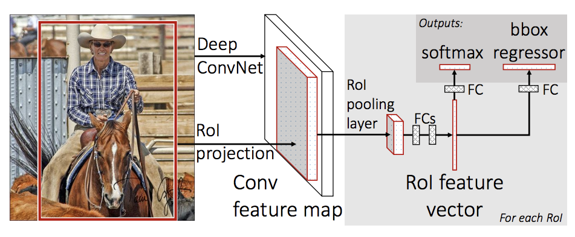
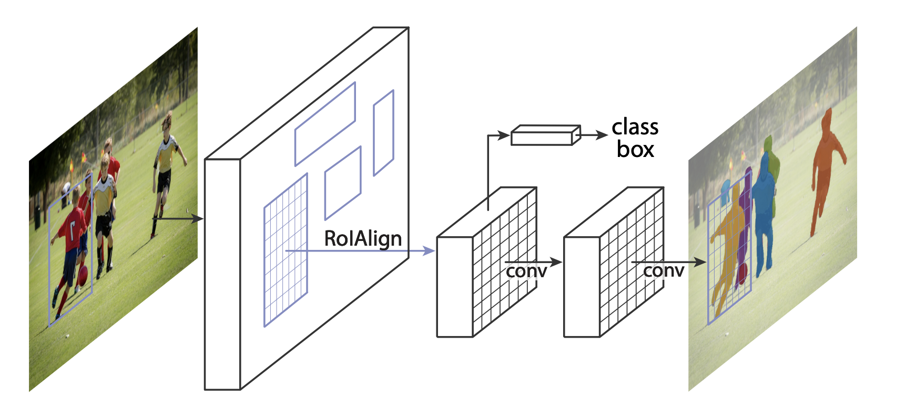

Note

Go to the end
to download the full example code.

# TorchVision Object Detection Finetuning Tutorial

For this tutorial, we will be finetuning a pre-trained [Mask
R-CNN](https://arxiv.org/abs/1703.06870) model on the [Penn-Fudan
Database for Pedestrian Detection and
Segmentation](https://www.cis.upenn.edu/~jshi/ped_html/). It contains
170 images with 345 instances of pedestrians, and we will use it to
illustrate how to use the new features in torchvision in order to train
an object detection and instance segmentation model on a custom dataset.

Note

This tutorial works only with torchvision version >=0.16 or nightly.
If you're using torchvision<=0.15, please follow
[this tutorial instead](https://github.com/pytorch/tutorials/blob/d686b662932a380a58b7683425faa00c06bcf502/intermediate_source/torchvision_tutorial.rst).

## Defining the Dataset

The reference scripts for training object detection, instance
segmentation and person keypoint detection allows for easily supporting
adding new custom datasets. The dataset should inherit from the standard
[`torch.utils.data.Dataset`](https://docs.pytorch.org/docs/stable/data.html#torch.utils.data.Dataset) class, and implement `__len__` and
`__getitem__`.

The only specificity that we require is that the dataset `__getitem__`
should return a tuple:

- image: [`torchvision.tv_tensors.Image`](https://docs.pytorch.org/vision/stable/generated/torchvision.tv_tensors.Image.html#torchvision.tv_tensors.Image) of shape `[3, H, W]`, a pure tensor, or a PIL Image of size `(H, W)`
- target: a dict containing the following fields

- `boxes`, [`torchvision.tv_tensors.BoundingBoxes`](https://docs.pytorch.org/vision/stable/generated/torchvision.tv_tensors.BoundingBoxes.html#torchvision.tv_tensors.BoundingBoxes) of shape `[N, 4]`:
the coordinates of the `N` bounding boxes in `[x0, y0, x1, y1]` format, ranging from `0`
to `W` and `0` to `H`
- `labels`, integer [`torch.Tensor`](https://docs.pytorch.org/docs/stable/tensors.html#torch.Tensor) of shape `[N]`: the label for each bounding box.
`0` represents always the background class.
- `image_id`, int: an image identifier. It should be
unique between all the images in the dataset, and is used during
evaluation
- `area`, float [`torch.Tensor`](https://docs.pytorch.org/docs/stable/tensors.html#torch.Tensor) of shape `[N]`: the area of the bounding box. This is used
during evaluation with the COCO metric, to separate the metric
scores between small, medium and large boxes.
- `iscrowd`, uint8 [`torch.Tensor`](https://docs.pytorch.org/docs/stable/tensors.html#torch.Tensor) of shape `[N]`: instances with `iscrowd=True` will be
ignored during evaluation.
- (optionally) `masks`, [`torchvision.tv_tensors.Mask`](https://docs.pytorch.org/vision/stable/generated/torchvision.tv_tensors.Mask.html#torchvision.tv_tensors.Mask) of shape `[N, H, W]`: the segmentation
masks for each one of the objects

If your dataset is compliant with above requirements then it will work for both
training and evaluation codes from the reference script. Evaluation code will use scripts from
`pycocotools` which can be installed with `pip install pycocotools`.

Note

For Windows, please install `pycocotools` from [gautamchitnis](https://github.com/gautamchitnis/cocoapi) with command

`pip install git+https://github.com/gautamchitnis/cocoapi.git@cocodataset-master#subdirectory=PythonAPI`

One note on the `labels`. The model considers class `0` as background. If your dataset does not contain the background class,
you should not have `0` in your `labels`. For example, assuming you have just two classes, *cat* and *dog*, you can
define `1` (not `0`) to represent *cats* and `2` to represent *dogs*. So, for instance, if one of the images has both
classes, your `labels` tensor should look like `[1, 2]`.

Additionally, if you want to use aspect ratio grouping during training
(so that each batch only contains images with similar aspect ratios),
then it is recommended to also implement a `get_height_and_width`
method, which returns the height and the width of the image. If this
method is not provided, we query all elements of the dataset via
`__getitem__` , which loads the image in memory and is slower than if
a custom method is provided.

### Writing a custom dataset for PennFudan

Let's write a dataset for the PennFudan dataset. First, let's download the dataset and
extract the [zip file](https://www.cis.upenn.edu/~jshi/ped_html/PennFudanPed.zip):

```
wget https://www.cis.upenn.edu/~jshi/ped_html/PennFudanPed.zip -P data
cd data && unzip PennFudanPed.zip
```

We have the following folder structure:

```
PennFudanPed/
 PedMasks/
 FudanPed00001_mask.png
 FudanPed00002_mask.png
 FudanPed00003_mask.png
 FudanPed00004_mask.png
 ...
 PNGImages/
 FudanPed00001.png
 FudanPed00002.png
 FudanPed00003.png
 FudanPed00004.png
```

Here is one example of a pair of images and segmentation masks

So each image has a corresponding
segmentation mask, where each color correspond to a different instance.
Let's write a [`torch.utils.data.Dataset`](https://docs.pytorch.org/docs/stable/data.html#torch.utils.data.Dataset) class for this dataset.
In the code below, we are wrapping images, bounding boxes and masks into
[`torchvision.tv_tensors.TVTensor`](https://docs.pytorch.org/vision/stable/generated/torchvision.tv_tensors.TVTensor.html#torchvision.tv_tensors.TVTensor) classes so that we will be able to apply torchvision
built-in transformations ([new Transforms API](https://pytorch.org/vision/stable/transforms.html))
for the given object detection and segmentation task.
Namely, image tensors will be wrapped by [`torchvision.tv_tensors.Image`](https://docs.pytorch.org/vision/stable/generated/torchvision.tv_tensors.Image.html#torchvision.tv_tensors.Image), bounding boxes into
[`torchvision.tv_tensors.BoundingBoxes`](https://docs.pytorch.org/vision/stable/generated/torchvision.tv_tensors.BoundingBoxes.html#torchvision.tv_tensors.BoundingBoxes) and masks into [`torchvision.tv_tensors.Mask`](https://docs.pytorch.org/vision/stable/generated/torchvision.tv_tensors.Mask.html#torchvision.tv_tensors.Mask).
As [`torchvision.tv_tensors.TVTensor`](https://docs.pytorch.org/vision/stable/generated/torchvision.tv_tensors.TVTensor.html#torchvision.tv_tensors.TVTensor) are [`torch.Tensor`](https://docs.pytorch.org/docs/stable/tensors.html#torch.Tensor) subclasses, wrapped objects are also tensors and inherit the plain
[`torch.Tensor`](https://docs.pytorch.org/docs/stable/tensors.html#torch.Tensor) API. For more information about torchvision `tv_tensors` see
[this documentation](https://pytorch.org/vision/main/auto_examples/transforms/plot_transforms_getting_started.html#what-are-tvtensors).

That's all for the dataset. Now let's define a model that can perform
predictions on this dataset.

## Defining your model

In this tutorial, we will be using [Mask
R-CNN](https://arxiv.org/abs/1703.06870), which is based on top of
[Faster R-CNN](https://arxiv.org/abs/1506.01497). Faster R-CNN is a
model that predicts both bounding boxes and class scores for potential
objects in the image.



Mask R-CNN adds an extra branch
into Faster R-CNN, which also predicts segmentation masks for each
instance.



There are two common
situations where one might want
to modify one of the available models in TorchVision Model Zoo. The first
is when we want to start from a pre-trained model, and just finetune the
last layer. The other is when we want to replace the backbone of the
model with a different one (for faster predictions, for example).

Let's go see how we would do one or another in the following sections.

### 1 - Finetuning from a pretrained model

Let's suppose that you want to start from a model pre-trained on COCO
and want to finetune it for your particular classes. Here is a possible
way of doing it:

```
# load a model pre-trained on COCO

# replace the classifier with a new one, that has
# num_classes which is user-defined

# get number of input features for the classifier

# replace the pre-trained head with a new one
```

### 2 - Modifying the model to add a different backbone

```
# load a pre-trained model for classification and return
# only the features

# ``FasterRCNN`` needs to know the number of
# output channels in a backbone. For mobilenet_v2, it's 1280
# so we need to add it here

# let's make the RPN generate 5 x 3 anchors per spatial
# location, with 5 different sizes and 3 different aspect
# ratios. We have a Tuple[Tuple[int]] because each feature
# map could potentially have different sizes and
# aspect ratios

# let's define what are the feature maps that we will
# use to perform the region of interest cropping, as well as
# the size of the crop after rescaling.
# if your backbone returns a Tensor, featmap_names is expected to
# be [0]. More generally, the backbone should return an
# ``OrderedDict[Tensor]``, and in ``featmap_names`` you can choose which
# feature maps to use.

# put the pieces together inside a Faster-RCNN model
```

### Object detection and instance segmentation model for PennFudan Dataset

In our case, we want to finetune from a pre-trained model, given that
our dataset is very small, so we will be following approach number 1.

Here we want to also compute the instance segmentation masks, so we will
be using Mask R-CNN:

That's it, this will make `model` be ready to be trained and evaluated
on your custom dataset.

## Putting everything together

In `references/detection/`, we have a number of helper functions to
simplify training and evaluating detection models. Here, we will use
`references/detection/engine.py` and `references/detection/utils.py`.
Just download everything under `references/detection` to your folder and use them here.
On Linux if you have `wget`, you can download them using below commands:

Since v0.15.0 torchvision provides [new Transforms API](https://pytorch.org/vision/stable/transforms.html)
to easily write data augmentation pipelines for Object Detection and Segmentation tasks.

Let's write some helper functions for data augmentation /
transformation:

## Testing `forward()` method (Optional)

Before iterating over the dataset, it's good to see what the model
expects during training and inference time on sample data.

```
# For Training

# For inference
```

We want to be able to train our model on an [accelerator](https://pytorch.org/docs/stable/torch.html#accelerators)
such as CUDA, MPS, MTIA, or XPU. Let's now write the main function which performs the training and the validation:

```
# train on the accelerator or on the CPU, if an accelerator is not available

# our dataset has two classes only - background and person

# use our dataset and defined transformations

# split the dataset in train and test set

# define training and validation data loaders

# get the model using our helper function

# move model to the right device

# construct an optimizer

# and a learning rate scheduler

# let's train it just for 2 epochs
```

So after one epoch of training, we obtain a COCO-style mAP > 50, and
a mask mAP of 65.

But what do the predictions look like? Let's take one image in the
dataset and verify

The results look good!

## Wrapping up

In this tutorial, you have learned how to create your own training
pipeline for object detection models on a custom dataset. For
that, you wrote a [`torch.utils.data.Dataset`](https://docs.pytorch.org/docs/stable/data.html#torch.utils.data.Dataset) class that returns the
images and the ground truth boxes and segmentation masks. You also
leveraged a Mask R-CNN model pre-trained on COCO train2017 in order to
perform transfer learning on this new dataset.

For a more complete example, which includes multi-machine / multi-GPU
training, check `references/detection/train.py`, which is present in
the torchvision repository.

```
# %%%%%%RUNNABLE_CODE_REMOVED%%%%%%
```

**Total running time of the script:** (0 minutes 0.003 seconds)

[`Download Jupyter notebook: torchvision_tutorial.ipynb`](../_downloads/4a542c9f39bedbfe7de5061767181d36/torchvision_tutorial.ipynb)

[`Download Python source code: torchvision_tutorial.py`](../_downloads/7590258df9f28b5ae0994c3b5b035edf/torchvision_tutorial.py)

[`Download zipped: torchvision_tutorial.zip`](../_downloads/aa82b146a324295d4af880b71bfd78cd/torchvision_tutorial.zip)