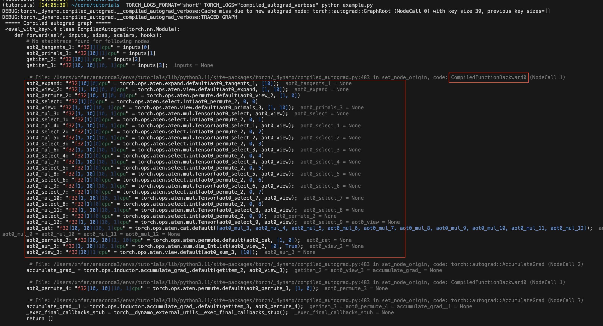
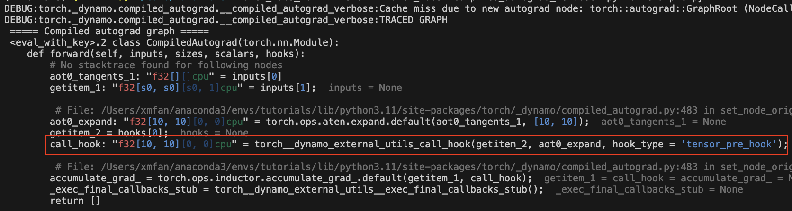
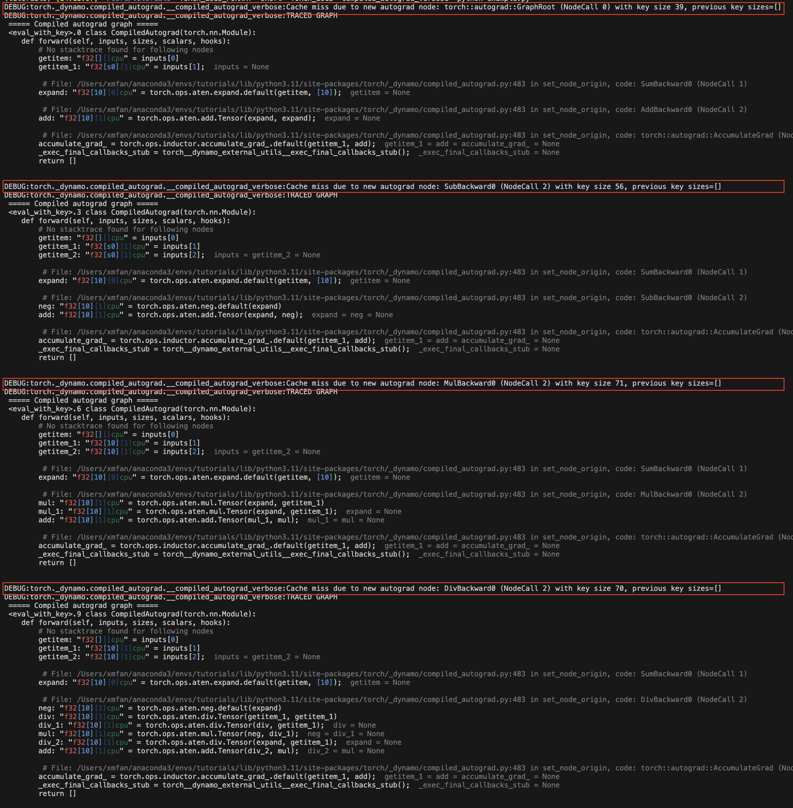
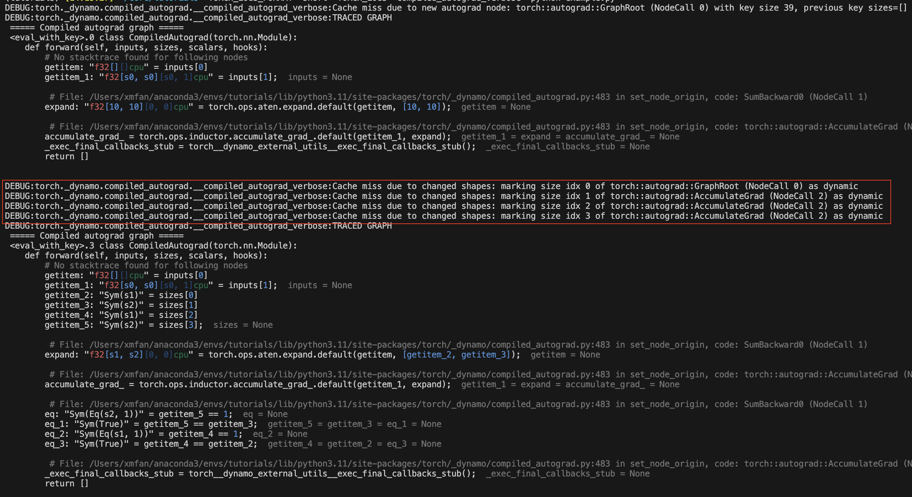

Compiled Autograd: Capturing a larger backward graph for ``torch.compile``
==========================================================================
**Author:** `Simon Fan <https://github.com/xmfan>`_

.. grid:: 2

    .. grid-item-card:: :octicon:`mortar-board;1em;` What you will learn
       :class-card: card-prerequisites

       * How compiled autograd interacts with ``torch.compile``
       * How to use the compiled autograd API
       * How to inspect logs using ``TORCH_LOGS``

    .. grid-item-card:: :octicon:`list-unordered;1em;` Prerequisites
       :class-card: card-prerequisites

       * PyTorch 2.4
       * Complete the `Introduction to torch.compile <https://pytorch.org/tutorials/intermediate/torch_compile_tutorial.html>`_
       * Read through the TorchDynamo and AOTAutograd sections of `Get Started with PyTorch 2.x <https://pytorch.org/get-started/pytorch-2.0/>`_

Overview
--------
Compiled Autograd is a ``torch.compile`` extension introduced in PyTorch 2.4
that allows the capture of a larger backward graph.

While ``torch.compile`` does capture the backward graph, it does so **partially**. The AOTAutograd component captures the backward graph ahead-of-time, with certain limitations:

* Graph breaks in the forward lead to graph breaks in the backward
* `Backward hooks <https://pytorch.org/docs/stable/notes/autograd.html#backward-hooks-execution>`_ are not captured

Compiled Autograd addresses these limitations by directly integrating with the autograd engine, allowing
it to capture the full backward graph at runtime. Models with these two characteristics should try
Compiled Autograd, and potentially observe better performance.

However, Compiled Autograd introduces its own limitations:

* Added runtime overhead at the start of the backward for cache lookup
* More prone to recompiles and graph breaks in dynamo due to the larger capture

.. note:: Compiled Autograd is under active development. While many restrictions have been lifted since its initial release, some features may still be evolving. If you encounter issues or have questions, please report them on the `PyTorch GitHub Issues <https://github.com/pytorch/pytorch/issues>`_ page.

Setup
-----
In this tutorial, we will base our examples on this simple neural network model.
It takes a 10-dimensional input vector, processes it through a single linear layer, and outputs another 10-dimensional vector.

.. code:: python

   import torch

   class Model(torch.nn.Module):
      def __init__(self):
         super().__init__()
         self.linear = torch.nn.Linear(10, 10)

      def forward(self, x):
         return self.linear(x)

Basic usage
------------
Before calling the ``torch.compile`` API, make sure to set ``torch._dynamo.config.compiled_autograd`` to ``True``:

.. code:: python

   model = Model()
   x = torch.randn(10)

   torch._dynamo.config.compiled_autograd = True
   @torch.compile
   def train(model, x):
      loss = model(x).sum()
      loss.backward()

   train(model, x) 

In the code above, we create an instance of the ``Model`` class and generate a random 10-dimensional tensor ``x`` by using ``torch.randn(10)``.
We define the training loop function ``train`` and decorate it with @torch.compile to optimize its execution.
When ``train(model, x)`` is called:

* Python Interpreter calls Dynamo, since this call was decorated with ``@torch.compile``.
* Dynamo intercepts the Python bytecode, simulates their execution and records the operations into a graph.
* ``AOTDispatcher`` disables hooks and calls the autograd engine to compute gradients for ``model.linear.weight`` and ``model.linear.bias``, and records the operations into a graph. Using ``torch.autograd.Function``, AOTDispatcher rewrites the forward and backward implementation of ``train``.
* Inductor generates a function corresponding to an optimized implementation of the AOTDispatcher forward and backward.
* Dynamo sets the optimized function to be evaluated next by Python Interpreter.
* Python Interpreter executes the optimized function, which executes ``loss = model(x).sum()``.
* Python Interpreter executes ``loss.backward()``, calling into the autograd engine, which routes to the Compiled Autograd engine since we set ``torch._dynamo.config.compiled_autograd = True``.
* Compiled Autograd computes the gradients for ``model.linear.weight`` and ``model.linear.bias``, and records the operations into a graph, including any hooks it encounters. During this process, it will record the backward previously rewritten by AOTDispatcher. Compiled Autograd then generates a new function which corresponds to a fully-traced implementation of ``loss.backward()``, and executes it with ``torch.compile`` in inference mode.
* The same steps recursively apply to the Compiled Autograd graph, but this time AOTDispatcher will not need to partition the graph.

Inspecting the compiled autograd logs
-------------------------------------
Run the script with the ``TORCH_LOGS`` environment variables:

* To only print the compiled autograd graph, use ``TORCH_LOGS="compiled_autograd" python example.py``
* To print the graph with more tensor metadata and recompile reasons, at the cost of performance, use ``TORCH_LOGS="compiled_autograd_verbose" python example.py``

Rerun the snippet above, the compiled autograd graph should now be logged to ``stderr``. Certain graph nodes will have names that are prefixed by ``aot0_``,
these correspond to the nodes previously compiled ahead of time in AOTAutograd backward graph 0, for example, ``aot0_view_2`` corresponds to ``view_2`` of the AOT backward graph with id=0.

In the image below, the red box encapsulates the AOT backward graph that is captured by ``torch.compile`` without Compiled Autograd.

.. note:: This is the graph on which we will call ``torch.compile``, **NOT** the optimized graph. Compiled Autograd essentially generates some unoptimized Python code to represent the entire C++ autograd execution.

Compiling the forward and backward pass using different flags
-------------------------------------------------------------
You can use different compiler configs for the two compilations, for example, the backward may be a fullgraph even if there are graph breaks in the forward.

.. code:: python

   def train(model, x):
       model = torch.compile(model)
       loss = model(x).sum()
       torch._dynamo.config.compiled_autograd = True
       torch.compile(lambda: loss.backward(), fullgraph=True)()

Or you can use the context manager, which will apply to all autograd calls within its scope.

.. code:: python

   def train(model, x):
      model = torch.compile(model)
      loss = model(x).sum()
      with torch._dynamo.compiled_autograd.enable(torch.compile(fullgraph=True)):
         loss.backward()

Compiled Autograd addresses certain limitations of AOTAutograd
--------------------------------------------------------------
1. Graph breaks in the forward pass no longer necessarily lead to graph breaks in the backward pass:

.. code:: python

   @torch.compile(backend="aot_eager")
   def fn(x):
      # 1st graph
      temp = x + 10
      torch._dynamo.graph_break()
      # 2nd graph
      temp = temp + 10
      torch._dynamo.graph_break()
      # 3rd graph
      return temp.sum()

   x = torch.randn(10, 10, requires_grad=True)
   torch._dynamo.utils.counters.clear()
   loss = fn(x)

   # 1. base torch.compile 
   loss.backward(retain_graph=True)
   assert(torch._dynamo.utils.counters["stats"]["unique_graphs"] == 3)
   torch._dynamo.utils.counters.clear()

   # 2. torch.compile with compiled autograd
   with torch._dynamo.compiled_autograd.enable(torch.compile(backend="aot_eager")):
      loss.backward()

   # single graph for the backward
   assert(torch._dynamo.utils.counters["stats"]["unique_graphs"] == 1)

In the first ``torch.compile`` case, we see that 3 backward graphs were produced due to the 2 graph breaks in the compiled function ``fn``. 
Whereas in the second ``torch.compile`` with compiled autograd case, we see that a full backward graph was traced despite the graph breaks.

.. note:: It is still possible for the Dynamo to graph break when tracing backward hooks captured by Compiled Autograd.

2. Backward hooks can now be captured

.. code:: python

   @torch.compile(backend="aot_eager")
   def fn(x):
      return x.sum()

   x = torch.randn(10, 10, requires_grad=True)
   x.register_hook(lambda grad: grad+10)
   loss = fn(x)

   with torch._dynamo.compiled_autograd.enable(torch.compile(backend="aot_eager")):
      loss.backward()

There should be a ``call_hook`` node in the graph, which dynamo will later inline into the following:

Common recompilation reasons for Compiled Autograd
--------------------------------------------------
1. Due to changes in the autograd structure of the loss value:

.. code:: python

   torch._dynamo.config.compiled_autograd = True
   x = torch.randn(10, requires_grad=True)
   for op in [torch.add, torch.sub, torch.mul, torch.div]:
      loss = op(x, x).sum()
      torch.compile(lambda: loss.backward(), backend="eager")()

In the example above, we call a different operator on each iteration, leading to ``loss`` tracking a different autograd history each time. You should see some recompile messages: **Cache miss due to new autograd node**.

2. Due to tensors changing shapes:

.. code:: python

   torch._dynamo.config.compiled_autograd = True
   for i in [10, 100, 10]:
      x = torch.randn(i, i, requires_grad=True)
      loss = x.sum()
      torch.compile(lambda: loss.backward(), backend="eager")()

In the example above, ``x`` changes shapes, and compiled autograd will mark ``x`` as a dynamic shape tensor after the first change. You should see recompiles messages: **Cache miss due to changed shapes**.

Conclusion
----------
In this tutorial, we went over the high-level ecosystem of ``torch.compile`` with compiled autograd, the basics of compiled autograd and a few common recompilation reasons. Stay tuned for deep dives on `dev-discuss <https://dev-discuss.pytorch.org/>`_.
