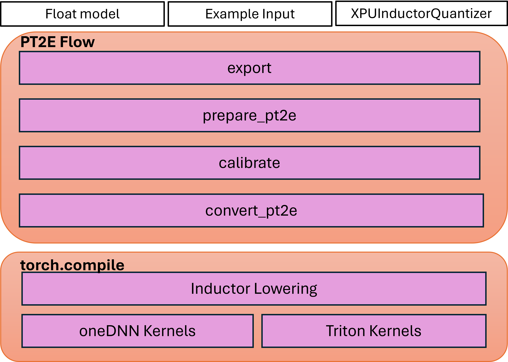

PyTorch 2 Export Quantization with Intel GPU Backend through Inductor
==================================================================

**Author**: `Yan Zhiwei <https://github.com/ZhiweiYan-96>`_, `Wang Eikan <https://github.com/EikanWang>`_, `Zhang Liangang <https://github.com/liangan1>`_, `Liu River <https://github.com/riverliuintel>`_, `Cui Yifeng <https://github.com/CuiYifeng>`_

Prerequisites
---------------

-  `PyTorch 2 Export Post Training Quantization <https://pytorch.org/tutorials/prototype/pt2e_quant_ptq.html>`_
-  `TorchInductor and torch.compile concepts in PyTorch <https://pytorch.org/tutorials/intermediate/torch_compile_tutorial.html>`_

Introduction
--------------

This tutorial introduces XPUInductorQuantizer, which aims to serve quantized models for inference on Intel GPUs.
utilizes the PyTorch 2 Export Quantization flow and lowers the quantized model into the inductor.

The Pytorch 2 Export Quantization flow uses `torch.export` to capture the model into a graph and perform quantization transformations on top of the ATen graph.
This approach is expected to have significantly higher model coverage with better programmability and a simplified user experience.
TorchInductor is the compiler backend that compiles the FX Graphs generated by TorchDynamo into optimized C++/Triton kernels.

The quantization flow has three steps:

- Step 1: Capture the FX Graph from the eager model based on the [torch export mechanism] (https://pytorch.org/docs/main/export.html).
- Step 2: Apply the quantization flow based on the captured FX Graph, including defining the backend-specific quantizer, generating the prepared model with observers,
  performing the prepared model's calibration, and converting the prepared model into the quantized model.
- Step 3: Lower the quantized model into inductor with the API ``torch.compile``, which would call triton kernels or oneDNN GEMM/Conv kernels.

The high-level architecture of this flow could look like this:

Post Training Quantization
----------------------------

Static quantization is the only method we currently support.

The following dependencies are recommended to be installed through the Intel GPU channel:

::

    pip3 install torch torchvision torchaudio pytorch-triton-xpu --index-url https://download.pytorch.org/whl/xpu

1. Capture FX Graph
^^^^^^^^^^^^^^^^^^^^^

We will start by performing the necessary imports, capturing the FX Graph from the eager module.

::

    import torch
    import torchvision.models as models
    from torch.ao.quantization.quantize_pt2e import prepare_pt2e, convert_pt2e
    import torch.ao.quantization.quantizer.xpu_inductor_quantizer as xpuiq
    from torch.ao.quantization.quantizer.xpu_inductor_quantizer import XPUInductorQuantizer
    from torch.export import export_for_training

    # Create the Eager Model
    model_name = "resnet18"
    model = models.__dict__[model_name](weights=models.ResNet18_Weights.DEFAULT)

    # Set the model to eval mode
    model = model.eval().to("xpu")

    # Create the data, using the dummy data here as an example
    traced_bs = 50
    x = torch.randn(traced_bs, 3, 224, 224, device="xpu").contiguous(memory_format=torch.channels_last)
    example_inputs = (x,)

    # Capture the FX Graph to be quantized
    with torch.no_grad():
        exported_model = export_for_training(
            model,
            example_inputs,
        ).module()

Next, we will quantize the FX Module.

2. Apply Quantization
^^^^^^^^^^^^^^^^^^^^^^^

After we capture the FX Module to be quantized, we will import the Backend Quantizer for Intel GPU and configure how to
quantize the model.

::

    quantizer = XPUInductorQuantizer()
    quantizer.set_global(xpuiq.get_default_xpu_inductor_quantization_config())

The default quantization configuration in ``XPUInductorQuantizer`` uses signed 8-bits for both activations and weights. The tensors are per-tensor quantized, whereas the weights are signed 8-bit per-channel quantized.

Besides the default quant configuration (asymmetric quantized activation), we also support signed 8-bits symmetric quantized activation, which has the potential to provide better performance.

::

    from torch.ao.quantization.observer import HistogramObserver, PerChannelMinMaxObserver
    from torch.ao.quantization.quantizer.quantizer import QuantizationSpec
    from torch.ao.quantization.quantizer.xnnpack_quantizer_utils import QuantizationConfig
    from typing import Any, Optional, TYPE_CHECKING
    if TYPE_CHECKING:
        from torch.ao.quantization.qconfig import _ObserverOrFakeQuantizeConstructor
    def get_xpu_inductor_symm_quantization_config():
        extra_args: dict[str, Any] = {"eps": 2**-12}
        act_observer_or_fake_quant_ctr = HistogramObserver
        act_quantization_spec = QuantizationSpec(
            dtype=torch.int8,
            quant_min=-128,
            quant_max=127,
            qscheme=torch.per_tensor_symmetric,  # Change the activation quant config to symmetric
            is_dynamic=False,
            observer_or_fake_quant_ctr=act_observer_or_fake_quant_ctr.with_args(
                **extra_args
            ),
        )

        weight_observer_or_fake_quant_ctr: _ObserverOrFakeQuantizeConstructor = (
            PerChannelMinMaxObserver
        )

        weight_quantization_spec = QuantizationSpec(
            dtype=torch.int8,
            quant_min=-128,
            quant_max=127,
            qscheme=torch.per_channel_symmetric, # Same as the default config, the only supported option for weight
            ch_axis=0,  # 0 corresponding to weight shape = (oc, ic, kh, kw) of conv
            is_dynamic=False,
            observer_or_fake_quant_ctr=weight_observer_or_fake_quant_ctr.with_args(
                **extra_args
            ),
        )

        bias_quantization_spec = None  # will use placeholder observer by default
        quantization_config = QuantizationConfig(
            act_quantization_spec,
            act_quantization_spec,
            weight_quantization_spec,
            bias_quantization_spec,
            False,
        )
        return quantization_config

Then, we can set the quantization configuration to the quantizer.

::

    quantizer = XPUInductorQuantizer()
    quantizer.set_global(get_xpu_inductor_symm_quantization_config())

After we import the backend-specific Quantizer, we will prepare the model for post-training quantization.
``prepare_pt2e`` folds BatchNorm operators into preceding Conv2d operators, and inserts observers in appropriate places in the model.

::

    prepared_model = prepare_pt2e(exported_model, quantizer)

**(For static quantization only)** Calibrate the ``prepared_model`` after the observers are inserted into the model.

::

    # We use the dummy data as an example here
    prepared_model(*example_inputs)

    # Alternatively: user can define the dataset to calibrate
    # def calibrate(model, data_loader):
    #     model.eval()
    #     with torch.no_grad():
    #         for image, target in data_loader:
    #             model(image)
    # calibrate(prepared_model, data_loader_test)  # run calibration on sample data

Finally, we will convert the calibrated Model to a quantized Model. ``convert_pt2e`` takes a calibrated model and produces a quantized model.

::

    converted_model = convert_pt2e(prepared_model)

After these steps, the quantization flow has been completed and the quantized model is available.

3. Lower into Inductor
^^^^^^^^^^^^^^^^^^^^^^^^

The quantized model will then be lowered into the inductor backend. 

::

    with torch.no_grad():
        optimized_model = torch.compile(converted_model)

        # Running some benchmark
        optimized_model(*example_inputs)

In a more advanced scenario, int8-mixed-bf16 quantization comes into play. In this instance,
a convolution or GEMM operator produces the output in BFloat16 instead of Float32 in the absence
of a subsequent quantization node. Subsequently, the BFloat16 tensor seamlessly propagates through
subsequent pointwise operators, effectively minimizing memory usage and potentially enhancing performance.
The utilization of this feature mirrors that of regular BFloat16 Autocast, as simple as wrapping the
script within the BFloat16 Autocast context.

::

    with torch.amp.autocast(device_type="xpu", dtype=torch.bfloat16), torch.no_grad():
            # Turn on Autocast to use int8-mixed-bf16 quantization. After lowering into indcutor backend,
            # For operators such as QConvolution and QLinear:
            # * The input data type is consistently defined as int8, attributable to the presence of a pair
            #    of quantization and dequantization nodes inserted at the input.
            # * The computation precision remains at int8.
            # * The output data type may vary, being either int8 or BFloat16, contingent on the presence
            #   of a pair of quantization and dequantization nodes at the output.
            # For non-quantizable pointwise operators, the data type will be inherited from the previous node,
            # potentially resulting in a data type of BFloat16 in this scenario.
            # For quantizable pointwise operators such as QMaxpool2D, it continues to operate with the int8
            # data type for both input and output.
            optimized_model = torch.compile(converted_model)

            # Running some benchmark
            optimized_model(*example_inputs)

Put all these codes together, we will have the toy example code.
Please note that since the Inductor ``freeze`` feature does not turn on by default yet, run your example code with ``TORCHINDUCTOR_FREEZING=1``.

For example:

::

    TORCHINDUCTOR_FREEZING=1 python xpu_inductor_quantizer_example.py
