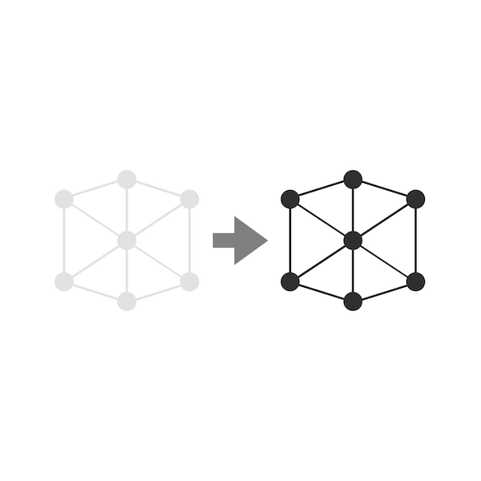
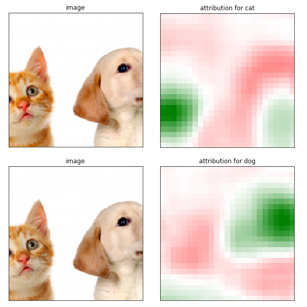
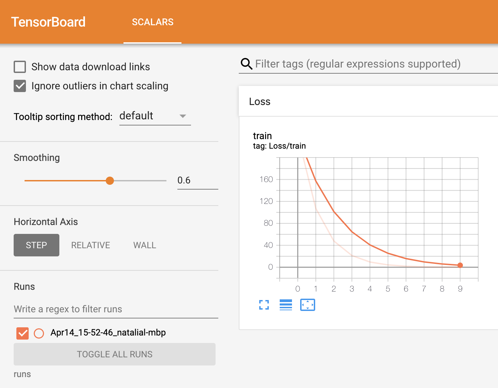
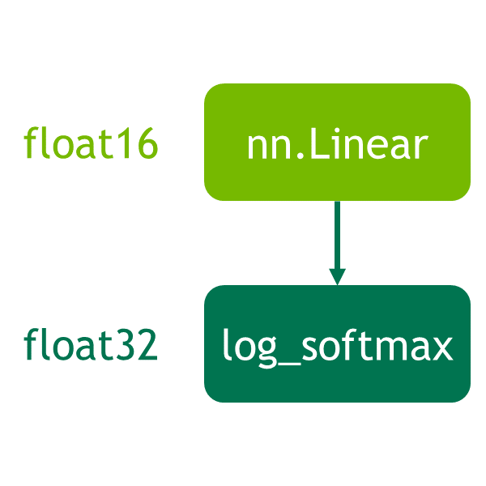

# Recipes

Recipes are bite-sized, actionable examples of
how to use specific PyTorch features, different
from our full-length tutorials.

---

[#### Defining a Neural Network

Learn how to use PyTorch's torch.nn package to create and define a neural network for the MNIST dataset.

Basics

](recipes/recipes/defining_a_neural_network.html)

[#### What is a state_dict in PyTorch

Learn how state_dict objects and Python dictionaries are used in saving or loading models from PyTorch.

Basics

](recipes/recipes/what_is_state_dict.html)

[#### Warmstarting model using parameters from a different model in PyTorch

Learn how warmstarting the training process by partially loading a model or loading a partial model can help your model converge much faster than training from scratch.

Basics

](recipes/recipes/warmstarting_model_using_parameters_from_a_different_model.html)

[#### Zeroing out gradients in PyTorch

Learn when you should zero out gradients and how doing so can help increase the accuracy of your model.

Basics

](recipes/recipes/zeroing_out_gradients.html)

[#### PyTorch Benchmark

Learn how to use PyTorch's benchmark module to measure and compare the performance of your code

Basics

](recipes/recipes/benchmark.html)

[#### PyTorch Benchmark (quick start)

Learn how to measure snippet run times and collect instructions.

Basics

](recipes/recipes/timer_quick_start.html)

[#### PyTorch Profiler

Learn how to use PyTorch's profiler to measure operators time and memory consumption

Basics

](recipes/recipes/profiler_recipe.html)

[#### PyTorch Profiler with Instrumentation and Tracing Technology API (ITT API) support

Learn how to use PyTorch's profiler with Instrumentation and Tracing Technology API (ITT API) to visualize operators labeling in Intel® VTune™ Profiler GUI

Basics

](recipes/profile_with_itt.html)

[#### Dynamic Compilation Control with ``torch.compiler.set_stance``

Learn how to use torch.compiler.set_stance

Compiler

](recipes/torch_compiler_set_stance_tutorial.html)

[#### Reasoning about Shapes in PyTorch

Learn how to use the meta device to reason about shapes in your model.

Basics

](recipes/recipes/reasoning_about_shapes.html)

[#### Tips for Loading an nn.Module from a Checkpoint

Learn tips for loading an nn.Module from a checkpoint.

Basics

](recipes/recipes/module_load_state_dict_tips.html)

[#### (beta) Using TORCH_LOGS to observe torch.compile

Learn how to use the torch logging APIs to observe the compilation process.

Basics

](recipes/torch_logs.html)

[#### Extension points in nn.Module for loading state_dict and tensor subclasses

New extension points in nn.Module.

Basics

](recipes/recipes/swap_tensors.html)

[#### torch.export AOTInductor Tutorial for Python runtime

Learn an end-to-end example of how to use AOTInductor for python runtime.

Basics

](recipes/torch_export_aoti_python.html)

[#### Demonstration of torch.export flow, common challenges and the solutions to address them

Learn how to export models for popular usecases

Compiler,TorchCompile

](recipes/torch_export_challenges_solutions.html)

[#### Model Interpretability using Captum

Learn how to use Captum attribute the predictions of an image classifier to their corresponding image features and visualize the attribution results.

Interpretability,Captum

](recipes/recipes/Captum_Recipe.html)

[#### How to use TensorBoard with PyTorch

Learn basic usage of TensorBoard with PyTorch, and how to visualize data in TensorBoard UI

Visualization,TensorBoard

](recipes/recipes/tensorboard_with_pytorch.html)

[#### DebugMode: Recording Dispatched Operations and Numerical Debugging

Inspect dispatched ops, tensor hashes, and module boundaries to debug eager and ``torch.compile`` runs.

Interpretability,Compiler

](recipes/debug_mode_tutorial.html)

[#### Automatic Mixed Precision

Use torch.cuda.amp to reduce runtime and save memory on NVIDIA GPUs.

Model-Optimization

](recipes/recipes/amp_recipe.html)

[#### Performance Tuning Guide

Tips for achieving optimal performance.

Model-Optimization

](recipes/recipes/tuning_guide.html)

[#### Optimizing CPU Performance on Intel® Xeon® with run_cpu Script

How to use run_cpu script for optimal runtime configurations on Intel® Xeon CPUs.

Model-Optimization

](recipes/xeon_run_cpu.html)

[#### (beta) Utilizing Torch Function modes with torch.compile

Override torch operators with Torch Function modes and torch.compile

Model-Optimization

](recipes/torch_compile_torch_function_modes.html)

[#### (beta) Compiling the Optimizer with torch.compile

Speed up the optimizer using torch.compile

Model-Optimization

](recipes/compiling_optimizer.html)

[#### (beta) Running the compiled optimizer with an LR Scheduler

Speed up training with LRScheduler and torch.compiled optimizer

Model-Optimization

](recipes/compiling_optimizer_lr_scheduler.html)

[#### (beta) Explicit horizontal fusion with foreach_map and torch.compile

Horizontally fuse pointwise ops with torch.compile

Model-Optimization

](recipes/foreach_map.py)

[#### Using User-Defined Triton Kernels with ``torch.compile``

Learn how to use user-defined kernels with ``torch.compile``

Model-Optimization

](recipes/torch_compile_user_defined_triton_kernel_tutorial.html)

[#### Compile Time Caching in ``torch.compile``

Learn how to use compile time caching in ``torch.compile``

Model-Optimization

](recipes/torch_compile_caching_tutorial.html)

[#### Compile Time Caching Configurations

Learn how to configure compile time caching in ``torch.compile``

Model-Optimization

](recipes/torch_compile_caching_configuration_tutorial.html)

[#### Reducing torch.compile cold start compilation time with regional compilation

Learn how to use regional compilation to control cold start compile time

Model-Optimization

](recipes/regional_compilation.html)

[#### Intel® Neural Compressor for PyTorch

Ease-of-use quantization for PyTorch with Intel® Neural Compressor.

Quantization,Model-Optimization

](recipes/intel_neural_compressor_for_pytorch.html)

[#### Getting Started with DeviceMesh

Learn how to use DeviceMesh

Distributed-Training

](recipes/distributed_device_mesh.html)

[#### Shard Optimizer States with ZeroRedundancyOptimizer

How to use ZeroRedundancyOptimizer to reduce memory consumption.

Distributed-Training

](recipes/zero_redundancy_optimizer.html)

[#### Direct Device-to-Device Communication with TensorPipe RPC

How to use RPC with direct GPU-to-GPU communication.

Distributed-Training

](recipes/cuda_rpc.html)

[#### Getting Started with Distributed Checkpoint (DCP)

Learn how to checkpoint distributed models with Distributed Checkpoint package.

Distributed-Training

](recipes/distributed_checkpoint_recipe.html)

[#### Asynchronous Checkpointing (DCP)

Learn how to checkpoint distributed models with Distributed Checkpoint package.

Distributed-Training

](recipes/distributed_async_checkpoint_recipe.html)

[#### Getting Started with CommDebugMode

Learn how to use CommDebugMode for DTensors

Distributed-Training

](recipes/distributed_comm_debug_mode.html)

[#### Reducing AoT cold start compilation time with regional compilation

Learn how to use regional compilation to control AoT cold start compile time

Model-Optimization

](recipes/regional_aot.html)