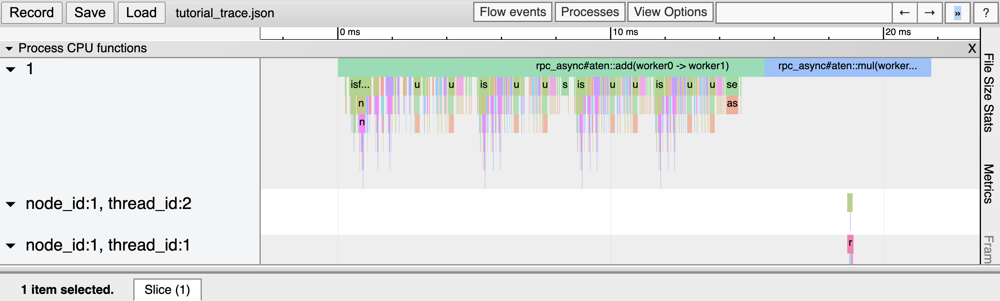
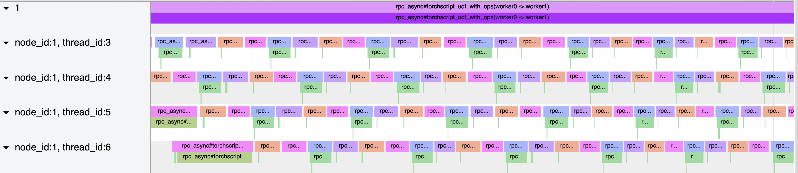

Profiling PyTorch RPC-Based Workloads
======================================

In this recipe, you will learn:

-  An overview of the `Distributed RPC Framework`_.
-  An overview of the `PyTorch Profiler`_.
-  How to use the profiler to profile RPC-based workloads.
-  A short example showcasing how to use the profiler to tune RPC parameters.

Requirements
------------

-  PyTorch 1.6+

The instructions for installing PyTorch are
available at `pytorch.org`_.

What is the Distributed RPC Framework?
---------------------------------------

The **Distributed RPC Framework** provides mechanisms for multi-machine model
training through a set of primitives to allow for remote communication, and a 
higher-level API to automatically differentiate models split across several machines.
For this recipe, it would be helpful to be familiar with the `Distributed RPC Framework`_
as well as the `RPC Tutorials`_. 

What is the PyTorch Profiler?
---------------------------------------
The profiler is a context manager based API that allows for on-demand profiling of
operators in a model's workload. The profiler can be used to analyze various aspects
of a model including execution time, operators invoked, and memory consumption. For a
detailed tutorial on using the profiler to profile a single-node model, please see the
`Profiler Recipe`_.

How to use the Profiler for RPC-based workloads
-----------------------------------------------

The profiler supports profiling of calls made of RPC and allows the user to have a
detailed view into the operations that take place on different nodes. To demonstrate an
example of this, let's first set up the RPC framework. The below code snippet will initialize
two RPC workers on the same host, named ``worker0`` and ``worker1`` respectively. The workers will
be spawned as subprocesses, and we set some environment variables required for proper
initialization.

::

  import torch
  import torch.distributed.rpc as rpc
  import torch.autograd.profiler as profiler
  import torch.multiprocessing as mp
  import os
  import logging
  import sys

  logging.basicConfig(stream=sys.stdout, level=logging.DEBUG)
  logger = logging.getLogger()

  def random_tensor():
      return torch.rand((3, 3), requires_grad=True)

  def worker(rank, world_size):
      os.environ["MASTER_ADDR"] = "localhost"
      os.environ["MASTER_PORT"] = "29500"
      worker_name = f"worker{rank}"

      # Initialize RPC framework.
      rpc.init_rpc(
          name=worker_name,
          rank=rank,
          world_size=world_size
      )
      logger.debug(f"{worker_name} successfully initialized RPC.")

      pass # to be continued below

      logger.debug(f"Rank {rank} waiting for workers and shutting down RPC")
      rpc.shutdown()
      logger.debug(f"Rank {rank} shutdown RPC")

  if __name__ == '__main__':
      # Run 2 RPC workers.
      world_size = 2
      mp.spawn(worker, args=(world_size,), nprocs=world_size)

Running the above program should present you with the following output:

::

  DEBUG:root:worker1 successfully initialized RPC.
  DEBUG:root:worker0 successfully initialized RPC.
  DEBUG:root:Rank 0 waiting for workers and shutting down RPC
  DEBUG:root:Rank 1 waiting for workers and shutting down RPC
  DEBUG:root:Rank 1 shutdown RPC
  DEBUG:root:Rank 0 shutdown RPC

Now that we have a skeleton setup of our RPC framework, we can move on to 
sending RPCs back and forth and using the profiler to obtain a view of what's
happening under the hood. Let's add to the above ``worker`` function:

::

    def worker(rank, world_size):
        # Above code omitted...
        if rank == 0:
            dst_worker_rank = (rank + 1) % world_size
            dst_worker_name = f"worker{dst_worker_rank}"
            t1, t2 = random_tensor(), random_tensor() 
            # Send and wait RPC completion under profiling scope.
            with profiler.profile() as prof:
                fut1 = rpc.rpc_async(dst_worker_name, torch.add, args=(t1, t2))
                fut2 = rpc.rpc_async(dst_worker_name, torch.mul, args=(t1, t2))
                # RPCs must be awaited within profiling scope.
                fut1.wait()
                fut2.wait()

            print(prof.key_averages().table())

The aforementioned code creates 2 RPCs, specifying ``torch.add`` and ``torch.mul``, respectively, 
to be run with two random input tensors on worker 1. Since we use the ``rpc_async`` API, 
we are returned a ``torch.futures.Future`` object, which must be awaited for the result
of the computation. Note that this wait must take place within the scope created by
the profiling context manager in order for the RPC to be accurately profiled. Running
the code with this new worker function should result in the following output:

:: 

  # Some columns are omitted for brevity, exact output subject to randomness
  ----------------------------------------------------------------  ---------------  ---------------  ---------------  ---------------  ---------------  ---------------  ---------------  
  Name                                                              Self CPU total %  Self CPU total   CPU total %      CPU total        CPU time avg     Number of Calls  Node ID          
  ----------------------------------------------------------------  ---------------  ---------------  ---------------  ---------------  ---------------  ---------------  ---------------  
  rpc_async#aten::add(worker0 -> worker1)                           0.00%            0.000us          0                20.462ms         20.462ms         1                0                         
  rpc_async#aten::mul(worker0 -> worker1)                           0.00%            0.000us          0                5.712ms          5.712ms          1                0                
  rpc_async#aten::mul(worker0 -> worker1)#remote_op: mul            1.84%            206.864us        2.69%            302.162us        151.081us        2                1                
  rpc_async#aten::add(worker0 -> worker1)#remote_op: add            1.41%            158.501us        1.57%            176.924us        176.924us        1                1                
  rpc_async#aten::mul(worker0 -> worker1)#remote_op: output_nr      0.04%            4.980us          0.04%            4.980us          2.490us          2                1                
  rpc_async#aten::mul(worker0 -> worker1)#remote_op: is_leaf        0.07%            7.806us          0.07%            7.806us          1.952us          4                1                
  rpc_async#aten::add(worker0 -> worker1)#remote_op: empty          0.16%            18.423us         0.16%            18.423us         18.423us         1                1                
  rpc_async#aten::mul(worker0 -> worker1)#remote_op: empty          0.14%            15.712us         0.14%            15.712us         15.712us         1                1                
  ----------------------------------------------------------------  ---------------  ---------------  ---------------  ---------------  ---------------  ---------------  ---------------  
  Self CPU time total: 11.237ms

Here we can see that the profiler has profiled our ``rpc_async`` calls made to ``worker1``
from ``worker0``. In particular, the first 2 entries in the table show details (such as
the operator name, originating worker, and destination worker) about each RPC call made
and the ``CPU total`` column indicates the end-to-end latency of the RPC call. 

We also have visibility into the actual operators invoked remotely on worker 1 due to RPC.
We can see operations that took place on ``worker1`` by checking the ``Node ID`` column. For 
example, we can interpret the row with name ``rpc_async#aten::mul(worker0 -> worker1)#remote_op: mul``
as a ``mul`` operation taking place on the remote node, as a result of the RPC sent to ``worker1``
from ``worker0``, specifying ``worker1`` to run the builtin ``mul`` operator on the input tensors.
Note that names of remote operations are prefixed with the name of the RPC event that resulted
in them. For example, remote operations corresponding to the ``rpc.rpc_async(dst_worker_name, torch.add, args=(t1, t2))``
call are prefixed with ``rpc_async#aten::mul(worker0 -> worker1)``.

We can also use the profiler to gain insight into user-defined functions that are executed over RPC. 
For example, let's add the following to the above ``worker`` function:

::

  # Define somewhere outside of worker() func.
  def udf_with_ops():
      import time
      time.sleep(1)
      t1, t2 = random_tensor(), random_tensor()
      torch.add(t1, t2)
      torch.mul(t1, t2)

  def worker(rank, world_size):
      # Above code omitted
      with profiler.profile() as p:
          fut = rpc.rpc_async(dst_worker_name, udf_with_ops)
          fut.wait()
      print(p.key_averages().table())

The above code creates a user-defined function that sleeps for 1 second, and then executes various
operators. Similar to what we've done above, we send an RPC to the remote worker, specifying it to
run our user-defined function. Running this code should result in the following output:

::

  # Exact output subject to randomness
  --------------------------------------------------------------------  ---------------  ---------------  ---------------  ---------------  ---------------  ---------------  ---------------  
  Name                                                                  Self CPU total %  Self CPU total   CPU total %      CPU total        CPU time avg     Number of Calls  Node ID          
  --------------------------------------------------------------------  ---------------  ---------------  ---------------  ---------------  ---------------  ---------------  ---------------  
  rpc_async#udf_with_ops(worker0 -> worker1)                            0.00%            0.000us          0                1.008s           1.008s           1                0                
  rpc_async#udf_with_ops(worker0 -> worker1)#remote_op: rand            12.58%           80.037us         47.09%           299.589us        149.795us        2                1                
  rpc_async#udf_with_ops(worker0 -> worker1)#remote_op: empty           15.40%           98.013us         15.40%           98.013us         24.503us         4                1                
  rpc_async#udf_with_ops(worker0 -> worker1)#remote_op: uniform_        22.85%           145.358us        23.87%           151.870us        75.935us         2                1                
  rpc_async#udf_with_ops(worker0 -> worker1)#remote_op: is_complex      1.02%            6.512us          1.02%            6.512us          3.256us          2                1                
  rpc_async#udf_with_ops(worker0 -> worker1)#remote_op: add             25.80%           164.179us        28.43%           180.867us        180.867us        1                1                
  rpc_async#udf_with_ops(worker0 -> worker1)#remote_op: mul             20.48%           130.293us        31.43%           199.949us        99.975us         2                1                
  rpc_async#udf_with_ops(worker0 -> worker1)#remote_op: output_nr       0.71%            4.506us          0.71%            4.506us          2.253us          2                1                
  rpc_async#udf_with_ops(worker0 -> worker1)#remote_op: is_leaf         1.16%            7.367us          1.16%            7.367us          1.842us          4                1                
  --------------------------------------------------------------------  ---------------  ---------------  ---------------  ---------------  ---------------  ---------------  ---------------  

Here we can see that the user-defined function has successfully been profiled with its name
``(rpc_async#udf_with_ops(worker0 -> worker1))``, and has the CPU total time we would roughly expect
(slightly greater than 1s given the ``sleep``). Similar to the above profiling output, we can see the
remote operators that have been executed on worker 1 as part of executing this RPC request.

In addition, we can visualize remote execution using the tracing functionality provided by the profiler.
Let's add the following code to the above ``worker`` function:

::

    def worker(rank, world_size):
        # Above code omitted
        # Will generate trace for above profiling output
        trace_file = "/tmp/trace.json"
        prof.export_chrome_trace(trace_file)
        logger.debug(f"Wrote trace to {trace_file}")

Now, we can load the trace file in Chrome (``chrome://tracing``). We should see output similar to
the following:

As we can see, we have traced our RPC requests and can also visualize traces of the remote operations,
in this case, given in the trace row for ``node_id: 1``.

Example: Using profiler to tune RPC initialization parameters
--------------------------------------------------------------

The following exercise is intended to be a simple example into how one can use statistics and traces
from the profiler to guide tuning RPC initialization parameters. In particular, we will focus on tuning
the ``num_worker_threads`` parameter used during RPC initialization. First, we modify our ``rpc.init_rpc``
call to the following:

::

    # Initialize RPC framework.
    num_worker_threads = 1
    rpc.init_rpc(
      name=worker_name,
      rank=rank,
      world_size=world_size,
      rpc_backend_options = rpc.TensorPipeRpcBackendOptions(num_worker_threads=num_worker_threads)
    )

This will initialize the [TensorPipe RPC backend](https://pytorch.org/docs/stable/rpc.html#tensorpipe-backend) with only one thread for processing RPC requests. Next, add
the following function somewhere outside of the ``worker`` main function:

::

    def num_workers_udf_with_ops():
      t = torch.randn((100, 100))
      for i in range(10):
        t.mul(t)
        t.add(t)
        t = t.relu()
        t = t.sigmoid()
    return t

This function is mainly intended to be a dummy CPU-intensive function for demonstration purposes. Next, we add the
following RPC and profiling code to our main ``worker`` function:

::

    with profiler.profile() as p:
      futs = []
      for i in range(4):
        fut = rpc.rpc_async(dst_worker_name, num_workers_udf_with_ops)
        futs.append(fut)
      for f in futs:
        f.wait()

    print(p.key_averages().table())

    trace_file = "/tmp/trace.json"
    # Export the trace.
    p.export_chrome_trace(trace_file)
    logger.debug(f"Wrote trace to {trace_file}")

Running the code should return the following profiling statistics (exact output subject to randomness):

::

    -------------------------------------------------------  ------------  ------------  ------------  ------------  ------------  ------------  ------------
                                                   Name    Self CPU %      Self CPU   CPU total %     CPU total  CPU time avg    # of Calls       Node ID
    -------------------------------------------------------  ------------  ------------  ------------  ------------  ------------  ------------  ------------
                                                aten::zeros         0.33%     143.557us         0.47%     203.125us      50.781us             4             0
                                                aten::empty         0.24%     101.487us         0.24%     101.487us      12.686us             8             0
                                                aten::zero_         0.04%      17.758us         0.04%      17.758us       4.439us             4             0
    rpc_async#num_workers_udf_with_ops(worker0 -> worker...         0.00%       0.000us             0     189.757ms      47.439ms             4             0
    # additional columns omitted for brevity
    -------------------------------------------------------  ------------  ------------  ------------  ------------  ------------  ------------  ------------

We can see that there were 4 RPC calls as expected taking a total of 190ms. Let's now tune the ``num_worker_threads`` 
parameter we set earlier, by changing it to ``num_worker_threads = 8``. Running the code with that change should return
the following profiling statistics (exact output subject to randomness):

::

    -------------------------------------------------------  ------------  ------------  ------------  ------------  ------------  ------------  ------------
                                                   Name    Self CPU %      Self CPU   CPU total %     CPU total  CPU time avg    # of Calls       Node ID
    -------------------------------------------------------  ------------  ------------  ------------  ------------  ------------  ------------  ------------
                                                aten::zeros         0.31%     127.320us         0.53%     217.203us      54.301us             4             0
                                                aten::empty         0.27%     113.529us         0.27%     113.529us      14.191us             8             0
                                                aten::zero_         0.04%      18.032us         0.04%      18.032us       4.508us             4             0
    rpc_async#num_workers_udf_with_ops(worker0 -> worker...         0.00%       0.000us             0      94.776ms      23.694ms             4             0

We see a clear ~2x speedup, and hypothesize that this speedup is due to exploiting parallelism on the server due
to the additional cores available. However, how can we ensure that this speedup is due to the increase in cores?
Taking a look at the trace visualization helps with this. Below is the trace when we set ``num_worker_threads=1``:

.. image:: ../_static/img/oneworker.png
   :scale: 25 %

Focusing on the trace for ``node 1``, we can see that the RPCs are ran serially on the server.

Next, the following is the trace where we set ``num_worker_threads=8``:

Based on the latter trace, we can see ``node 1`` was able to execute the RPCs in parallel on the server, due to having additional
worker threads. To summarize, we were able to leverage both the profiler's output report and trace to pick an appropriate
``num_worker_threads`` parameter for RPC initialization in this simple exercise.

Putting it all together, we have the following code for this recipe:

::

    import torch
    import torch.distributed.rpc as rpc
    import torch.autograd.profiler as profiler
    import torch.multiprocessing as mp
    import os
    import logging
    import sys

    logging.basicConfig(stream=sys.stdout, level=logging.DEBUG)
    logger = logging.getLogger()

    def random_tensor():
      return torch.rand((3, 3), requires_grad=True)

    def udf_with_ops():
      import time
      time.sleep(1)
      t1, t2 = random_tensor(), random_tensor()
      torch.add(t1, t2)
      torch.mul(t1, t2)

    def num_workers_udf_with_ops():  
      t = torch.randn((100, 100))
      for i in range(10):
          t.mul(t)
          t.add(t)
          t = t.relu()
          t = t.sigmoid()
      return t

    def worker(rank, world_size):
      os.environ["MASTER_ADDR"] = "localhost"
      os.environ["MASTER_PORT"] = "29500"
      worker_name = f"worker{rank}"

      # Initialize RPC framework.
      num_worker_threads =8
      rpc.init_rpc(
        name=worker_name,
        rank=rank,
        world_size=world_size,
        rpc_backend_options = rpc.TensorPipeRpcBackendOptions(num_worker_threads=num_worker_threads),
      )
      logger.debug(f"{worker_name} successfully initialized RPC.")

      if rank == 0:
        dst_worker_rank = (rank + 1) % world_size
        dst_worker_name = f"worker{dst_worker_rank}"
        t1, t2 = random_tensor(), random_tensor()
        # Send and wait RPC completion under profiling scope.
        with profiler.profile() as prof:  
          fut1 = rpc.rpc_async(dst_worker_name, torch.add, args=(t1, t2))
          fut2 = rpc.rpc_async(dst_worker_name, torch.mul, args=(t1, t2))
          # RPCs must be awaited within profiling scope.
          fut1.wait()
          fut2.wait()
        print(prof.key_averages().table())

        with profiler.profile() as p:
          futs = []
          for i in range(4):
            fut = rpc.rpc_async(dst_worker_name, num_workers_udf_with_ops)
            futs.append(fut)
            for f in futs:
              f.wait()

        print(p.key_averages().table())

        trace_file = "/tmp/trace.json"
        # Export the trace.
        p.export_chrome_trace(trace_file)
        logger.debug(f"Wrote trace to {trace_file}")

      logger.debug(f"Rank {rank} waiting for workers and shutting down RPC")
      rpc.shutdown()
      logger.debug(f"Rank {rank} shutdown RPC")

    if __name__ == '__main__':
      # Run 2 RPC workers.
      world_size = 2
      mp.spawn(worker, args=(world_size,), nprocs=world_size)

Learn More
-------------------

-  `pytorch.org`_ for installation instructions, and more documentation
   and tutorials.
-  `Distributed RPC Framework`_ for RPC framework and API reference.
- `Full profiler documentation`_ for profiler documentation.

.. _pytorch.org: https://pytorch.org/
.. _Full profiler documentation: https://pytorch.org/docs/stable/autograd.html#profiler
.. _Pytorch Profiler: https://pytorch.org/docs/stable/autograd.html#profiler
.. _Distributed RPC Framework: https://pytorch.org/docs/stable/rpc.html
.. _RPC Tutorials: https://pytorch.org/tutorials/intermediate/rpc_tutorial.html
.. _Profiler Recipe: https://pytorch.org/tutorials/recipes/recipes/profiler.html
